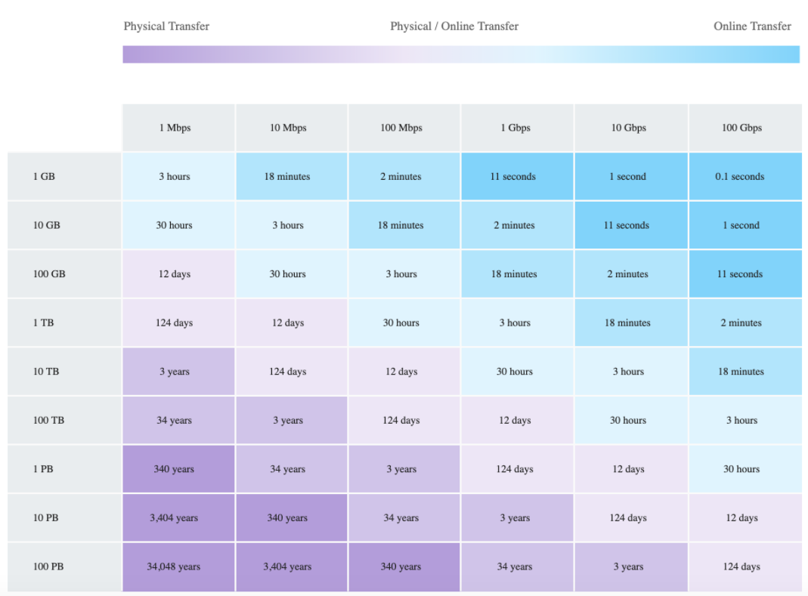

# **L3 AWS Data Transfer Services**

## **1 AWS Data Transfer Services**

* AWS provides a suite of data transfer services that includes many methods that to migrate your data more effectively.
* Data Transfer services work both **Online and Offline and the usage depends on several factors like the amount of data**, the time required, frequency, available bandwidth, and cost.

### **Online data transfer and hybrid cloud storage**

* A network link to the VPC, transfer data to AWS or use S3 for hybrid cloud storage with existing on-premises applications.
* helps both to lift and shift large datasets once, as well as help you integrate existing process flows like backup and recovery or continuous data streams directly with cloud storage.

### **Offline data migration to S3.**

use shippable, ruggedized devices are **ideal for moving large archives, data lakes, or in situations where bandwidth and data volumes cannot pass over your networks within your desired time frame**.

## **2 Online data transfer**

### **2-1 VPN**

* connect securely between data centers and AWS
* quick to set up and cost-efficient
* ideal for small data transfers and connectivity
* not reliable as still uses shared Internet connection

### **2-2 Direct Connect**

* provides a dedicated physical connection to accelerate network transfers between data centers and AWS
* provides reliable data transfer
* ideal for regular large data transfer
* needs time to setup
* is not a cost-efficient solution
* can be secured using VPN over Direct Connect

### **2-3 AWS S3 Transfer Acceleration**

* **makes public Internet transfers to S3 faster.**
* helps maximize the available bandwidth regardless of distance or varying Internet weather, and there are no special clients or proprietary network protocols.  Simply change the endpoint you use with your S3 bucket and acceleration is automatically applied.
* **ideal for recurring jobs that travel across the globe, such as media uploads, backups, and local data processing tasks that are regularly sent to a central location**

### **2-4 AWS DataSync**

* **automates moving data between on-premises storage and S3 or Elastic File System (Amazon EFS).**
* automatically handles many of the tasks related to data transfers that can slow down migrations or burden the IT operations, 
	* **including running your own instances, handling encryption, managing scripts, network optimization, and data integrity validation**.
* **helps transfer data at speeds up to 10 times faster than open-source tools.**
* uses AWS Direct Connect or internet links to AWS and is ideal for one-time data migrations, recurring data processing workflows, and automated replication for data protection and recovery.

## **3 Offline data transfer**

### **3-1 AWS Snowcone**

* **AWS Snowcone is portable, rugged, and secure that provides edge computing and data transfer devices.**
* Snowcone can be used to collect, process, and move data to AWS, either offline **by shipping the device or online with AWS DataSync**.
* **AWS Snowcone stores data securely in edge locations**, and can run edge computing workloads that use AWS IoT Greengrass or EC2 instances.
* Snowcone devices are small and weigh 4.5 lbs. (2.1 kg), so you can carry one in a backpack or fit it in tight spaces for **IoT, vehicular, or even drone use cases.**

### **3-2 AWS Snowball**

AWS Snowball is a data migration and edge computing device that comes in two device options:

**Compute Optimized**

Snowball Edge Compute Optimized devices provide 52 vCPUs, 42 terabytes of usable block or object storage, and an optional GPU for use cases such as advanced machine learning and full-motion video analysis in disconnected environments.

**Storage Optimized.**

* Snowball Edge Storage Optimized devices provide 40 vCPUs of compute capacity coupled with 80 terabytes of usable block or S3-compatible object storage.
* It is well-suited for local storage and large-scale data transfer.

Customers can use these two options for data collection, machine learning and processing, and storage in environments with intermittent connectivity (such as manufacturing, industrial, and transportation) or in extremely remote locations (such as military or maritime operations) before shipping it back to AWS.

Snowball devices may also be rack mounted and clustered together to build larger, temporary installations.

### **3-3 AWS Snowmobile**

* AWS Snowmobile moves up to 100 PB of data in a 45-foot long ruggedized shipping container and is ideal for multi-petabyte or Exabyte-scale digital media migrations and data center shutdowns.
* A Snowmobile arrives at the customer site and appears as a network-attached data store for more secure, high-speed data transfer.
* After data is transferred to Snowmobile, it is driven back to an AWS Region where the data is loaded into S3.
* Snowmobile is tamper-resistant, waterproof, and temperature controlled with multiple layers of logical and physical security – including encryption, fire suppression, dedicated security personnel, GPS tracking, alarm monitoring, 24/7 video surveillance, and an escort security vehicle during transit.

### **3-4 Data Transfer Chart – Bandwidth vs Time**

## **4 AWS Certification Exam**

An organization is moving non-business-critical applications to AWS while maintaining a mission critical application in an on-premises data center. An on-premises application must share limited confidential information with the applications in AWS. The Internet performance is unpredictable. Which configuration will ensure continued connectivity between sites MOST securely?

* VPN and a cached storage gateway
* AWS Snowball Edge
* **VPN Gateway over AWS Direct Connect**
* AWS Direct Connect

A company wants to transfer petabyte-scale of data to AWS for their analytics, however are constrained on their internet connectivity? Which AWS service can help them transfer the data quickly?

* S3 enhanced uploader
* Snowmobile
* **Snowball**
* Direct Connect

A company wants to transfer its video library data, which runs in exabytes, to AWS. Which AWS service can help the company transfer the data?

* **Snowmobile**
* Snowball
* S3 upload
* S3 enhanced uploader

You are working with a customer who has 100 TB of archival data that they want to migrate to Amazon Glacier. The customer has a 1-Gbps connection to the Internet. Which service or feature provides the fastest method of getting the data into Amazon Glacier?

* Amazon Glacier multipart upload
* AWS Storage Gateway
* VM Import/Export
* **AWS Snowball**
