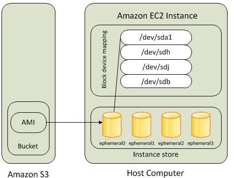
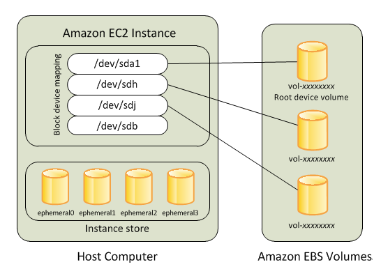
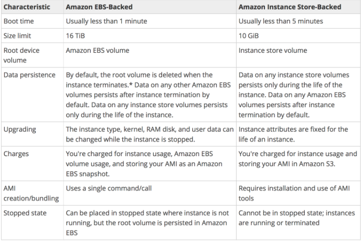

# **L2 AWS Storage & Content Delivery Cheat Sheet**
 

## **1、Simple Storage Service – S3**

* provides key-value based object storage with unlimited storage, unlimited objects up to **5 TB for the internet**
* offers an extremely durable, highly available, and **infinitely scalable data storage infrastructure at very low costs**.
* is Object-level storage (not a Block level storage) and cannot be used to **host OS or dynamic websites (but can work with Javascript SDK)**
* provides durability by redundantly storing objects on multiple facilities within a region
* **S3 resources consist of globally unique buckets with objects and related metadata.** The data model is a **flat structure with no hierarchies or folders**.
* regularly verifies the integrity of data using **checksums and provides the auto-healing capability**
* **S3 Replication** enables automatic, asynchronous copying of objects across S3 buckets **in the same or different AWS regions** using **SRR** or **CRR**. Replication needs **versioning enabled on either side.**
* **S3 Transfer Acceleration** helps speed data transport over long distances between a client and an S3 bucket using CloudFront edge locations.
* S3 supports cost-effective **Static Website hosting** with **Client-side scripts**.
* S3 **CORS** – Cross-Origin Resource Sharing **allows cross-origin access to S3 resources**.
* **S3 Access Logs** enables tracking access requests to an S3 bucket.
* **S3 notification feature** enables **notifications to be triggered** when certain events happen in the bucket.
* **S3 Inventory** helps manage the storage and *can be used to audit and report on the replication and encryption status* of the objects for business, compliance, and regulatory needs.
* **Requestor Pays** help bucket owner to **specify that the requester requesting the download** will be charged for the download.
* **S3 Batch Operations** help perform **large-scale batch operations on S3 objects and can perform** a single operation on lists of specified S3 objects.
* **Pre-Signed URLs** can be used **shared for uploading/downloading objects** for a limited time w**ithout requiring AWS security credentials**.

### **Multipart Uploads** allows

* parallel uploads with improved throughput and bandwidth utilization
* **fault tolerance and quick recovery from network issues**
* **ability to pause and resume uploads**
* **begin an upload before the final object size is known**

### **Versioning**

* helps preserve, retrieve, and restore every version of every object
* protect from unintended overwrites and accidental deletions
* protects individual files but **<mark>does NOT protect from Bucket deletion</mark>**

### **MFA (Multi-Factor Authentication)**

can be enabled for additional security for the deletion of objects.

**Integrates with CloudTrail, CloudWatch, and SNS for event notifications**

### **S3 Storage Classes**

**S3 Standard**

* default storage class, **ideal for frequently accessed data**
* 99.999999999% durability & 99.99% availability
* Low latency and high throughput performance
* designed to sustain the loss of data in a two facilities

**S3 Standard-Infrequent Access (S3 Standard-IA)**

* optimized for long-lived and less frequently accessed data
* designed to sustain the loss of data in a two facilities
* 99.999999999% durability & 99.9% availability
* **suitable for objects greater than 128 KB kept for at least 30 days**

**S3 One Zone-Infrequent Access (S3 One Zone-IA)**

* optimized for rapid access, less frequently access data
* ideal for secondary backups and reproducible data
* **stores data in a single AZ, data stored in this storage class will be lost in the event of AZ destruction**.
* 99.999999999% durability & 99.5% availability

**<mark>S3 Glacier</mark>**

* suitable for low cost data archiving, where data access is infrequent
* provides retrieval time of minutes to several hours
	* **Expedited – 1 to 5 minutes**
	* **Standard – 3 to 5 hours**
	* **Bulk – 5 to 12 hour**s
* 99.999999999% durability & 99.9% availability
* Minimum storage duration of 90 days

**S3 Glacier Deep Archive (S3 Glacier Deep Archive)**

* provides lowest cost data archiving, where data access is infrequent
* 99.999999999% durability & 99.9% availability
* **provides retrieval time of several (12-48) hours**
	* Standard – 12 hours
	* Bulk – 48 hours
* Minimum storage duration of 180 days
* supports long-term retention and digital preservation for data that may be accessed once or twice a year

### **Lifecycle Management policies**

* **transition to move objects to different storage classes and Glacier**
* expiration to remove objects and object versions
* **can be applied to both current and non-current objects, in case, versioning is enabled**.

### **Data Consistency Model**

* provides strong read-after-write consistency for PUT and DELETE requests of objects in the S3 bucket in all AWS Regions
* updates to a single key are atomic
* **<mark>does not currently support object locking for concurrent writes</mark>**

### **S3 Security**

* IAM policies – grant users within your own AWS account permission to access S3 resources
* Bucket and Object ACL – **grant other AWS accounts (not specific users) access to  S3 resources**
* Bucket policies – allows to add or deny permissions across some or all of the objects within a single bucket
* **S3 Access Points** simplify data access for any AWS service or customer application that stores data in S3.
* **S3 Glacier Vault Lock** helps deploy and enforce compliance controls for **individual S3 Glacier vaults with a vault lock policy**.
* **S3 VPC Gateway Endpoint** enables private connections between a **VPC and S3, without requiring that you use an internet gateway, NAT device, VPN connection, or AWS Direct Connect connection**.
* Support SSL encryption of data in transit and data encryption at rest

### **S3 Data Encryption**

* supports data at rest and data in transit encryption
* Server-Side Encryption
	* SSE-S3 – encrypts S3 objects using keys handled & managed by AWS
	* SSE-KMS – leverage AWS Key Management Service to manage encryption keys. KMS provides control and audit trail over the keys.
	* SSE-C – when you want to manage your own encryption keys. AWS does not store the encryption key. Requires HTTPS.

* **Client-Side Encryption**

	* Client library such as the S3 Encryption Client
	* Clients must encrypt data themselves before sending it to S3
	* Clients must decrypt data themselves when retrieving from S3
	* Customer fully manages the keys and encryption cycle

### **<mark>S3 Best Practices</mark>**

* use parallel threads and **Multipart upload for faster writes**
* use parallel threads and **Range Header GET for faster reads**
* for list operations with a large number of objects, it’s better to build a secondary index in DynamoDB
* use **Versioning to protect from unintended overwrites and deletions**, but this does not protect against bucket deletion
* use **VPC S3 Endpoints** with VPC to transfer data using Amazon internal network

## **2、Instance Store**

* provides **temporary or ephemeral <mark>block-level storage</mark>** for an EC2 instance
* <mark>is **physically attached** to the Instance</mark>
* **deliver very high random I/O performance**, which is a good option when storage with very low latency is needed
* **cannot be dynamically resized**
* data persists when an instance is rebooted
* data does not persists if the
	* underlying disk drive fails
	* instance stops i.e. if the EBS backed instance with instance store volumes attached is stopped
	* instance terminates
* can be attached to an EC2 instance only **when the instance is launched**
* **is ideal for the temporary storage of information that changes frequently**, such as buffers, caches, scratch data, and other temporary content, or for data that is replicated across a fleet of instances, such as a load-balanced pool of web servers.

## **3、Elastic Block Store – EBS**

* is **virtual network-attached** block storage
* provides **highly available**, reliable, durable, block-level storage volumes that can be attached to a running instance
* provides **high durability** and are **redundant in an AZ**, as the data is automatically replicated **within that AZ to prevent data loss due to any single hardware component failure**
* persists and is independent of EC2 lifecycle
* **multiple volumes can be attached to a single EC2 instance**
* can be detached & attached to another EC2 instance in that same AZ only
* volumes are **Zonal** i.e. **created in a specific AZ and CAN’T span across AZs**
* **snapshots**
* for making volume available to different AZ, create a snapshot of the volume and restore it to a new volume in any AZ within the region
* for making the volume available to different Region, the snapshot of the volume can be copied to a different region and restored as a volume
* **PIOPS is designed to run transactions applications that require high and consistent IO for e.g. Relation database, NoSQL**, etc
* PIOPS is designed to run transactions applications that require high and consistent IO for e.g. Relation database, NoSQL, etc
* **Multi-Attach enables attaching a single Provisioned IOPS SSD** (io1 or io2) volume to multiple instances that are in the same AZ.

## **4、EBS Encryption**

* allow encryption using the EBS encryption feature.
* All data stored at rest, disk I/O, and snapshots created from the volume are encrypted.
* uses 256-bit AES algorithms (AES-256) and an Amazon-managed KMS
* Snapshots of encrypted EBS volumes are automatically encrypted.

## **5、EBS Snapshots**

* helps create backups of EBS volumes
* are **incremental**
* occur **asynchronously**, consume the instance IOPS
* are **regional** and CANNOT span across regions
* can be **copied across regions** to make it easier to leverage multiple regions for geographical expansion, data center migration, and disaster recovery
* can be shared by making them public or with specific AWS accounts by modifying the access permissions of the snapshots
* support **EBS encryption**
	* Snapshots of encrypted volumes are automatically encrypted
	* Volumes created from encrypted snapshots are automatically encrypted
	* All data in flight between the instance and the volume is encrypted
	* Volumes created from an unencrypted snapshot owned or have access to can be encrypted on the fly.
	* Encrypted snapshot owned or having access to, can be encrypted with a different key during the copy process.

* can be automated using AWS Data Lifecycle Manager

## **6、EBS vs Instance Store**

### **6-1 AWS EBS vs Instance Store Overview**

EC2 instances support two types for block level storage

* Elastic Block Store (EBS)
* Instance Store (Ephemeral store)

EC2 Instances can be **launched using either Elastic Block Store (EBS) or Instance Store volume as root volumes and additional volumes**.

EC2 instances can be launched by choosing between AMIs backed by **EC2 instance store** and AMIs backed by **EBS**. However, **AWS recommends using EBS backed AMIs** because they launch faster and use persistent storage.

### **6-2 Instance Store (Ephemeral storage)**

* An Instance store backed instance is an EC2 instance using an **Instance store as root device volume created from a template stored in S3**.
* Instance store volumes access storage from **disks that are physically attached to the host computer**.
* When an Instance stored instance is launched, the image that is used to boot the instance is copied to the root volume (**typically sda1**).
* Instance store provides temporary block-level storage for instances.
* Data on an instance store volume persists only during the life of the associated instance; if an instance is stopped or terminated, any data on instance store volumes is lost.

### **6-3 Key points for Instance store backed Instance**

* Boot time is slower than EBS backed volumes and usually less than **5 min**
* Can be selected as Root Volume and attached as additional volumes
* Instance store backed Instances can be of a **maximum 10GiB volume size**
* Instance store volume can be attached as additional volumes only when the instance is being launched and cannot be attached once the Instance is up and running
* **Instance store backed Instances cannot be stopped**, as when **<mark>stopped and started AWS does not guarantee the instance would be launched in the same host, and hence the data is lost</mark>**
* Data on Instance store volume is **<mark>LOST</mark>** in the following scenarios:
	* Failure of an underlying drive
	* **Stopping an EBS-backed instance where instance stores are attached as additional volumes**
	* Termination of the Instance

Data on Instance store volume is **NOT LOST** when the instance is **rebooted**

For EC2 instance store-backed instances AWS recommends to

* distribute the data on the instance stores across multiple AZs
* back up critical data from the instance store volumes to persistent storage on a regular basis.

AMI creation requires usage on AMI tools and needs to be executed from **within the running instance**

Instance store backed Instances cannot be upgraded

### **6-3 Elastic Block Store (EBS)**

* An “EBS-backed” instance means that the root device for an instance launched from the AMI is an EBS volume created from an EBS snapshot
* An EBS volume behaves like a raw, unformatted, external block device that **can be attached to a single instance** and is not physically attached to the Instance host computer (more like network-attached storage).
* **Volume persists independently from the running life of an instance**.
* After an EBS volume is attached to an instance, you can use it like any other physical hard drive.
* **EBS volume can be detached from one instance and attached to another instance**
* **EBS volumes can be created as encrypted volumes using the EBS encryption feature**

### **6-4 Key points for EBS backed Instance**

* **Boot time is very fast usually less than a min**
* Can be selected as **Root Volume and attached as additional volumes**
* EBS backed Instances can be of maximum 64TiB volume size depending upon the OS
* **EBS volume can be attached as additional volumes when the Instance is launched** and even when the Instance is up and running
* Data on the EBS volume is **<mark>LOST</mark>** for
	* EBS Root volume, if **Delete On Termination flag is enabled**, which is the default.
	* Attached EBS volumes, if the Delete On Termination flag is enabled. It’s disabled, by default.

* Data on EBS volume is **NOT LOST** in the following scenarios:
	* Reboot on the Instance
	* Stopping an EBS-backed instance
	* Termination of the Instance for the additional EBS volumes. **Additional EBS volumes are detached with their data intact**

* When an EBS-backed instance is in a stopped state, various instance– and volume-related tasks can be done for e.g. 
	* you can modify the properties of the instance, 
	* you can change the size of your instance or update the kernel it is using, 
	* **you can attach your root volume to a different running instance for debugging or any other purpose**

* EBS volumes are **AZ scoped** and tied to a single AZ  in which created

* EBS volumes are automatically **replicated within that zone to prevent data loss** due to the failure of any single hardware component

* AMI creation is easy using a Single command
* EBS backed Instances can be **upgraded for instance type, Kernel, RAM disk, and user data**

### **6-4 EBS vs Instance Store Comparision**

### **6-5 Boot Times**

* EBS-backed AMIs launch faster than EC2 instance store-backed AMIs.
* When an EC2 instance store-backed AMI is launched, all the parts have to be retrieved from S3 before the instance is available.
* With an EBS-backed AMI is launched, parts are lazily loaded and only the parts required to boot the instance need to be retrieved from the snapshot before the instance is available.
* However, the performance of an instance that uses an EBS volume for its root device is slower for a short time while the remaining parts are retrieved from the snapshot and loaded into the volume.
* When you stop and restart the instance, it launches quickly, because the state is stored in an EBS volume.

1. EC2 EBS-backed (EBS root) instance is stopped, what happens to the data on **any ephemeral store volumes**?
	* Data is automatically saved in an EBS volume.
	* Data is unavailable until the instance is restarted.
	* **Data will be deleted and will no longer be accessible**.
	* Data is automatically saved as an EBS snapshot.

2. When an EC2 instance that is backed by an **S3-based AMI** is terminated, what happens to the data on the root volume?
	* Data is automatically saved as an EBS snapshot.
	* Data is automatically saved as an EBS volume.
	* Data is unavailable until the instance is restarted.
	* **Data is automatically deleted.**

3.  Which of the following will occur when an EC2 instance in a VPC (Virtual Private Cloud) with an associated Elastic IP is stopped and started? (Choose 2 answers)
	* The Elastic IP will be dissociated from the instance
	* **All data on instance-store devices will be lost**
	* All data on EBS (Elastic Block Store) devices will be lost
	* The ENI (Elastic Network Interface) is detached
	* **The underlying host for the instance is changed**

4. Which of the following provides the fastest storage medium?
	* Amazon S3
	* Amazon EBS using Provisioned IOPS (PIOPS)
	* **SSD Instance (ephemeral) store (SSD Instance Storage provides 100,000 IOPS on some instance types, much faster than any network-attached storage)**
	* AWS Storage Gateway

## **7、Glacier**

suitable for **archiving** data, where data access is **infrequent** and **a retrieval time of several hours (3 to 5 hours)** is acceptable (**Not true anymore with enhancements from AWS**)

provides a **high durability** by storing archive in multiple facilities and multiple devices at a **very low cost storage**

performs regular, systematic **data integrity checks** and is built to be **automatically self healing**

**aggregate files into bigger** files before sending them to Glacier and use **range retrievals to retrieve partial file and reduce costs**

improve speed and reliability with **multipart upload**

**automatically encrypts** the data using AES-256

**upload or download data to Glacier via SSL encrypted endpoints**

**8、EFS**

fully-managed, easy to set up, scale, and cost-optimize file storage

can automatically scale from gigabytes to petabytes of data without needing to provision storage

provides managed NFS (network file system) that can be mounted on and accessed by multiple EC2 in multiple AZs simultaneously

highly durable, highly scalable and highly available.

* stores data redundantly across multiple Availability Zones
* grows and shrinks automatically as files are added and removed, so you there is no need to manage storage procurement or provisioning.

**expensive (3x gp2), but you pay per use**

**uses the Network File System version 4 (NFS v4) protocol**

**is compatible with all Linux-based AMIs for EC**2,  POSIX file system (~Linux) that has a standard file API

**does not support Windows AMI**

**does not support Windows AMI**

offers the ability to encrypt data at rest using KMS and in transit.

**can be accessed from on-premises using an AWS Direct Connect or AWS VPN connection between the on-premises datacenter and VPC**.

can be **accessed concurrently from servers in the on-premises datacenter as well as EC2 instances in the Amazon VPC**

**Performance mode**

* General purpose (default)
	* latency-sensitive use cases (web server, CMS, etc…)

* Max I/O
	* higher latency, throughput, highly parallel (big data, media processing)

**Storage Tiers**

* Standard
	* for frequently accessed files
	* ideal for active file system workloads and you pay only for the file system storage you use per month

* Infrequent access (EFS-IA)
	* a lower cost storage class that’s cost-optimized for files infrequently accessed i.e. not accessed every day
	* cost to retrieve files, lower price to store

EFS Lifecycle Management with choosing an age-off policy allows moving files to EFS IA

Lifecycle Management automatically moves the data to the EFS IA storage class according to **the lifecycle policy. for e.g., you can move files automatically into EFS IA fourteen days of not being accessed**.

**<mark>EFS is a shared POSIX system for Linux systems and does not work for Windows</mark>**

## **8、Amazon FSx for Windows**

* is a fully managed,  highly reliable, and scalable Windows file system share drive
* **supports SMB protocol & Windows NTFS**
* supports Microsoft Active Directory integration, ACLs, user quotas
* built on SSD, scale up to 10s of GB/s, millions of IOPS, 100s PB of data
* **is accessible from Windows, Linux, and MacOS compute instances**
* can be accessed from the on-premise infrastructure
* **can be configured to be Multi-AZ (high availability)**
* supports encryption of data at rest and in transit
* provides data deduplication, which enables further cost optimization by removing redundant data.
* **data is backed-up daily to S3**

## **9、Amazon FSx for Lustre**

* **provides easy and cost effective way to launch and run the world’s most popular high-performance file system**.
* is a type of parallel distributed file system, for large-scale computing
* **Lustre is derived from “Linux” and “cluster”**
* Machine Learning, High Performance Computing (HPC) esp. **Video Processing, Financial Modeling, Electronic Design Automation**
* scales up to 100s GB/s, millions of IOPS, sub-ms latencies
* **seamless integration with S3, it transparently presents S3 objects as files and allows you to write changed data back to S3**.
* can “read S3” as a file system (through FSx)
* can write the output of the computations back to S3 (through FSx)
* supports encryption of data at rest and in transit
* **can be used from on-premise servers**

## **10、CloudFront**

provides low latency and high data transfer speeds for distribution of static, dynamic web or streaming content to web users

delivers the content through a worldwide network of data centers called **Edge Locations**

**keeps persistent connections with the origin servers so that the files can be fetched from the origin servers as quickly as possible**.

dramatically **reduces the number of network hops** that users’ requests must pass through

supports **multiple origin server options**, like AWS hosted service for e.g. *S3, EC2, ELB or an on premise server*, which stores the original, definitive version of the objects

**single distribution can have multiple origin**s and Path pattern in a cache behavior determines which requests are routed to the origin

### **supports Web Download distribution and RTMP Streaming distribution**

* Web distribution supports static, dynamic web content, on demand using progressive download & HLS and live streaming video content
* **<mark>RTMP supports streaming of media files using Adobe Media Server and the Adobe Real-Time Messaging Protocol (RTMP) ONLY</mark>**

### **supports HTTPS using either**

* **dedicated IP address**, which is expensive as dedicated IP address is assigned to each CloudFront edge location
* **Server Name Indication (SNI), which is free but supported by modern browsers only with the domain name available in the request header**

### **For E2E HTTPS connection**,

* **Viewers -> CloudFront** needs either **self signed certificate, or certificate issued by CA or ACM**
* **CloudFront -> Origin** needs **certificate issued by ACM for ELB and by CA for other origins**

### **Security**

* **Origin Access Identity (OAI)** can be used to restrict the content from S3 origin to be accessible from CloudFront only
* supports **Geo restriction (Geo-Blocking) to whitelist or blacklist** countries that can access the content
* Signed URLs 
	* for RTMP distribution as signed cookies aren’t supported
	* to restrict access to individual files, **for e.g., an installation download for your application**.
	* users using a client, for e.g. a **custom HTTP client**, that doesn’t support cookies

### **Signed Cookies**

* provide access to multiple restricted files, **for e.g., video part files in HLS format or all of the files in the subscribers’ area of a website.**
* don’t want to change the current URLs

**Integrates with AWS WAF**, **a web application firewall that helps protect web applications from attacks by allowing rules configured** based on IP addresses, HTTP headers, and custom URI 

**supports GET, HEAD, OPTIONS, PUT, POST, PATCH, DELETE** to get object & object headers, add, update, and delete objects

* **only caches responses to GET and HEAD** requests and, optionally, OPTIONS requests
* **does not cache responses to PUT, POST, PATCH, DELETE** request methods and these requests are proxied back to the origin

### object **removal** from cache

* would be removed upon **expiry (TTL) from the cache, by default 24 hrs**
* can be **invalidated explicitly**, but has a cost associated, however might continue to see the old version until it expires from those caches
* objects can be **invalidated only for Web distribution**
* change object name, **versioning**, to serve different version

supports adding or modifying custom headers before the request is sent to origin which can be used to

* **validate** if user is accessing the content from CDN
* **identifying CDN** from which the request was forwarded from, in case of multiple CloudFront distribution
* for **viewers not supporting CORS** to return the Access-Control-Allow-Origin header for every request

supports **Partial GET requests** using range header to download object in smaller units improving the efficiency of partial downloads and recovery from partially failed transfers

supports **compression** to compress and serve compressed files when viewer requests include Accept-Encoding: gzip in the request header

supports **different price class** to include all regions, to include only least expensive regions and other regions to exclude most expensive regions

supports **access logs** which contain detailed information about every user request for both web and RTMP distribution

## **11、AWS Import/Export**

accelerates moving large amounts of data into and out of AWS using portable storage devices for transport and transfers data directly using Amazon’s high speed internal network, bypassing the internet.

suitable for use cases with

* large datasets
* low bandwidth connections
* first time migration of data

Importing data to several types of AWS storage, **including EBS snapshots, S3 buckets, and Glacier vaults**.

Exporting data out from S3 only, with versioning enabled only the latest version is exported

Import data can be encrypted (optional but recommended) while export is always encrypted using Truecrypt

**Amazon will wipe the device if specified, however it will not destroy the device**