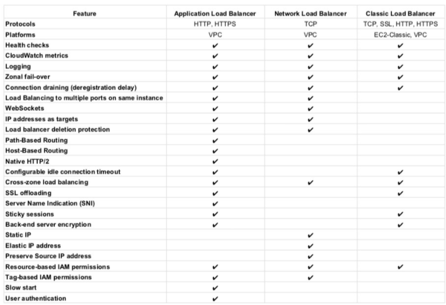

# **L5 AWS Compute Services Cheat Sheet**

## **1 Elastic Cloud Compute – EC2**

provides **scalable computing capacity**

### **1-1 Features**

* Virtual computing environments, known as **EC2 instances**
* Preconfigured templates for EC2 instances, known as **Amazon Machine Images (AMIs)**, that package the bits needed for the server (including the operating system and additional software)
* Various configurations of CPU, memory, storage, and networking capacity for your instances, known as **Instance types**
* Secure login information for your instances using key pairs (public-private keys where private is kept by user)
* Storage volumes for temporary data that’s deleted when you stop or terminate your instance, known as Instance store volumes
* Persistent storage volumes for data using **Elastic Block Store (EBS)**
* Multiple physical locations for your resources, such as instances and EBS volumes, known as **Regions and Availability Zones**
* A firewall to specify the protocols, ports, and source IP ranges that can reach your instances using **Security Groups**
* Static IP addresses, known as **Elastic IP addresses**
* Metadata, known as **tags**, can be created and assigned to EC2 resources
* Virtual networks that are logically isolated from the rest of the AWS cloud, and can optionally connect to on-premises network, known as **Virtual private clouds (VPCs)**

### **1-2 Amazon Machine Image – AMI**

* **template** from which EC2 instances can be launched quickly
* **does NOT span across regions**, and needs to be copied
* **can be shared with other specific AWS accounts or made public**

### **1-3 Instance Types**

* **T** for applications needing **general** usage
	* T2 instances are **Burstable Performance Instances** that provide a baseline level of CPU performance with the ability to burst above the baseline.
	* T2 instances accumulate **CPU Credits when they are idle, and consume CPU Credits when they are active.**
	* T2 **Unlimited Instances can sustain high CPU performance** for as long as a workload needs it at an additional cost.
* **R** for applications needing more **RAM or Memory**
* **C** for applications needing more **Compute**
* **M** for applications needing more **Medium or Moderate** performance on both Memory and CPU
* **I** for applications needing more **IOPS**
* **G** for applications needing more **GPU**

## **2 Instance Purchasing Option**

### **2-1 On-Demand Instances**

* pay for instances and compute capacity that you use by the hour
* no long-term commitments or up-front payments

### **2-2 Reserved Instances**

* provides lower hourly running costs by providing a billing discount
* capacity reservation is applied to instances
* suited if consistent, heavy, predictable usage
* provides benefits with Consolidate Billing
* **can be modified to switch Availability Zones or the instance size within the same instance type, given the instance size footprint (Normalization factor) remains the same**
* pay for the entire term regardless of the usage
* is not a physical instance that is launched, but rather a billing discount applied to the use of On-Demand Instances

### **2-3 Scheduled Reserved Instances**

* enable capacity reservations purchase that recurs on a daily, weekly, or monthly basis, with a specified start time and duration, for a one-year term.
* enable capacity reservations purchase that recurs on a daily, weekly, or monthly basis, with a specified start time and duration, for a one-year term.
* good choice for workloads that do not run continuously, but do run on a regular schedule

### **2-4 Spot Instances**

* **cost-effective choice but does NOT guarantee availability**
* applications flexible in the timing when they can run and also able to handle interruption by storing the state externally
* **provides a two-minute warning if the instance is to be terminated to save any unsaved work**
* Spot blocks can also be launched with a required duration, which are not interrupted due to changes in the Spot price
* Spot Fleet is a collection, or fleet, of Spot Instances, and optionally On-Demand Instances, which attempts to launch the number of Spot and On-Demand Instances to meet the specified target capacity

### **2-5 Dedicated Instances**

is a tenancy option that enables instances to run in VPC on **hardware that’s isolated, dedicated to a single customer**

### **2-6 Dedicated Host**

is a physical server with EC2 instance capacity fully dedicated to your use

Light, Medium, and Heavy Utilization Reserved Instances are no longer available for purchase and were part of the Previous Generation AWS EC2 purchasing model

## **3 Enhanced Networking**

* results in higher bandwidth, higher packet per second (PPS) performance, lower latency, consistency, scalability, and lower jitter
* **supported using Single Root – I/O Virtualization (SR-IOV) only on supported instance types**
* **is supported only with a VPC (not EC2 Classic), HVM virtualization type and available by default on Amazon AMI** but can be installed on other AMIs as well

## **4 Placement Group**

### **4-1 Cluster Placement Group**

* provide low latency, High-Performance Computing **via 10Gbps network**
* **is a logical grouping on instances within a Single AZ**
* don’t span availability zones, can span multiple subnets but subnets must be in the same AZ
* can span across peered VPCs for the same Availability Zones
* <mark>**An existing instance can be moved to a placement group**, or moved from one placement group to another, or removed from a placement group, given it is in the stopped state.</mark>
* for capacity errors, stop and start the instances in the placement group
* use homogenous instance types which support enhanced networking and launch all the instances at once

### **4-3 Spread Placement Groups**

* is a group of instances that are each placed on **distinct underlying hardware i.e. each instance on a distinct rack across AZ**
* recommended for applications that have a small number of critical instances that should be **kept separate from each othe**r.
* **reduces the risk of simultaneous failures that might occur** when instances share the same underlying hardware.

### **4-4 Partition Placement Groups**

* is a group of instances spread across partitions i.e. **group of instances spread across racks across AZs**
* reduces the likelihood of correlated hardware failures for the application.
* can be used to spread deployment of large distributed and replicated workloads, such as HDFS, HBase, and Cassandra, across distinct hardware

## **5 EC2 Monitoring**

* CloudWatch provides monitoring for EC2 instances
* Status monitoring helps quickly determine whether EC2 has detected any problems that might prevent instances from running applications.
* Status monitoring includes
	* System Status checks – indicate issues with the underlying hardware
	* Instance Status checks – indicate issues with the underlying instance.

 Elastic Load Balancer

## **6 Elastic Load Balancer**

* Managed load balancing service and scales automatically
* distributes incoming application traffic across multiple EC2 instances
* is distributed system that is fault tolerant and actively monitored by AWS scales it as per the demand
* **are engineered to not be a single point of failure**
* **<mark>need to Pre-Warm ELB if the demand is expected to shoot especially during load testing. AWS documentation does not mention it now.</mark>**
* supports routing traffic to instances in multiple AZs in the same region
* performs **Health Checks to route traffic** only to the healthy instances
* support Listeners with HTTP, HTTPS, SSL, TCP protocols
* has an associated IPv4 and dual stack DNS name
* can **offload the work of encryption and decryption (SSL termination) so that the EC2 instances can focus on their main work**
* supports Cross Zone load balancing to help route traffic evenly across all EC2 instances regardless of the AZs they reside in
* to help identify the IP address of a client
	* supports Proxy Protocol header for TCP/SSL connections
	* supports X-Forward headers for HTTP/HTTPS connections
* supports **Stick Sessions (session affinity) to bind a user’s session** to a specific application instance,
	* **it is not fault tolerant, if an instance is lost the information is lost**
	* requires HTTP/HTTPS listener and does not work with TCP
	* requires SSL termination on ELB as it users the headers
* supports **Connection draining to help complete the in-flight requests in case an instance is deregistered**
* For High Availability, it is recommended to attach one subnet per AZ for **at least two AZs**, even if the instances are in a single subnet.
* supports Static/Elastic IP (NLB only)
* IPv4 & IPv6 support however VPC does not support IPv6. VPC now supports IPV6.
* **HTTPS listener does not support Client Side Certificate**
* For SSL termination at backend instances or support for Client Side Certificate use TCP for connections from the client to the ELB, **use the SSL protocol for connections from the ELB to the back-end application, and deploy certificates on the back-end instances handling requests**
* Uses **Server Name Indication to supports multiple SSL certificates**

## **7 Application Load Balancer**

* supports **HTTP and HTTPS (Secure HTTP) protocols**
* supports **HTTP/2**, which is enabled natively. **Clients that support HTTP/2 can connect over TLS**
* supports **WebSockets** and **Secure WebSockets** natively
* supports **Request tracing**, by default.
	* request tracing can be used to track HTTP requests from clients to targets or other services.
	* Load balancer upon receiving a request from a client, adds or updates the **X-Amzn-Trace-Id header** before sending the request to the target
* supports **containerized applications**. **Using Dynamic port mapping**, ECS can select an unused port when scheduling a task and register the task with a target group using this port.
* **supports Sticky Sessions (Session Affinity) using load balancer generated cookies**, to route requests from the same client to the same target
* supports **SSL termination, to decrypt the request on ALB before sending it to the underlying targets**.
* supports **layer 7 specific features like X-Forwarded-For** headers to help determine the actual client IP, port and protocol
* automatically **scales** its request handling capacity in response to incoming application traffic.
* supports hy**brid load balancing, to route traffic to instances in VPC and an on-premises location**
* provides **High Availability**, by allowing more than one AZ to be specified
* integrates with **ACM** to **provision and bind a SSL/TLS certificate** to the load balancer thereby making the entire SSL offload process very easy
* supports **multiple certificates** for the same domain to a secure listener
* supports **IPv6** addressing, for an Internet facing load balancer
* supports **Cross-zone load balancing**, and cannot be disabled.
* supports **Security Groups** to **control the traffic allowed to and from the load balancer**.
* provides **Access Logs, to record all requests sent the load balancer**, and store the logs in S3 for later analysis in compressed format
* provides **Delete Protection**, to prevent the **ALB from accidental deletion**
* supports **Connection Idle Timeout** – A**LB maintains two connections for each request one with the Client (front end) and one with the target instance (back end)**. If no data has been sent or received by the time that the idle timeout period elapses, ALB closes the front-end connection
* integrates with **CloudWatch to provide metrics such as request counts**, error counts, error types, and request latency
* integrates with **AWS WAF, a web application firewall that helps protect web applications from attacks by allowing rules configuration** based on IP addresses, HTTP headers, and custom URI strings
* **integrates with CloudTrail** to receive a history of ALB API calls made on the AWS account
* **<mark>back-end server authentication is NOT supported</mark>**
* **<mark>does not provide Static, Elastic IP addresses</mark>**

## **8 Network Load Balancer**

* handles **volatile workloads** and **scale to millions of requests per second, without the need of pre-warming**
* offers **extremely low latencies** for latency-sensitive applications
* provides **static IP/Elastic IP addresses** for the load balancer
* allows **registering targets by IP address, including targets outside the VPC (on-premises) for the load balancer**.
* supports **containerized applications**. Using Dynamic port mapping, ECS can select an unused port when scheduling a task and register the task with a target group using this port.
* monitors the health of its registered targets and routes the traffic only to healthy targets
* enable **cross-zone loading balancing** only after creating the NLB
* preserves **client side source IP** allowing the back-end to see client IP address. 
	* Target groups can be created with target type as instance ID or IP address. 
	* If targets registered by instance ID, the source IP addresses of the clients are preserved and provided to the applications.
	*  If register targets registered by IP address, the source IP addresses are the private IP addresses of the load balancer nodes.
* supports **both network and application target health checks**.
* supports long-lived TCP connections ideal for WebSocket type of applications
* supports **Zonal Isolation**, which is designed for application architectures in a single zone and can be enabled in a single AZ to support architectures that require zonal isolation
* **<mark>does not support stick sessions</mark>**

## **9 Auto Scaling**

* ensures correct number of EC2 instances are always running to handle the load by scaling up or down automatically as demand changes
* **<mark>cannot span multiple regions</mark>**.
* *attempts to distribute instances evenly between the AZs* that are enabled for the Auto Scaling group
* performs checks either using EC2 status checks or can use ELB health checks to determine the health of an instance and terminates the instance if unhealthy, to launch a new instance
* **can be scaled using manual scaling, scheduled scaling or demand based scaling**
* **cooldown period** helps ensure instances are not launched or terminated before the previous scaling activity takes effect to allow the newly launched instances to start handling traffic and reduce load

## **10 AWS Auto Scaling & ELB**

* Auto Scaling & ELB can be used for **High Availability and Redundancy** by spanning Auto Scaling groups across multiple AZs within a region and then setting up ELB to distribute incoming traffic across those AZs
* **With Auto Scaling, use ELB health check with the instances to ensure that traffic is routed only to the healthy instances**
