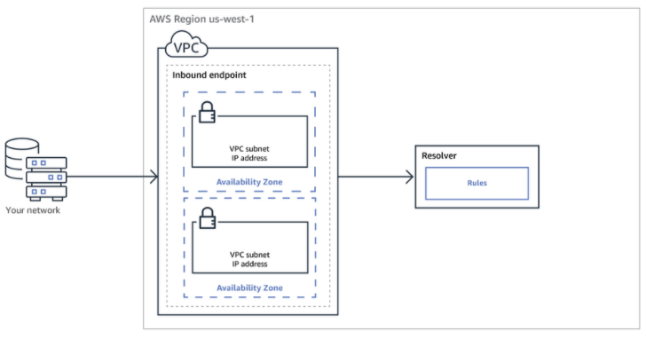

# **L11 AWS Route 53 Resolver**

## **1 AWS Route 53 – Resolving DNS Queries Between VPCs and On-premises Network**

* Route 53 Resolver provides automatic DNS resolution within the VPC.
* By default, Resolver answers DNS queries for VPC domain names such as **domain names for EC2 instances or ELB load balancers**.
* Resolver performs recursive lookups against public name servers for all other domain names.
* However, **on-premises instances cannot resolve Route 53 DNS entries and Route 53 cannot resolve on-premises DNS entries**
* DNS resolution between AWS VPC and on-premises network can be configured over a Direct Connect or VPN connection
* **<mark>Route 53 Resolver is regional</mark>**.
* **To use inbound or outbound forwarding, create a Resolver endpoint in the VPC**.
* As part of the definition of an endpoint, specify the IP addresses to forward inbound DNS queries to or the IP addresses that outbound queries to originate from. 
	* **For each IP address specified, Resolver automatically creates a VPC elastic network interface**.

## **2 Forward DNS queries from resolvers on your network to Route 53 Resolver**

* **DNS resolvers on on-premises network can forward DNS queries to Resolver in a specified VPC**.
* This enables DNS resolvers to easily resolve domain names for AWS resources such as EC2 instances or records in a Route 53 private hosted zone. 

## **3 Conditionally forward queries from a VPC to resolvers on your network**

* Route 53 Resolver can be configured to forward queries that it receives from EC2 instances in the VPCs to DNS resolvers on on-premises network.
* To forward selected queries, Resolver rules can be created that specify the domain names for the DNS queries that you want to forward (such as example.com), and the IP addresses of the DNS resolvers on on-premises network that you want to forward the queries to.
* If a query matches multiple rules (example.com, acme.example.com), Resolver chooses the rule with the most specific match (acme.example.com) and forwards the query to the IP addresses that you specified in that rule. 