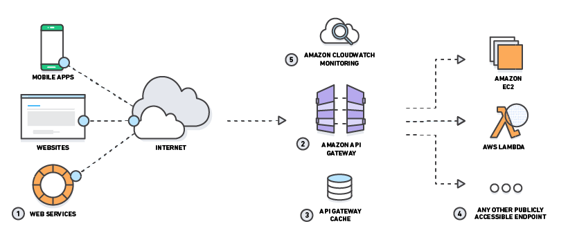
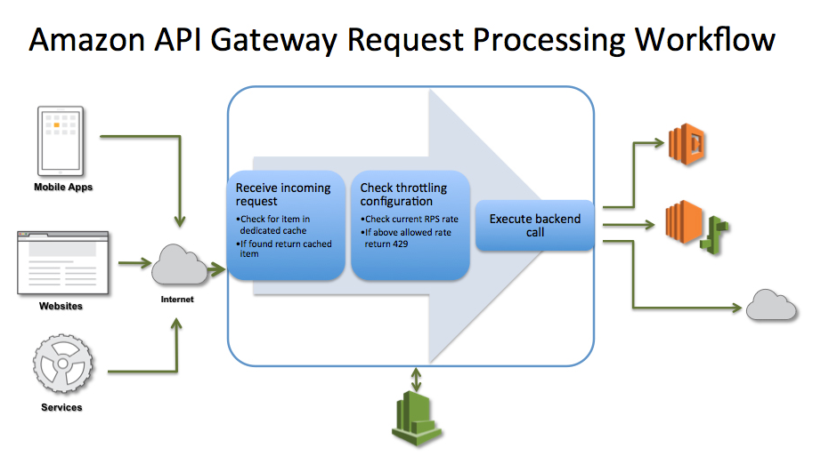

# **L12 AWS API Gateway**

## **1 AWS API Gateway**

* **AWS API Gateway is a fully managed service that makes it easy for developers to publish, maintain, monitor, and secure APIs at any scale**
* API Gateway handles all of the tasks involved in accepting and processing up to hundreds of thousands of concurrent API calls, including traffic management, authorization and access control, monitoring, and API version management.
* **API Gateway has no minimum fees or startup costs and charges only for the API calls received and the amount of data transferred out**.
* **API Gateway acts as a proxy to the configured backend operations**.
* API Gateway scales automatically to handle the amount of traffic the API receives
* **API Gateway expose HTTPS endpoints only for all the APIs created**. It does not support unencrypted (HTTP) endpoints
* APIs built on API Gateway can accept any payloads sent over HTTP with typical data formats include JSON, XML, query string parameters, and request headers
* API Gateway can communicate to multiple backends
	* Lambda functions
	* AWS Step functions state machines
	* HTTP endpoints exposed through Elastic Beanstalk, ELB or EC2 servers
	* **Non AWS hosted HTTP based operations accessible via public Internet**
* API Gateway endpoints are always public to the Internet and does not run within an VPC. 
	* **Proxy requests to backend operations also need to be publicly accessible on the Internet**.

API Gateway helps with several aspects of creating and managing APIs

### **Metering**

* automatically meters traffic to the APIs and and lets you extract utilization data for each API key.
* define plans that meter, restrict third-party developer access, configure throttling, and quota limits on a per API key basis

### **Security**

* helps removing authorization concerns from the backend code
* allows leveraging of AWS administration and security tools, such as IAM and Cognito, to authorize access to APIs
* can verify signed API calls on your behalf using the same methodology AWS uses for its own APIs
* supports custom authorizers written as Lambda functions and verify incoming bearer tokens
* automatically protects the backend systems from distributed denial-of-service (DDoS) attacks, whether attacked with counterfeit requests (Layer 7) or SYN floods (Layer 3).

### **Resiliency**

* helps manage traffic with throttling so that backend operations can withstand traffic spikes
* helps improve the performance of the APIs and the latency end users experience by caching the output of API calls to avoid calling the backend every time.

### **Operations Monitoring**

* integrates with CloudWatch and provides a metrics dashboard to monitor calls to API services
* integrates with CloudWatch Logs to receive error, access or debug logs
* provides with backend performance metrics covering API calls, latency data and error rates.

### **Lifecycle Management**

* allows multiple API versions and multiple stages (development, staging, production etc.) for each version simultaneously so that existing applications can continue to call previous versions after new API versions are published.
* saves the history of the deployments, which allows rollback of a stage to a previous deployment at any point, using APIs or console

### **Designed for Developers**

* allows you to specify a mapping template to generate static content to be returned, helping you mock APIs before the backend is ready
* helps reduce cross-team development effort and time-to-market for applications and allow dependent teams to begin development while backend processes is still built

## **2 API Gateway Throttling and Caching**

### **Throttling**

* API Gateway provides throttling at multiple levels including global and by service call and limits can be set for standard rates and bursts
* It tracks the number of requests per second. Any requests over the limit will receive a 429 HTTP response
* Throttling ensures that API traffic is controlled to help the backend services maintain performance and availability.

### **Caching**

* API Gateway provides API result caching by provisioning an API Gateway cache and specifying its size in gigabytes
* Caching helps improve performance and reduces the traffic sent to the back end
* API Gateway handles the request in the following manner
	* If caching is not enabled and throttling limits have not been applied, then all requests pass through to the backend service until the account level throttling limits are reached.
	* If throttling limits specified, then API Gateway will shed necessary amount of requests and send only the defined limit to the back-end
	* If a cache is configured, then API Gateway will return a cached response for duplicate requests for a customizable time, but only if under configured throttling limits

* API Gateway does not arbitrarily limit or throttle invocations to the backend operations and all requests that are not intercepted by throttling and caching settings are sent to your backend operations.

You are running a mobile media application and are considering API Gateway for the client entry point. What benefits would this provide? Choose 2 answers

* **Caching API responses**
* IP blacklisting
* Intrusion prevention
* Load balancing
* **Throttling traffic**
