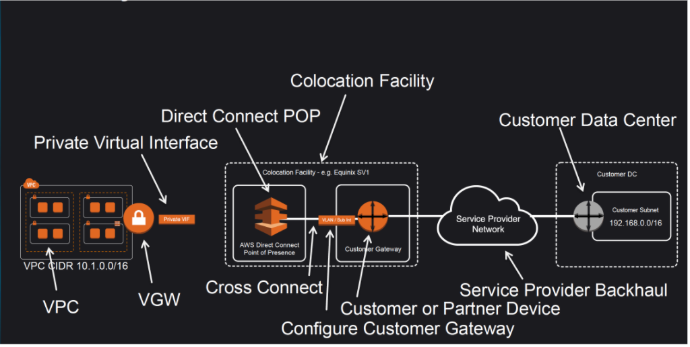
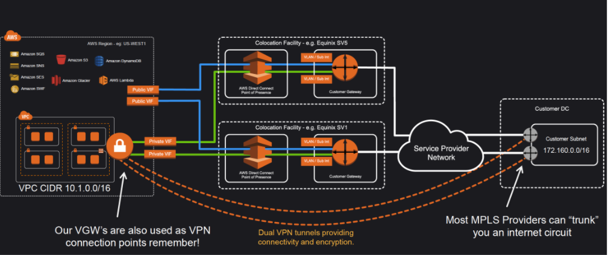

# **14 AWS Direct Connect – DX**

## **1 Direct Connect Overview**

* **AWS Direct Connect is a network service that provides an alternative to using the Internet to utilize AWS cloud services**
* AWS Direct Connect links **your internal network to an AWS Direct Connect location over a standard 1 gigabit or 10 gigabit Ethernet fiber-optic cable with one end of the cable connected to your router,** the other to an AWS Direct Connect router.
* Direct Connect connection can be established with **1Gbps and 10Gbps ports. Speeds of 50Mbps, 100Mbps, 200Mbps, 300Mbps, 400Mbps, and 500Mbps can be ordered from any APN partners supporting AWS Direct Connect**.
* AWS Direct Connect helps to create virtual interfaces directly to the AWS cloud for e.g, to EC2 & S3 and to Virtual Private Cloud (VPC), bypassing Internet service providers in the network path.
* AWS Direct Connect location provides access to Amazon Web Services in the region it is associated with, as well as access to other US regions (in case of a Direct Connect in a US region). for e.g. , **you can provision a single connection to any AWS Direct Connect location in the US and use it to access public AWS services in all US Regions and AWS GovCloud (US).**
* **Each AWS Direct Connect location enables connectivity to all Availability Zones within the geographically nearest AWS region**.

## **2 Direct Connect Advantages**

### **2-1 Reduced Bandwidth Costs**

* All data transferred over the dedicated connection is charged at the reduced AWS Direct Connect data transfer rate rather than Internet data transfer rates.
* **Transferring data to and from AWS directly reduces your bandwidth commitment to your Internet service provider**

### **2-2 Consistent Network Performance**

Direct Connect provides a dedicated connection and a more consistent network performance experience as compared to the Internet which can widely vary

### **2-3 AWS Services Compatibility**

Direct Connect is a network service and works with all of the AWS services like S3, EC2 and VPC

### **2-4 Private Connectivity to AWS VPC**

Using Direct Connect Private Virtual Interface a private, dedicated, high bandwidth network connection can be established between your network and VPC

### **2-5 Elastic**

Direct Connect can be easily scaled to meet the needs by either using a higher bandwidth connection or by establishing multiple connections.

## **3 Direct Connect vs IPSec VPN Connections**

* A VPC VPN Connection utilizes IPSec to establish encrypted network connectivity between your intranet and Amazon VPC over the Internet.
* VPN Connections **can be configured in minutes** and are a good solution for immediate needs, have low to modest bandwidth requirements, and can tolerate the inherent variability in Internet-based connectivity.
* **<mark>AWS Direct Connect does not involve the Internet; instead, it uses dedicated, private network connections between your intranet and Amazon VPC</mark>**
* **VPN connections are very cheap ($37.20/month as of now)** as compared to Direct Connect connection as it requires actual hardware and infrastructure and might go in thousands.

## **4 Direct Connect Anatomy**

* Amazon maintains **AWS Direct Connect PoP** across different locations (referred to as Colocation Facilities) which are different from AWS regions
* Connection from the AWS Direct Connect PoP to the AWS regions is maintained by AWS itself
* As a consumer, you can either purchase a rack space or use any of the AWS APN Partner which already have the infrastructure within the Colocation Facility and configure a **Customer Gateway**
* Connection between the AWS Direct Connect PoP and the Customer gateway within the Colocation Facility is called **Cross Connect**.
* Connection from the Customer Gateway to the Customer Data Center can be establish using any Service Provider Network
* Once a Direct Connect connection is created with AWS,  a LOA-CFA (Letter Of Authority – Connecting Facility Assignment) would be received.
* LOA-CFA can be handover to the Colocation Facility or the APN Partner to establish the Cross Connect
* Once the Cross Connect and the connectivity between the CGW and Customer DataCenter is established, **Virtual Interfaces** can be created
* **AWS Direct Connect requires a VGW to access the AWS VPC**

### **Virtual Interfaces**

* Each AWS Direct Connect connection **requires a Virtual Interface**
* Each AWS Direct Connect connection **can be configured with one or more virtual interfaces**.
* Public Virtual Interface **can be created to connect to public resources for e.g. SQS, S3, EC2, Glacier etc which are reachable publicly only**.
* Private virtual interface can be created to connect to the VPC for e.g. instances with private ip address
* **Each virtual interface needs a VLAN ID, interface IP address, ASN, and BGP key.**

* To use your AWS Direct Connect connection with another AWS account, you can create a hosted virtual interface for that account. These hosted virtual interfaces work the same as standard virtual interfaces and can connect to public resources or a VPC.

## **5 Direct Connect Redundancy**

* Direct Connect connections do not provide redundancy and have multiple single point of failures wrt to the hardware devices as each connection consists of a single dedicated connection between ports on your router and an Amazon router
* **Redundancy can be provided by**
	* **Establishing a second Direct Connect connection, preferably in a different Colocation Facility using different router and AWS Direct Connect PoP**
	* **IPsec VPN connection between the Customer DC to the VGW**
* For Multiple ports requested in the same AWS Direct Connect location, Amazon itself makes sure they are provisioned on redundant Amazon routers to prevent impact from an hardware failure

## **6 Direct Connect LAG**

* A link aggregation group (LAG) is a logical interface that uses the Link Aggregation Control Protocol (LACP) to aggregate multiple connections at a single AWS Direct Connect endpoint, treating them as a single, managed connection.
* LAG can be created from existing connections, or you can provision new connections.
* Existing connections (whether standalone or part of another LAG) with the LAG can be associated after LAG creation
* **LAG needs following rules**
	* **All connections in the LAG must use the same bandwidth**.
	* Maximum of four connections in a LAG. Each connection in the LAG counts towards the overall connection limit for the Region.
	* **All connections in the LAG must terminate at the same AWS Direct Connect endpoint**.

## **7 AWS Certification Exam**

1. You are building a solution for a customer to extend their on-premises data center to AWS. The customer requires a 50-Mbps dedicated and private connection to their VPC. Which AWS product or feature satisfies this requirement?
	* Amazon VPC peering
	* Elastic IP Addresses
	* **AWS Direct Connect**
	* Amazon VPC virtual private gateway

2. Is there any way to own a direct connection to Amazon Web Services?
	* You can create an encrypted tunnel to VPC, but you don’t own the connection.
	* Yes, it’s called Amazon Dedicated Connection.
	* No, AWS only allows access from the public Internet.
	* **Yes, it’s called Direct Connect**

3. An organization has established an Internet-based VPN connection between their on-premises data center and AWS. They are considering migrating from VPN to AWS Direct Connect. Which operational concern should drive an organization to consider switching from an Internet-based 
VPN connection to AWS Direct Connect?
	* AWS Direct Connect provides greater redundancy than an Internet-based VPN connection.
	* AWS Direct Connect provides greater resiliency than an Internet-based VPN connection.
	* **AWS Direct Connect provides greater bandwidth than an Internet-based VPN connection**.
	* AWS Direct Connect provides greater control of network provider selection than an Internet-based VPN connection.

4. Does AWS Direct Connect allow you access to all Availabilities Zones within a Region?
	* Depends on the type of connection
	* No
	* **Yes**
	* Only when there’s just one availability zone in a region. If there are more than one, only one availability zone can be accessed directly.

5. A customer has established an AWS Direct Connect connection to AWS. The link is up and routes are being advertised from the customer’s end, however the customer is unable to connect from EC2 instances inside its VPC to servers residing in its datacenter. Which of the following options provide a viable solution to remedy this situation? (Choose 2 answers)
	* Add a route to the route table with an IPSec VPN connection as the target (deals with VPN)
	* **Enable route propagation to the Virtual Private Gateway (VGW)**
	* Enable route propagation to the customer gateway (CGW) (route propagation is enabled on VGW)
	* Modify the route table of all Instances using the ‘route’ command. (no route command available)
	* **Modify the Instances VPC subnet route table by adding a route back to the customer’s on-premises environment**.

6. A company has configured and peered two VPCs: VPC-1 and VPC-2. VPC-1 contains only private subnets, and VPC-2 contains only public subnets. The company uses a single AWS Direct Connect connection and private virtual interface to connect their on-premises network with VPC-1. Which two methods increase the fault tolerance of the connection to VPC-1? Choose 2 answers
	* Establish a hardware VPN over the internet between VPC-2 and the on-premises network. (Peered VPC does not support Edge to Edge Routing)
	* Establish a hardware VPN over the internet between VPC-1 and the on-premises network
	* Establish a new AWS Direct Connect connection and private virtual interface in the same region as VPC-2 (Peered VPC does not support Edge to Edge Routing)
	* Establish a new AWS Direct Connect connection and private virtual interface in a different AWS region than VPC-1 (need to be in the same region as VPC-1)
	* Establish a new AWS Direct Connect connection and private virtual interface in the same AWS region as VPC-1

7. Your company previously configured a heavily used, dynamically routed VPN connection between your on premises data center and AWS. You recently provisioned a Direct Connect connection and would like to start using the new connection. After configuring Direct Connect settings in the AWS Console, which of the following options will provide the most seamless transition for your users?
	* Delete your existing VPN connection to avoid routing loops configure your Direct Connect router with the appropriate settings and verity network traffic is leveraging Direct Connect.
	* Configure your Direct Connect router with a higher BGP priority than your VPN router, verify network traffic is leveraging Direct Connect and then delete your existing VPN connection.
	* **Update your VPC route tables to point to the Direct Connect connection configure your Direct Connect router with the appropriate settings verify network traffic is leveraging Direct Connect and then delete the VPN connection**.
	* Configure your Direct Connect router, update your VPC route tables to point to the Direct Connect connection, configure your VPN connection with a higher BGP priority. And verify network traffic is leveraging the Direct Connect connection

8. You are designing the network infrastructure for an application server in Amazon VPC. Users will access all the application instances from the Internet as well as from an on-premises network The on-premises network is connected to your VPC over an AWS Direct Connect link. How would you design routing to meet the above requirements?
	* Configure a single routing Table with a default route via the Internet gateway. Propagate a default route via BGP on the AWS Direct Connect customer router. Associate the routing table with all VPC subnets (propagating default route would cause conflict)
	* **Configure a single routing table with a default route via the internet gateway. Propagate specific routes for the on-premises networks via BGP on the AWS Direct Connect customer router. Associate the routing table with all VPC subnets**.
	* Configure a single routing table with two default routes: one to the internet via an Internet gateway the other to the on-premises network via the VPN gateway use this routing table across all subnets in your VPC. (there cannot be 2 default routes)
	* Configure two routing tables one that has a default route via the Internet gateway and another that has a default route via the VPN gateway Associate both routing tables with each VPC subnet. (as the instances has to be in public subnet and should have a single routing table associated with them)

9. You are implementing AWS Direct Connect. You intend to use AWS public service end points such as Amazon S3, across the AWS Direct Connect link. You want other Internet traffic to use your existing link to an Internet Service Provider. What is the correct way to configure AWS Direct Connect for access to services such as Amazon S3?
	* Configure a public Interface on your AWS Direct Connect link. Configure a static route via your AWS Direct Connect link that points to Amazon S3. Advertise a default route to AWS using BGP.
	* Create a private interface on your AWS Direct Connect link. Configure a static route via your AWS Direct connect link that points to Amazon S3 Configure specific routes to your network in your VPC.
	* **Create a public interface on your AWS Direct Connect link. Redistribute BGP routes into your existing routing infrastructure advertise specific routes for your network to AWS**
	* Create a private interface on your AWS Direct connect link. Redistribute BGP routes into your existing routing infrastructure and advertise a default route to AWS.

10. You have been asked to design network connectivity between your existing data centers and AWS. Your application’s EC2 instances must be able to connect to existing backend resources located in your data center. Network traffic between AWS and your data centers will start small, but ramp up to 10s of GB per second over the course of several months. The success of your application is dependent upon getting to market quickly. Which of the following design options will allow you to meet your objectives?
	* Quickly create an internal ELB for your backend applications, submit a DirectConnect request to provision a 1 Gbps cross connect between your data center and VPC, then increase the number or size of your DirectConnect connections as needed.
	* Allocate EIPs and an Internet Gateway for your VPC instances to use for quick, temporary access to your backend applications, then provision a VPN connection between a VPC and existing on -premises equipment.
	* **Provision a VPN connection between a VPC and existing on -premises equipment, submit a DirectConnect partner request to provision cross connects between your data center and the DirectConnect location, then cut over from the VPN connection to one or more DirectConnect connections as needed.**
	* Quickly submit a DirectConnect request to provision a 1 Gbps cross connect between your data center and VPC, then increase the number or size of your DirectConnect connections as needed.

11. You are tasked with moving a legacy application from a virtual machine running inside your datacenter to an Amazon VPC. Unfortunately this app requires access to a number of on-premises services and no one who configured the app still works for your company. Even worse there’s no documentation for it. What will allow the application running inside the VPC to reach back and access its internal dependencies without being reconfigured? (Choose 3 answers)
	* **An AWS Direct Connect link between the VPC and the network housing the internal services**
	* An Internet Gateway to allow a VPN connection. (Virtual and Customer gateway is needed)
	* An Elastic IP address on the VPC instance (Don’t need a EIP as private subnets can also interact with on-premises network)
	* **An IP address space that does not conflict with the one on-premises** (IP address cannot conflict)
	* Entries in Amazon Route 53 that allow the Instance to resolve its dependencies’ IP addresses (Route 53 is not required)
	* **A VM Import of the current virtual machine** (VM Import to copy the VM to AWS as there is no documentation it can’t be configured from scratch)