# **L1 AWS Virtual Private Cloud – VPC**

## **1 VPC Overview & Components**

A virtual private cloud (VPC) is a virtual network dedicated to the AWS account. It is logically isolated from other virtual networks in the AWS cloud.

VPC allows the user to select IP address range, create subnets, and configure route tables, network gateways, and security settings.

### **1-1 VPC Sizing**

* VPC needs a set of IP addresses in the form of a Classless Inter-Domain Routing (CIDR) block for e.g, `10.0.0.0/16`, which allows `2^16 (65536)` IP address to be available 
* Allowed CIDR block size is between
	* `/28` netmask (minimum with `2^4`– 16 available IP address) and
	* `/16` netmask (maximum with `2^16` – 65536 IP address)

* CIDR block from private (non-publicly routable) IP address can be assigned
	* `10.0.0.0 – 10.255.255.255` (10/8 prefix)
	* `172.16.0.0 – 172.31.255.255` (172.16/12 prefix)
	* `192.168.0.0 – 192.168.255.255` (192.168/16 prefix)

* It’s possible to specify a range of publicly routable IP addresses; however, direct access to the Internet is not currently supported from publicly routable CIDR blocks in a VPC

* **<mark>NOTE – You can now resize VPC</mark>**

* Each VPC is separate from any other VPC created with the same CIDR block even if it resides within the same AWS account

* VPC allows **VPC Peering** connections with other VPC within the same or different AWS accounts

* **Connection between your VPC and corporate or home network can be established**, **however the CIDR blocks should be not be overlapping** for e.g. **<mark>VPC with CIDR 10.0.0.0/16 can communicate with 10.1.0.0/16 corporate network but the connections would be dropped if it tries to connect to 10.0.37.0/16 corporate network cause of overlapping ip addresses.</mark>**

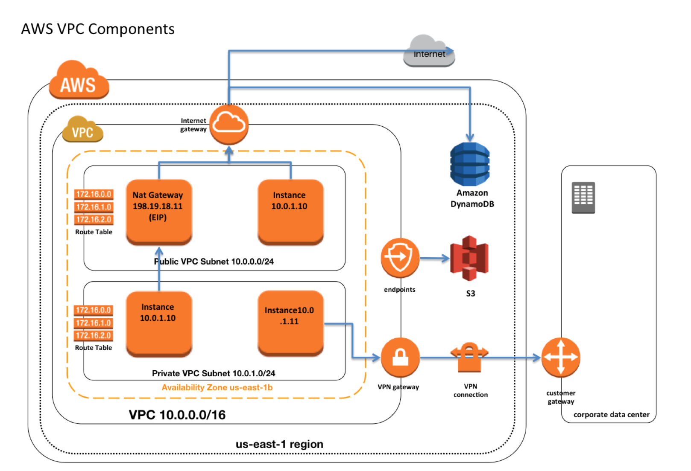

### **1-2 VPC Peering**

VPC allows VPC Peering connections with other VPC within the same or different AWS accounts

**VPC Peering Overview**

* A VPC peering connection is a networking connection between two VPCs that enables routing of traffic between them using private IP addresses.
* Instances in either VPC can communicate with each other as if they are within the same network
* VPC peering connection can be established between your own VPCs, or with a VPC in another AWS account in a single different region.
* AWS uses the existing infrastructure of a VPC to create a VPC peering connection; it is neither a gateway nor a VPN connection, and does not rely on a separate piece of physical hardware.
* **There is no single point of failure for communication or a bandwidth bottleneck**

**VPC Peering Rules & Limitations**

* VPC peering connection cannot be created between VPCs that have matching or overlapping CIDR blocks.
* **VPC Peering is now supported inter-region**
* VPC peering connection are limited on the number active and pending VPC peering connections that you can have per VPC.
* **<mark>VPC peering does not support transitive peering relationships</mark>**. 
	* In a VPC peering connection, the VPC does not have access to any other VPCs that the peer VPC may be peered with even if established entirely within your own AWS account
* **VPC peering does not support Edge to Edge Routing Through a Gateway or Private Connection**
* In a VPC peering connection, the VPC **does not have access** to any other connection that the peer VPC may have and vice versa. Connections that the peer VPC can include
* **A VPN connection or an AWS Direct Connect connection to a corporate network**
	* **An Internet connection through an Internet gateway**
	* **An Internet connection in a private subnet through a NAT device**
	* **A ClassicLink connection to an EC2-Classic instance**
	* **A VPC endpoint to an AWS service; for example, an endpoint to S3**.
* Only one VPC peering connection can be established between the same two VPCs at the same time
* Maximum Transmission Unit (MTU) across a VPC peering connection is 1500 bytes.
* A placement group can span peered VPCs that are **<mark>in the same region</mark>;** however, you do not get full-bisection bandwidth between instances in peered VPCs
* Any tags created for the VPC peering connection are only applied in the account or region in which they were created
* **Unicast reverse path forwarding in VPC peering connections is not supported**
* **Instance’s Public DNS can now be resolved to its private IP address across peered VPCs**

**VPC Peering Architecture**

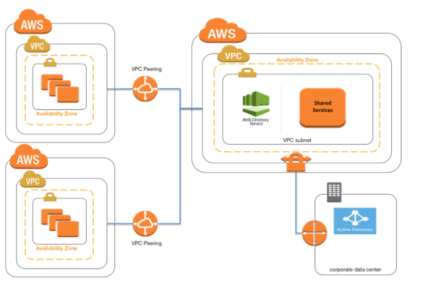

* VPC Peering can be applied to create shared services or perform authentication with an on-premises instance
* This would help creating a single point of contact, as well limiting the VPN connections to a single account or VPC

**Questions**

A company has an AWS account that contains **three VPCs (Dev, Test, and Prod) in the same region.** Test is peered to both Prod and Dev. All VPCs have non-overlapping CIDR blocks. The company wants to push minor code releases from Dev to Prod to speed up time to market. Which of the following options helps the company accomplish this?

* **Create a new peering connection Between Prod and Dev along with appropriate routes.**
* Create a new entry to Prod in the Dev route table using the peering connection as the target.
* Attach a second gateway to Dev. Add a new entry in the Prod route table identifying the gateway as the target.
* The VPCs have non-overlapping CIDR blocks in the same account. The route tables contain local routes for all VPCs.
* **VPC allows you to set tenancy option for the Instances launched in it**. By default, the tenancy option is shared. If dedicated option selected, all the instances within it are launched on a dedicated hardware overriding the individual instance tenancy setting
* Deletion of the VPC is possible only after terminating all instances within the VPC, and ***deleting all the components with the VPC for e.g. subnets, security groups, network ACLs, route tables, Internet gateways, VPC peering connections, and DHCP options***

## **2 IP Addresses**

Instances launched in the VPC can have Private, Public and Elastic IP address assigned to it and are properties of ENI (Network Interfaces)

**Private IP Addresses**

* Private IP addresses are not reachable over the Internet, and can be used for **communication only between the instances within the VPC**
* **All instances are assigned a private IP address**, within the IP address range of the subnet, to the default network interface
* **Primary IP** address is associated with the network interface for its lifetime, even when the instance is stopped and restarted and **is released only when the instance is terminated**
* Additional Private IP addresses, known as secondary private IP address, can be assigned to the instances and these can be reassigned from one network interface to another

**Public IP address**

* **Public IP addresses are reachable over the Internet**, and can be used for communication between instances and the Internet, or with other AWS services that have public endpoints
* Public IP address assignment to the Instance **depends if the Public IP Addressing is enabled for the Subnet**.
* **Public IP address can also be assigned to the Instance by enabling the Public IP addressing during the creation of the instance**, which overrides the subnet’s public IP addressing attribute
* Public IP address is assigned from **AWS pool of IP addresses and it is not associated with the AWS account** and hence is released when the instance is stopped and restarted or terminated.

**Elastic IP address**

* **<mark>Elastic IP addresses are static, persistent public IP addresses which can be associated and disassociated with the instance, as required</mark>**
* **Elastic IP address is allocated at an VPC and owned by the account unless released**
* **A Network Interface can be assigned either a Public IP or an Elastic IP**. If you assign an instance, already having an Public IP, an Elastic IP, the public IP is released
* **Elastic IP addresses can be moved from one instance to another**, which can be within the same or different VPC within the same account
* Elastic IP are charged for non usage i.e. if it is not associated or associated with a stopped instance or an unattached Network Interface

## **3、Elastic Network Interface (ENI)**

* Each Instance is attached with **default elastic network interface** (**Primary Network Interface eth0**) and **cannot be detached from the instance**
* ENI can include the following attributes
	* **Primary private IP address**
	* **One or more secondary private IP addresses**
	* **One Elastic IP address per private IP address**
	* **One public IP address, which can be auto-assigned to the network interface for eth0** when you launch an instance, but only when you create a network interface for eth0 instead of using an existing ENI
	* **One or more security groups**
	* A MAC address
	* A source/destination check flag
	* A description
* **ENI’s attributes** follow the *ENI as it is attached or detached from an instance and reattached to another instance*. When an ENI is moved from one instance to another, network traffic is redirected to the new instance.
* **Multiple ENIs can be attached to an instance** and is useful for use cases:
	* Create a management network.
	* Use network and security appliances in your VPC.
	* Create dual-homed instances with workloads/roles on distinct subnets.
	* Create a low-budget, high-availability solution.

	
## **4 Route Tables**

* Route table **defines rules, termed as routes**, **which determine where network traffic from the subnet would be routed**
* Each VPC has a **implicit router to route network traffic**
* Each VPC has a **Main Route table, and can have multiple custom route tables created**
* **Each Subnet within a VPC must be associated with a single route table at a time,** while a route table can have multiple subnets associated with it
* Subnet, if not explicitly associated to a route table, is implicitly associated with the main route table
* **Every route table contains a local route that enables communication within a VPC which cannot be modified or deleted**
* **Route priority is decided by matching the most specific route in the route table that matches the traffic**
* **Route tables needs to be updated to defined routes for Internet gateways**, Virtual Private gateways, VPC Peering, VPC Endpoints, NAT Device etc.

## **5 Internet Gateways – IGW**

* An Internet gateway is a **horizontally scaled, redundant, and highly available VPC component that allows communication between instances in the VPC and the Internet**.
* IGW imposes no availability risks or bandwidth constraints on the network traffic.
* An Internet gateway serves two purposes:
	* **To provide a target in the VPC route tables for Internet-routable traffic,**
	* **To perform network address translation (NAT) for instances that have been NOT been assigned public IP addresses**.

### **5-1 Enabling Internet access to an Instance requires**

* **Attaching Internet gateway to the VPC**
* **Subnet should have route tables associated with the route pointing to the Internet gateway**
* Instances should have a Public IP or Elastic IP address assigned
* **Security groups and NACLs associated with the Instance should allow relevant traffic**

## **6 NAT**

* **NAT device enables instances in a private subnet to connect to the Internet or other AWS services**, but prevents the Internet from initiating connections with the instances.
* *NAT devices do not support IPv6 traffic, use an <MARK>egress-only Internet gateway instead</mark>*. 

### **6-1 NAT Overview**

* **Network Address Translation (NAT) devices, launched in the public subnet, enables instances in a private subnet to connect to the Internet, **but prevents the Internet from initiating connections with the instances.
* Instances in private subnets would need internet connection for performing software updates or trying to access external services
* NAT device performs the function of both address translation and port address translation (PAT)
* NAT instance prevents instances to be directly exposed to the Internet and having to be launched in Public subnet and assignment of the Elastic IP address to all, which are limited.
* NAT device routes the traffic, **from the private subnet to the Internet, by replacing the source IP address with its address and for the response traffic it translates the address back to the instances’ private IP addresses.**
* AWS allows NAT configuration in 2 ways
	* NAT Instance
	* NAT Gateway, managed service by AWS

### **6-2 NAT device Configuration Key Points**

* needs to be **launched in the Public Subnet**
* **needs to be associated with an Elastic IP address (or public IP address)**
* should have the **Source/Destination flag disabled** to **route traffic from the instances in the private subnet to the Internet and send the response back**
* should have a **Security group associated** that
	* allows Outbound Internet traffic from instances in the private subnet
	* disallows Inbound Internet traffic from everywhere
* **Instances in the private subnet should have the Route table configured to direct all Internet traffic to the NAT device**

### **6-3 NAT Gateway**

NAT gateway is a AWS managed NAT service that provides better availability, higher bandwidth, and requires less administrative effort.

* A NAT gateway supports bursts of up to **10 Gbps of bandwidth**.
* For over 10 Gbps bursts requirement, the workload can be distributed by splitting the resources into multiple subnets, **and creating a NAT gateway in each subnet**
* **NAT gateway is associated with One Elastic IP address which cannot be disassociated after it’s creation.**
* Each NAT gateway is created in a **specific Availability Zone and implemented with redundancy in that zone**.
* A NAT gateway supports the following protocols: **TCP, UDP, and ICMP**.
* NAT gateway cannot be associated a security group. **Security can be configured for the instances in the private subnets to control the traffic**
* **Network ACL can be used to control the traffic to and from the subnet. NACL applies to the NAT gateway’s traffic, which uses ports 1024-65535**
* NAT gateway when created receives an elastic network interface that’s automatically assigned a private IP address from the IP address range of the subnet. **Attributes of this network interface cannot be modified**
* **NAT gateway cannot send traffic over VPC endpoints, VPN connections, AWS Direct Connect, or VPC peering connections**. Private subnet’s route table should be modified to route the traffic directly to these devices.

### **6-4 NAT Instance**

* NAT instance can be created by using Amazon Linux AMIs configured to route traffic to Internet.
* They do not provide the same availability and bandwidth and need to configured as per the application needs.
* NAT instances must have security groups associated with Inbound traffic enabled from private subnets and Outbound traffic enabled to the Internet
* **NAT instances should have the Source Destination Check attribute disabled, as it is neither the source nor the destination for the traffic and merely acts as a gateway**

### **6-5 High Availability NAT Instance**

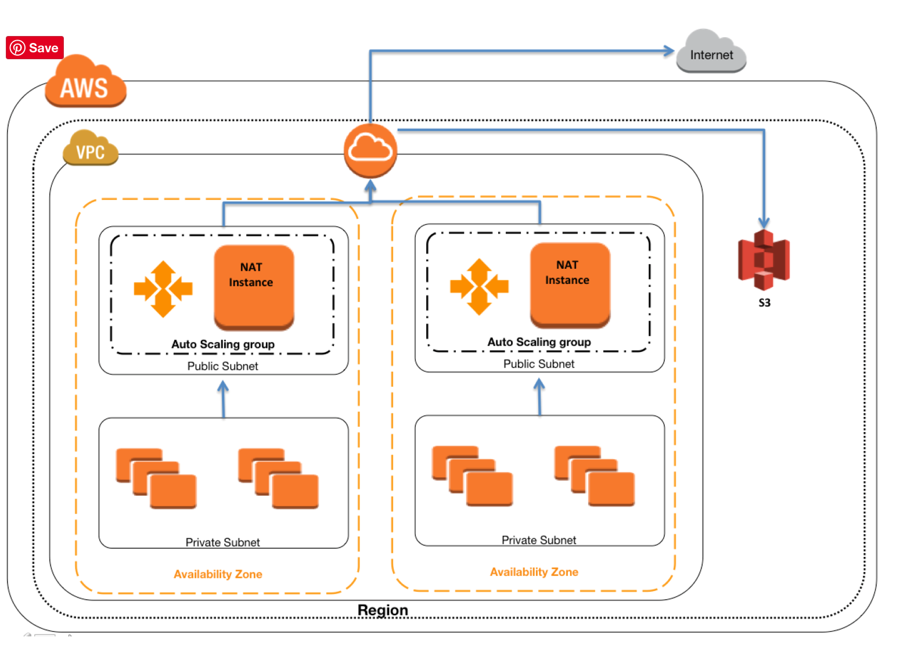

* **Create One NAT instance per Availability Zone**
* Configure all Private subnet route tables to the same zone NAT instance
* **Use Auto Scaling for NAT availability**
* **Use Auto Scaling group per NAT instance with min and max size set of 1. So if NAT instances fail, Auto Scaling will automatically launch an replacement instance**
* NAT instance is highly available with limited downtime
* Let Auto Scaling monitor health and availability of the NAT instance
* Bootstrap scripts with the NAT instance to update the Route tables programmatically
* Keep a close watch on the Network Metrics and scale vertically the NAT instance type to the one with high network performance

### **6-6 Disabling Source/Destination checks**

* Each EC2 instance performs source/destination checks, by default, and the instance must be the source or destination of any traffic it sends or receives
* **<mark>However, as the NAT instance acts as a router between the Internet and *the instances in the private subnet it must be able to send and receive traffic when the source or destination is not itself*.</mark>**
* Therefore, the source/destination checks on the NAT instance should be disabled

### **6-7 NAT Gateway & Instance Comparison**

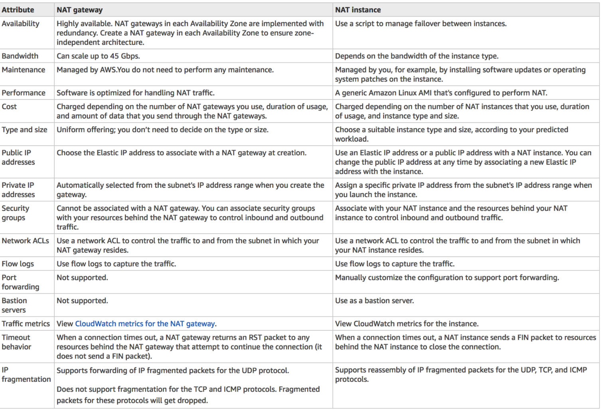

### **6-8 NAT Exam**

1. After launching an instance that you intend to serve as a NAT (Network Address Translation) device in a public subnet you modify your route tables to have the NAT device be the target of internet bound traffic of your private subnet. **When you try and make an outbound connection to the Internet from an instance in the private subnet**, you are not successful. Which of the following steps could resolve the issue?
	* Attaching a second Elastic Network interface (ENI) to the NAT instance, and placing it in the private subnet
	* Attaching an Elastic IP address to the instance in the private subnet
	* Attaching a second Elastic Network Interface (ENI) to the instance in the private subnet, and placing it in the public subnet
	* **Disabling the Source/Destination Check attribute on the NAT instance (V)**

2. You manually launch a NAT AMI in a public subnet. The network is properly configured. Security groups and network access control lists are property configured. **Instances in a private subnet can access the NAT. The NAT can access the Internet. However, private instances cannot access the Internet**. What additional step is required to allow access from the private instances?
	* Enable Source/Destination Check on the private Instances.
	* Enable Source/Destination Check on the NAT instance.
	* Disable Source/Destination Check on the private instances
	* **Disable Source/Destination Check on the NAT instance**
3. A user has created a VPC with public and private subnets. The VPC has CIDR `20.0.0.0/16`. **The private subnet uses CIDR `20.0.1.0/24` and the public subnet uses CIDR `20.0.0.0/24`.** The user is planning to host a web server in the public subnet (port 80. and a DB server in the private subnet (port 3306.. The user is configuring a security group of the NAT instance. Which of the below mentioned entries **is not required for the NAT security group**?
	* For Inbound allow Source: 20.0.1.0/24 on port 80
	* For Outbound allow Destination: 0.0.0.0/0 on port 80
	* **For Inbound allow Source: `20.0.0.0/24` on port 80**
	* For Outbound allow Destination: 0.0.0.0/0 on port 443

4. A web company is looking to implement an external payment service into their highly available application deployed in a VPC. Their application EC2 instances are behind a public facing ELB. Auto scaling is used to add additional instances as traffic increases. Under normal load the application runs 2 instances in the Auto Scaling group but at peak it can scale 3x in size. **The application instances need to communicate with the payment service over the Internet, which requires whitelisting of all public IP addresses used to communicate with it**. **A maximum of 4 whitelisting IP addresses are allowed at a time and can be added through an API**. How should they architect their solution?
	* **Route payment requests through two NAT instances setup for High Availability and whitelist the Elastic IP addresses attached to the NAT instances (check)** 
	* _Whitelist the VPC Internet Gateway_ Public IP and route payment requests through the Internet Gateway. (**Internet gateway is only to route traffic**)
	* _Whitelist the ELB IP addresses_ and route payment requests from the Application servers through the ELB. (**ELB does not have a fixed IP address**)
	* Automatically assign public IP addresses to the application instances in the Auto Scaling group and run a script on boot that adds each instances public IP address to the payment validation whitelist API. (**would exceed the allowed 4 IP addresses**)

## **7、Egress-only Internet gateway**

* **Egress-only Internet gateway works as a NAT gateway, but for IPv6 traffic**
* Egress-only Internet gateway is a horizontally scaled, redundant, and highly available VPC component that allows outbound communication over IPv6 from instances in the VPC to the Internet, and prevents the Internet from initiating an IPv6 connection with the instances.
* **An egress-only Internet gateway is for use with IPv6 traffic only**.
* **<mark>To enable outbound-only Internet communication over IPv4, use a NAT gateway instead</mark>**.

## **8、VPC & Subnet Sizing**

* VPC supports IPv4 and IPv6 addressing, and has different **CIDR block size limits for each**
* IPv6 CIDR block can be optionally associated with the VPC
* VPC IPv4 CIDR block cannot be modified once created i.e. cannot increase or decrease the size of an existing CIDR block.
* However, **secondary CIDR blocks can be associated with the VPC to extend the VPC**
* Limitations
	* allowed block size is between a /28 netmask and /16 netmask.
	* **CIDR block must not overlap with any existing CIDR block** that’s associated with the VPC.
	* CIDR block must not be the same or larger than the CIDR range of a route in any of the VPC route tables for e.g. for a CIDR block `10.0.0.0/24`, can only associate smaller CIDR blocks like `10.0.0.0/25`

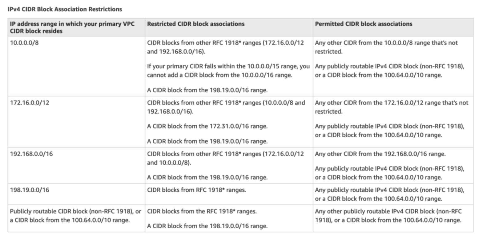

## **9、VPC Security**

Security within a VPC is provided through

* **Security groups** – **Act as a firewall for associated EC2 instances**, controlling both inbound and outbound traffic at the instance level
* Network access control lists (ACLs) – **Act as a firewall for associated subnets, controlling both inbound and outbound traffic at the subnet level**
* **Flow logs – Capture information about the IP traffic going to and from network interfaces in your VPC**

## **10、Security Groups vs NACLs**

### **10-1 AWS VPC Security Overview**

In a VPC, both Security Groups and Network ACLs (NACLS) together help to build a layered network defence.

* **Security groups** – Act as a **virtual firewall for associated instances**, controlling both inbound and outbound traffic at the instance level
* **Network access control lists (NACLs)** – Act as a firewall for associated subnets, controlling both inbound and outbound traffic at the subnet level

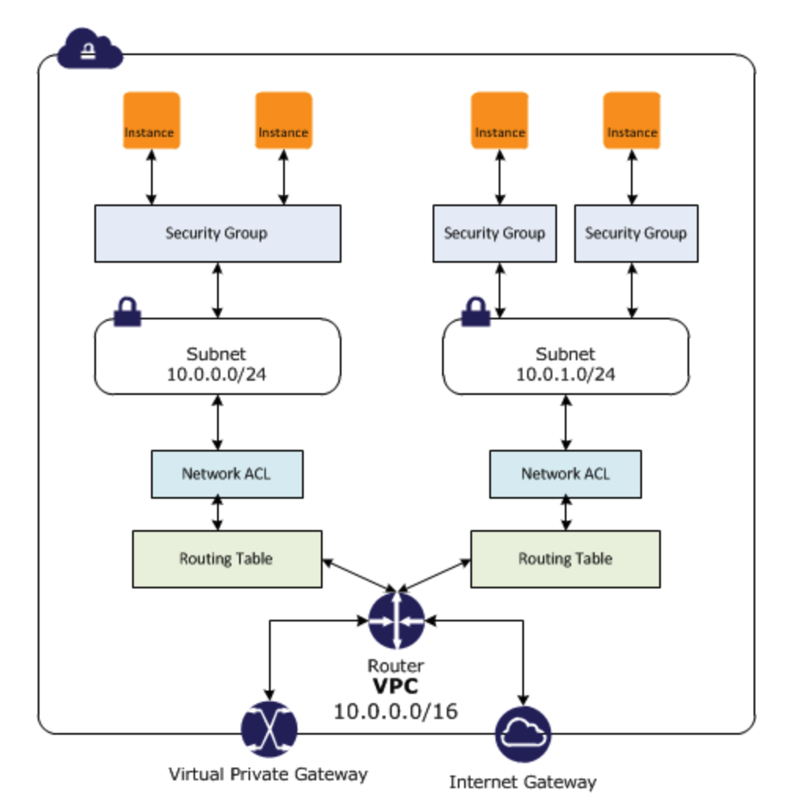

### **10-2 Security Groups**

* Acts at an Instance level and not at the subnet level.
* Each instance within a **subnet can be assigned a different set of Security groups**
* An instance can be **assigned 5 security groups with each security group having60 rules**
* allows separate rules for inbound and outbound traffic
* allows adding or removing rules (authorizing or revoking access) for **both Inbound (ingress) and Outbound (egress)** traffic to the instance
	* **Default** Security group allows **no external inbound** traffic but allows inbound traffic from instances with the same security group
	* **Default Security group allows all outbound traffic**
	* New Security groups start **with only an outbound rule that allows all traffic to leave the instances**
* can specify only Allow rules, but not deny rules
* **can grant access to a specific IP, CIDR range, or to another security group in the VPC or in a peer VPC (requires a VPC peering connection)**
* **are evaluated as a Whole or Cumulative bunch of rules** with the most permissive rule taking precedence for e.g. *if you have a rule that allows access to TCP port 22 (SSH) from IP address 203.0.113.1 and another rule that allows access to TCP port 22 from everyone, everyone has access to TCP port 22.*
* **are Stateful** – responses to allowed inbound traffic are allowed to flow outbound regardless of outbound rules, and vice versa. Hence an Outbound rule for the response is not needed
* **Instances associated with a security group can’t talk to each other unless  rules allowing the traffic are added**.
* **are associated with ENI (network interfaces)**.
* **are associated with the instance and can be changed, which changes the security groups associated with the primary network interface (eth0)** and the changes would be applicable immediately to all the instances associated with the Security group

### **10-3 Connection Tracking**

* Security groups are Stateful as they use Connection tracking to track information about traffic to and from the instance.
* **Responses to inbound traffic are allowed to flow out of the instance regardless of outbound security group rules**, and vice versa.
* **Connection Tracking** is maintained only **if there is no explicit Outbound rule for an Inbound request** (and vice versa)
* However, if there is an explicit Outbound rule for an Inbound request, **the response traffic is allowed on the basis of the Outbound rule and not on the Tracking information**
* Tracking flow e.g.
	* If an instance (host A) initiates traffic to host B and uses a protocol other than TCP, UDP, or ICMP, the instance’s firewall only tracks the IP address & protocol number for the purpose of allowing response traffic from host B.
	* If host B initiates traffic to the instance in a separate request within 600 seconds of the original request or response, the instance accepts it regardless of inbound security group rules, because it’s regarded as response traffic.
* This can be controlled by modifying the security group’s outbound rules to permit only certain types of outbound traffic. Alternatively, Network ACLs (NACLs) can be used for the subnet, network ACLs are stateless and therefore do not automatically allow response traffic.

### **10-4 Network Access Control Lists – NACLs**

* A Network ACLs (NACLs) is an optional layer of security for the VPC that acts as a **firewall for controlling traffic in and out of one or more subnets.**
* are not for granular control and are assigned at a Subnet level and **is applicable to all the instances in that Subnet**
* has separate inbound and outbound rules, and each rule can either **allow or deny traffic**
	* **Default ACL allows all inbound and outbound traffic**.
	* **Newly created ACL denies all inbound and outbound traffic**
* **A Subnet can be assigned only 1 NACLs** and if not associated explicitly would be associated implicitly with the **default NACL
can associate a network ACL with multiple subnets**
* is a numbered list of rules that are **evaluated in order** *starting with the lowest numbered rule,* to determine whether traffic is allowed in or out of any subnet associated with the network ACL for e.g. ***if you have a Rule No. 100 with Allow All and 110 with Deny All, the Allow All would take precedence and all the traffic will be allowed***
* are **Stateless**; responses to allowed inbound traffic are subject to the rules for outbound traffic (and vice versa) for e.g. *if you enable Inbound SSH on port 22 from the specific IP address, you would need to add an Outbound rule for the response as well.*

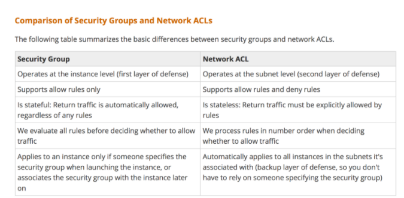

### **10-4  Security Group vs NACLs Questions**

1. Instance A and instance B are running in two different subnets A and B of a VPC. **Instance A is not able to ping instance B**. What are two possible reasons for this? (Pick 2 correct answers)
	* The routing table of subnet A has no target route to subnet B
	* **The security group attached to instance B does not allow inbound ICMP traffic**
	* The policy linked to the IAM role on instance A is not configured correctly
	* **The NACL on subnet B does not allow outbound ICMP traffic**
2. An instance is **launched into a VPC subnet with the network ACL configured to allow all inbound traffic and deny all outbound traffic**. *The instance’s security group is configured to allow SSH from any IP address and deny all outbound traffic*. What changes need to be made to allow SSH access to the instance?
	* The outbound security group needs to be modified to allow outbound traffic.
	* **The outbound network ACL needs to be modified to allow outbound traffic**.
	* Nothing, it can be accessed from any IP address using SSH.
	* Both the outbound security group and outbound network ACL need to be modified to allow outbound traffic.
3. From what services I can block incoming/outgoing IPs?
	* Security Groups
	* DNS
	* ELB
	* VPC subnet
	* IGW
	* **NACL**
4. What is the difference between a security group in VPC and a network ACL in VPC (chose 3 correct answers)
	* Security group restricts access to a Subnet while ACL restricts traffic to EC2
	* **Security group restricts access to EC2 while ACL restricts traffic to a subnet**
	* Security group can work outside the VPC also while ACL only works within a VPC
	* **Network ACL performs stateless filtering and Security group provides stateful filtering**
	* **Security group can only set Allow rule, while ACL can set Deny rule also**
5. You are currently hosting multiple applications in a VPC and have logged numerous port scans coming in from a specific IP address block. **Your security team has requested that all access from the offending IP address block be denied for the next 24 hours.** Which of the following is the best method to quickly and temporarily deny access from the specified IP address block?
	* Create an AD policy to modify Windows Firewall settings on all hosts in the VPC to deny access from the IP address block
	* **Modify the Network ACLs associated with all public subnets in the VPC to deny access from the IP address block**
	* Add a rule to all of the VPC 5 Security Groups to deny access from the IP address block
	* Modify the Windows Firewall settings on all Amazon Machine Images (AMIs) that your organization uses in that VPC to deny access from the IP address block
6. You have two Elastic Compute Cloud (EC2) instances inside a Virtual Private Cloud (VPC) in the same Availability Zone (AZ) but in different subnets. One instance is running a database and the other instance an application that will interface with the database. You want to confirm that they can talk to each other for your application to work properly. **Which two things do we need to confirm in the VPC settings so that these EC2 instances can communicate inside the VPC**? Choose 2 answers
	* **A network ACL that allows communication between the two subnets**.
	* Both instances are the same instance class and using the same Key-pair.
	* That the default route is set to a NAT instance or Internet Gateway (IGW) for them to communicate.
	* **Security groups are set to allow the application host to talk to the database on the right port/protocol**
7. A benefits enrollment company is hosting a 3-tier web application running in a VPC on AWS, which includes a NAT (Network Address Translation) instance in the public Web tier. There is enough provisioned capacity for the expected workload tor the new fiscal year benefit enrollment period plus some extra overhead Enrollment proceeds nicely for two days and then the web tier becomes unresponsive, upon investigation using CloudWatch and other monitoring tools it is discovered that there is an extremely large and unanticipated amount of inbound traffic coming from a set of 15 specific IP addresses over port 80 from a country where the benefits company has no customers. **The web tier instances are so overloaded that benefit enrollment administrators cannot even SSH into them**. Which activity would be useful in defending against this attack?
	* Create a custom route table associated with the web tier and block the attacking IP addresses from the IGW (internet Gateway)
	* Change the EIP (Elastic IP Address) of the NAT instance in the web tier subnet and update the Main Route Table with the new EIP
	* Create 15 Security Group rules to block the attacking IP addresses over port 80
	* **Create an inbound NACL (Network Access control list) associated with the web tier subnet with deny rules to block the attacking IP addresses**

8. Which of the following statements describes network ACLs? (Choose 2 answers)
	* Responses to allowed inbound traffic are allowed to flow outbound regardless of outbound rules, and vice versa (**<mark>are stateless</mark>**)
	* **Using network ACLs, you can deny access from a specific IP range**
	* **Keep network ACL rules simple and use a security group to restrict application level access**
	* NACLs are associated with a single Availability Zone (**<mark>associated with Subnet</mark>**)
9. You are designing security inside your VPC. You are considering the options for establishing separate security zones and enforcing network traffic rules across different zone to limit Instances can communications.  How would you accomplish these requirements? Choose 2 answers
	* Configure a security group for every zone. Configure a default allow all rule. Configure explicit deny rules for the zones that shouldn’t be able to communicate with one another (**Security group does not allow deny rules**)
	* **Configure you instances to use pre-set IP addresses with an IP address range every security zone. Configure NACL to explicitly allow or deny communication between the different IP address ranges, as required for interzone communication**
	* **Configure a security group for every zone. Configure allow rules only between zone that need to be able to communicate with one another. Use implicit deny all rule to block any other traffic**
	* Configure multiple subnets in your VPC, one for each zone. Configure routing within your VPC in such a way that each subnet only has routes to other subnets with which it needs to communicate, and doesn’t have routes to subnets with which it shouldn’t be able to communicate. (**default routes are unmodifiable**)
10. Your entire AWS infrastructure lives inside of one Amazon VPC. You have an Infrastructure monitoring application running on an Amazon instance in Availability Zone (AZ) A of the region, and another application instance running in AZ B. The monitoring application needs to make use of ICMP ping to confirm network reachability of the instance hosting the application. Can you configure the security groups for these instances to only allow the ICMP ping to pass from the monitoring instance to the application instance and nothing else” If so how?
	* No Two instances in two different AZ’s can’t talk directly to each other via ICMP ping as that protocol is not allowed across subnet (i.e. broadcast) boundaries (**Can communicate**)
	* Yes Both the monitoring instance and the application instance have to be a part of the same security group, and that security group needs to allow inbound ICMP (**Need not have to be part of same security group**)
	* **<mark>Yes, The security group for the monitoring instance needs to allow outbound ICMP and the application instance’s security group needs to allow Inbound ICMP (is stateful, so just allow outbound ICMP from monitoring and inbound ICMP on monitored instance)</mark>**
	* Yes, Both the monitoring instance’s security group and the application instance’s security group need to allow both inbound and outbound ICMP ping packets since ICMP is not a connection-oriented protocol (Security groups are stateful)
11. A user has configured a VPC with a new subnet. The user has created a security group. The user wants to configure that instances of the same subnet communicate with each other. How can the user configure this with the security group?
	* There is no need for a security group modification as all the instances can communicate with each other inside the same subnet
	* Configure the subnet as the source in the security group and allow traffic on all the protocols and ports
	* **Configure the security group itself as the source and allow traffic on all the protocols and ports**
	* The user has to use VPC peering to configure this
12. You are designing a data leak prevention solution for your VPC environment. You want your VPC Instances to be able to access software depots and distributions on the Internet for product updates. The depots and distributions are accessible via third party CDNs by their URLs. You want to explicitly deny any other outbound connections from your VPC instances to hosts on the Internet. Which of the following options would you consider?
	* **Configure a web proxy server in your VPC and enforce URL-based rules for outbound access Remove default routes. (Security group and NACL cannot have URLs in the rules nor does the route)**
	* Implement security groups and configure outbound rules to only permit traffic to software depots.
	* Move all your instances into private VPC subnets remove default routes from all routing tables and add specific routes to the software depots and distributions only.
	* Implement network access control lists to all specific destinations, with an Implicit deny as a rule.
13. You have an EC2 Security Group with several running EC2 instances. You change the Security Group rules to allow inbound traffic on a new port and protocol, and launch several new instances in the same Security Group. The new rules apply:
	* **Immediately to all instances in the security group**.
	* Immediately to the new instances only.
	* Immediately to the new instances, but old instances must be stopped and restarted before the new rules apply.
	* To all instances, but it may take several minutes for old instances to see the changes.

	
## **11、VPC Flow logs**

* **VPC Flow Logs is a feature that enables you to capture information about the IP traffic** going to and from network interfaces in the VPC and can help in monitoring the traffic or troubleshooting any connectivity issues
* Flow log data is **stored using Amazon CloudWatch Logs**
* **Flow log can be created for the entire VPC**, subnets or each network interface. **If enabled, for entire VPC or subnet all the network interfaces are monitored**
* <mark>**Flow logs do not capture real-time log streams for network interfaces**</mark>.
* Flow logs can be created for network interfaces that are created by other AWS services; for example, Elastic Load Balancing, RDS, ElastiCache, Redshift, and WorkSpaces

## **12 Subnets**

* Subnet spans a single Availability Zone, distinct locations engineered to be isolated from failures in other AZs, and cannot span across AZs
* **<mark>Subnet can be configured with an Internet gateway to enable communication over the Internet</mark>**, or virtual private gateway (VPN) connection to enable communication with your corporate network
* **Subnet can be Public or Private and it depends on whether it has Internet connectivity** i.e. is able to route traffic to the Internet through the IGW
* **Instances within the Public Subnet should be assigned a Public IP or Elastic IP address to be able to communicate with the Internet**
* For Subnets not connected to the Internet, but has traffic routed through Virtual Private Gateway only is termed as VPN-only subnet
* **Subnets can be configured to Enable assignment of the Public IP address to all the Instances launched within the Subnet by default**, which can be overridden during the creation of the Instance

### **12-1 Subnet Sizing**

* CIDR block assigned to the Subnet can be the same as the VPC CIDR, in this case you can launch **only one subnet within your VPC**
* CIDR block assigned to the Subnet can be a subset of the VPC CIDR, which allows you to launch multiple subnets within the VPC
* CIDR block assigned to the subnet should not be overlapping
* CIDR block size allowed is between
	* `/28` netmask (minimum with `2^4 – 16` available IP address) and
	* `/16` netmask (maximum with `2^16 – 65536` IP address)
* AWS reserves 5 IPs address (first 4 and last 1 IP address) in each Subnet which are not available for use and cannot be assigned to an instance. for e.g. for a Subnet with a CIDR block `10.0.0.0/24` the following five IPs are reserved
	* `10.0.0.0`: Network address
	* **`10.0.0.1`: Reserved by AWS for the VPC router**
	* **`10.0.0.2`: Reserved by AWS for mapping to Amazon-provided DNS**
	* **`10.0.0.3`: Reserved by AWS for future use**
	* **`10.0.0.255`: Network broadcast address. AWS does not support** broadcast in a VPC, therefore the address is reserved.

### **12-2 Subnet Routing**

Each Subnet is associated with a route table which controls the traffic.

### **12-3 Subnet Security**

* **Subnet security can be configured using Security groups and NACLs**
* **<mark>Security groups works at instance level, NACLs work at the subnet level</mark>**

## **13 Shared VPCs**

* **VPC sharing allows multiple AWS accounts to create their application resources**, such as EC2 instances, RDS databases, Redshift clusters, and AWS Lambda functions, into shared, centrally-managed VPCs.
* **<mark>In this model, the account that owns the VPC (owner) shares one or more subnets with other accounts (participants) that belong to the same organization from AWS Organizations</mark>**.
* After a subnet is shared, **the participants can view, create, modify, and delete their application resources in the subnets shared with them**. Participants cannot view, modify, or delete resources that belong to other participants or the VPC owner.

## **14 AWS VPC Endpoints**

### **14-1 VPC Endpoints Overview**

* VPC endpoint enables creation of a **private connection between VPC to supported AWS services and VPC endpoint services powered by PrivateLink using its private IP address**
* **<mark>VPC Endpoint does not require a public IP address</mark>**, *access over the Internet, NAT device, a VPN connection or AWS Direct Connect*
* Traffic between VPC and AWS service **does not leave the Amazon network**
* E**ndpoints are virtual devices**, that are horizontally scaled, redundant, and highly available VPC components that allow communication between instances in the VPC and AWS services without imposing availability risks or bandwidth constraints on your network traffic.
* **Endpoints currently do not support cross-region requests, ensure that the endpoint is created in the same region as your bucket**
* AWS currently supports two types of Endpoints
	* VPC Interface Endpoints
	* VPC Gateway Endpoints
* VPC Endpoint policy is an IAM resource policy attached to an endpoint for controlling access from the endpoint to the specified service.. Endpoint policy, by default, allows full access to the service.
* Endpoint policy does not override or replace IAM user policies or service-specific policies (such as S3 bucket policies).

### **14-2 VPC Gateway Endpoints**

* A VPC Gateway Endpoint is a gateway that is a target for a specified **route in the route table**, used for traffic destined to a supported AWS service.
* **VPC Gateway Endpoint currently supports S3 and DynamoDB services**

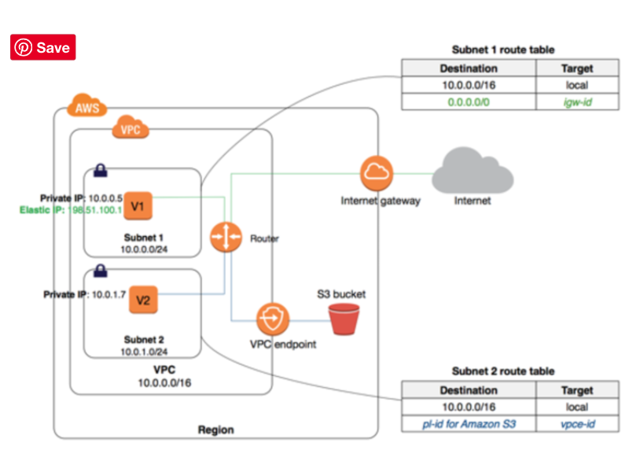

### **14-3 Configuration**

* Endpoint requires the VPC and the service to be accessed via the endpoint
* Endpoint needs to be associated with the Route table and the route table cannot be modified to remove the route entry. It can only be deleted by removing the Endpoint association with the Route table
* **A route is automatically added to the Route table with a destination that specifies the prefix list of service and the target with the endpoint id**. for e.g. <mark>A rule with *destination pl-68a54001 (com.amazonaws.us-west-2.s3)* and a target with this endpoints’ ID (e.g. vpce-12345678) will be added to the route tables</mark>
* Access to the resources in other services can be controlled by endpoint policies
* **<mark>Security groups needs to be modified to allow Outbound traffic from the VPC to the service thats specified in the endpoint</mark>.** *Use the service prefix list ID for e.g. com.amazonaws.us-east-1.s3  as the destination in the outbound rule*
* Multiple endpoints can be created in a single VPC, for e.g., to multiple services.
* Multiple endpoints can be created for a single service, and different route tables used to enforce different access policies from different subnets to the same service.
* **Multiple endpoints to the same service CANNOT be specified in a single route table**

### **14-2 Limitations**

* Endpoint **cannot be created between a VPC and an AWS service in a different region**.
* Endpoints support **IPv4 traffic only**.
* Endpoint cannot be transferred from one VPC to another, or from one service to another
* **Endpoint connections cannot be extended out of a VPC** i.e. **resources across the VPN connection, VPC peering connection, AWS Direct Connect connection cannot use the endpoint**

### **14-3 VPC Interface Endpoints**

* **<mark>VPC Interface endpoint enables connectivity to services powered by AWS PrivateLink.</mark>**
* Services include **some AWS services for e.g. CloudTrail, CloudWatch etc., services hosted by other AWS customers and partners in their own VPCs (referred to as endpoint services)**, and supported AWS Marketplace partner services.

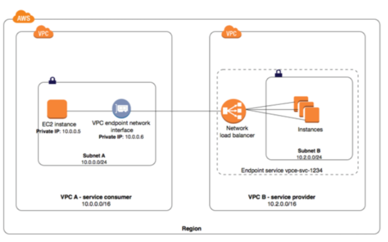

### **14-4 Limitations**

* For each interface endpoint, only one subnet per Availability Zone can be selected.
* Each interface endpoint can support a bandwidth of up to 10 Gbps per Availability Zone by default. Additional capacity may be added automatically based on your usage.
* **Network ACL for the subnet can restrict traffic, and needs to be configured properly**
* **Interface Endpoint supports TCP traffic only**.
* **Endpoints are supported within the same region only**. 
* Endpoints support **IPv4 traffic only.**
* **Endpoints cannot be transferred from one VPC to another, or from one service to another**.

### **14-5 AWS VPC Endpoints Exam**

1. You have an application running on an Amazon EC2 instance that uploads 10 GB video objects to amazon S3. Video uploads are taking longer than expected inspite of using multipart upload cause of internet bandwidth, resulting in poor application performance. Which action can help improve the upload performance?
	* Apply an Amazon S3 bucket policy
	* Use Amazon EBS provisioned IOPS
	* **Use VPC endpoints for S3**
	* Request a service limit increase

2. What are the services supported by VPC endpoints, using Gateway endpoint type? Choose 2 answers
	* **Amazon S3**
	* Amazon EFS
	* **Amazon DynamoDB**
	* Amazon Glacier
	* Amazon SQS
3. What are the different types of endpoint types supported by VPC endpoints? Choose 2 Answers
	* **Gateway**
	* Classic
	* **Interface**
	* Virtual
	* Network
4. An application running on EC2 instances processes sensitive information stored on Amazon S3. The information is accessed over the Internet.** The security team is concerned that the Internet connectivity to Amazon S3 is a security risk.** Which solution will resolve the security concern?
	* Access the data through an Internet Gateway.
	* Access the data through a VPN connection.
	* Access the data through a NAT Gateway.
	* **Access the data through a VPC endpoint for Amazon S3**.
5. You need to design a VPC for a three-tier architecture, web-application consisting of an Elastic Load Balancer (ELB), a fleet of web/application servers, and backend consisting of an RDS database. The entire Infrastructure must be distributed over 2 availability zones. Which VPC configuration works while assuring the least components are exposed to Internet?
	* Two public subnets for ELB, two private subnets for the web-servers, two private subnets for RDS and DynamoDB
	* Two public subnets for ELB and web-servers, two private subnets for RDS and DynamoDB
	* **Two public subnets for ELB, two private subnets for the web-servers, two private subnets for RDS and VPC Endpoints for DynamoDB**
	* Two public subnets for ELB and web-servers, two private subnets for RDS and VPC Endpoints for DynamoDB

	
## **15 AWS VPC VPN – CloudHub Connections**

* VPC VPN connections are used to **extend on-premise data centers to AWS**
* VPC VPN connections provide **secure IPSec connections from on-premise** computers/services to AWS

### **15-1 VPC VPN Connections**

**AWS hardware VPN**

* **Connectivity can be established by creating an IPSec, hardware VPN connection between the VPC and the remote network**.
* On the AWS side of the VPN connection, **a Virtual Private Gateway (VGW) provides two VPN endpoints for automatic failover**.
* **On customer side a customer gateway (CGW) needs to be configured,** which is the **physical device or software application on the remote side of the VPN connection**

**AWS Direct Connect**

* AWS Direct Connect provides a dedicated p**rivate connection from a remote network to your VPC**.
* Direct Connect can be combined with an AWS hardware VPN connection to create an IPsec-encrypted connection

**AWS VPN CloudHub**

* For more than one remote network for e.g. *multiple branch offices*, **multiple AWS hardware VPN connections can be created via the VPC to enable communication between these networks**

**Software VPN**

* VPN connection can be setup by running a **software VPN like OpenVPN** appliance on an EC2 instance in the VPC
* **AWS does not provide or maintain software VPN appliances**; however, there are range of products provided by partners and open source communities

### **15-2 Hardware VPN Connection**

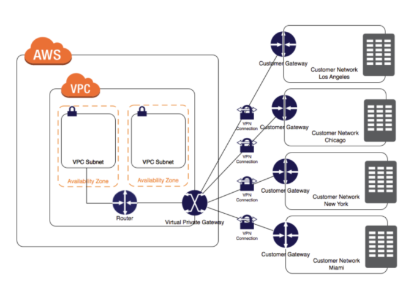

### **15-3 VPN Components**

**Virtual Private Gateway – VGW**

**A virtual private gateway** is the VPN concentrator on the AWS side of the VPN connection

**Customer Gateway – CGW**

* **A customer gateway is a physical device or software application on customer side of the VPN connection.**
* When a VPN connection is created, the **VPN tunnel comes up when traffic is generated from the remote side of the VPN connection**.
* **VGW is not the initiator; CGW must initiate the tunnels**
* If the VPN connection experiences a period of idle time, **usually 10  seconds, depending on the configuration, the tunnel may go dow**n. To prevent this, a network monitoring tool to generate keepalive pings; for e.g. by using IP SLA.

### **15-4 VPN Configuration**

* VPC has an attached virtual private gateway, and the remote network includes a customer gateway, which must be configured to enable the
* VPN connection.
* Routing must be setup so that any traffic from the VPC bound for the remote network is routed to the virtual private gateway.
* **Each VPN has two tunnels associated with it that can be configured on the customer router, as is not single point of failure**
* M**ultiple VPN connections to a single VPC can be created, and a second CGW can be configured to create a redundant connection to the same external location** or to create VPN connections to multiple geographic locations.

### **15-5 VPN Routing Options**

* For a VPN connection, the route table for the subnets s**hould be updated with the type of routing (static of dynamic) that you plan to use**.
* Route tables determine where network traffic is directed. Traffic destined for the VPN connections must be routed to the virtual private gateway.
* **Type of routing can depend on the make and model of your VPN devices**.

**Static Routing**

* **If your device does not support BGP, specify static routing**.
* Using static routing, the routes (IP prefixes) can be specified that should be communicated to the virtual private gateway.
* **Devices that don’t support BGP may also perform health checks** to assist failover to the second tunnel when needed.

**BGP dynamic routing**

* If the VPN device supports **Border Gateway Protocol (BGP)**, specify dynamic routing with the VPN connection.
* When using a BGP device, static routes need not be specified to the VPN connection because the device uses BGP for auto discovery and to advertise its routes to the virtual private gateway.
* BGP-capable devices are recommended as the BGP protocol offers robust liveness detection checks that can assist failover to the second VPN tunnel if the first tunnel goes down.
Only IP prefixes known to the virtual private gateway, either through BGP advertisement or static route entry, can receive traffic from your VPC.
Virtual private gateway does not route any other traffic destined outside of the advertised BGP, static route entries, or its attached VPC CIDR.

* **Only IP prefixes known to the virtual private gateway, either through BGP advertisement or static route entry, can receive traffic from your VPC**.
* **Virtual private gateway does not route any other traffic destined outside of the advertised BGP, static route entries, or its attached VPC CIDR.**

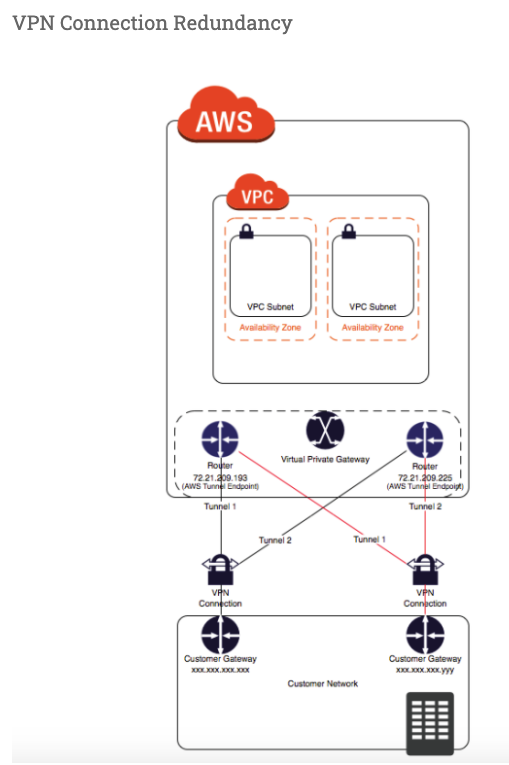

* A VPN connection is used to connect the customer network to a VPC.
* **Each VPN connection has two tunnels to help ensure connectivity in case one of the VPN connections becomes unavailable, with each tunnel using a unique virtual private gateway public IP address**.
* **Both tunnels should be configured for redundancy**.
* When one tunnel becomes unavailable, for e.g. down for maintenance, network traffic is automatically routed to the available tunnel for that specific VPN connection.
* To protect against a loss of connectivity in case the customer gateway becomes unavailable, a second VPN connection can be setup to the VPC and virtual private gateway by using a second customer gateway.
* **Customer gateway IP address for the second VPN connection must be publicly accessibl**e.
* By using redundant VPN connections and CGWs, maintenance on one of the customer gateways can be performed while traffic continues to flow over the second customer gateway’s VPN connection.
* **Dynamically routed VPN connections using the Border Gateway Protocol (BGP) are recommended, if available, to exchange routing information between the customer gateways and the virtual private gateways**.
* **Statically routed VPN connections require static routes for the network to be entered on the customer gateway side**.
* BGP-advertised and statically entered route information allow gateways on both sides to determine which tunnels are available and reroute traffic if a failure occurs.

### **15-6 VPN CloudHub**

* **<mark>VPN CloudHub can be used to provide secure communication between sites, if you have multiple VPN connections</mark>**
* VPN CloudHub operates on a simple **hub-and-spoke model that can be used with or without a VPC**.
* Design is suitable for customers with multiple branch offices and existing Internet connections who’d like to implement a convenient, potentially low-cost hub-and-spoke model for primary or backup connectivity between these remote offices

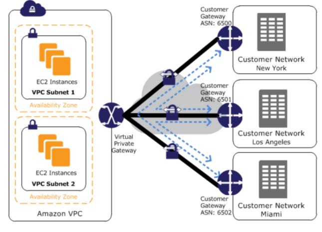

* **VPN CloudHub architecture with blue dashed lines indicates network**
* traffic between remote sites being routed over their VPN connections.
* A**WS VPN CloudHub requires a virtual private gateway with multiple customer gateways**.
* Each customer gateway must use a unique Border Gateway Protocol (BGP) Autonomous System Number (ASN)
* Customer gateways advertise the appropriate routes (BGP prefixes) over their VPN connections.
* Routing advertisements are received and re-advertised to each BGP peer, enabling each site to send data to and receive data from the other sites.
* Routes for each spoke must have unique ASNs and the sites must not have overlapping IP ranges.
* **Each site can also send and receive data from the VPC as if they were using a standard VPN connection**.
* **Sites that use AWS Direct Connect connections to the virtual private gateway can also be part of the AWS VPN CloudHub.**
* To configure the AWS VPN CloudHub,
	* multiple customer gateways can be created, each with the unique public IP address of the gateway and the ASN.
	* **a VPN connection can be created from each customer gateway to a common virtual private gateway.**
	* each VPN connection must advertise its specific BGP routes. This is done using the network statements in the VPN configuration files for the VPN connection.

### **15-7 VPC VPN – CloudHub Connections**

1. You have in total 5 offices, and the entire employee related information is stored under AWS VPC instances. Now all the offices want to connect the instances in VPC using VPN. Which of the below help you to implement this?
	* **you can have redundant customer gateways between your data center and your VPC**
	* **you can have multiple locations connected to the AWS VPN CloudHub**
	* You have to define 5 different static IP addresses in route table.
	* **1 and 2**
	* 1,2 and 3
2. You have in total 15 offices, and the entire employee related information is stored under AWS VPC instances. Now all the offices want to connect the instances in VPC using VPN. What problem do you see in this scenario?
	* You can not create more than 1 VPN connections with single VPC (**Can be created**)
	* You can not create more than 10 VPN connections with single VPC (**soft limit can be extended**)
	* When you create multiple VPN connections, the virtual private gateway can not sends network traffic to the appropriate VPN connection using statically assigned routes. (**Can route the traffic to correct connection**)
	* Statically assigned routes cannot be configured in case of more than 1 VPN with virtual private gateway. (**can be configured**)
	* **None of above**
3. You have been asked to virtually extend two existing data centers into AWS to support a highly available application that depends on existing, on-premises resources located in multiple data centers and static content that is served from an Amazon Simple Storage Service (S3) bucket. Your design currently includes a dual-tunnel VPN connection between your CGW and VGW. Which component of your architecture represents a potential single point of failure that you should consider changing to make the solution more highly available?
	* Add another VGW in a different Availability Zone and create another dual-tunnel VPN connection.
	* **Add another CGW in a different data center and create another dual-tunnel VPN connection**. 
	* Add a second VGW in a different Availability Zone, and a CGW in a different data center, and create another dual-tunnel.
	* No changes are necessary: the network architecture is currently highly available.
4. You are designing network connectivity for your fat client application. The application is designed for business travelers who must be able to connect to it from their hotel rooms, cafes, public Wi-Fi hotspots, and elsewhere on the Internet. You do not want to publish the application on the Internet. Which network design meets the above requirements while minimizing deployment and operational costs? [PROFESSIONAL]
	* Implement AWS Direct Connect, and create a private interface to your VPC. Create a public subnet and place your application servers in it. (High Cost and does not minimize deployment)
	* Implement Elastic Load Balancing with an SSL listener that terminates the back-end connection to the application. (Needs to be published to internet)
	* Configure an IPsec VPN connection, and provide the users with the configuration details. Create a public subnet in your VPC, and place your application servers in it. (Instances still in public subnet are internet accessible)
	* **Configure an SSL VPN solution in a public subnet of your VPC, then install and configure SSL VPN client software on all user computers. Create a private subnet in your VPC and place your application servers in it. (Cost effective and can be in private subnet as well)**
5. You are designing a connectivity solution between on-premises infrastructure and Amazon VPC Your server’s on-premises will De communicating with your VPC instances You will De establishing IPSec tunnels over the internet You will be using VPN gateways and terminating the IPsec tunnels on AWS-supported customer gateways. Which of the following objectives would you achieve by implementing an IPSec tunnel as outlined above? (Choose 4 answers) [PROFESSIONAL]
	* End-to-end protection of data in transit
	* End-to-end Identity authentication
	* **Data encryption across the Internet**
	* **Protection of data in transit over the Internet**
	* **Peer identity authentication between VPN gateway and customer gateway**
	* **Data integrity protection across the Internet**
6. A development team that is currently doing a nightly six-hour build which is lengthening over time on-premises with a large and mostly under utilized server would like to transition to a continuous integration model of development on AWS with multiple builds triggered within the same day. However, they are concerned about cost, security and how to integrate with existing on-premises applications such as their LDAP and email servers, which cannot move off-premises. The development environment needs a source code repository; a project management system with a MySQL database resources for performing the builds and a storage location for QA to pick up builds from. What AWS services combination would you recommend to meet the development team’s requirements? [PROFESSIONAL]
	* A Bastion host Amazon EC2 instance running a VPN server for access from on-premises, Amazon EC2 for the source code repository with attached Amazon EBS volumes, Amazon EC2 and Amazon RDS MySQL for the project management system, EIP for the source code repository and project management system, Amazon SQL for a build queue, An Amazon Auto Scaling group of Amazon EC2 instances for performing builds and Amazon Simple Email Service for sending the build output. (Bastion is not for VPN connectivity also SES should not be used)
	* An AWS Storage Gateway for connecting on-premises software applications with cloud-based storage securely, Amazon EC2 for the resource code repository with attached Amazon EBS volumes, Amazon EC2 and Amazon RDS MySQL for the project management system, EIPs for the source code repository and project management system, Amazon Simple Notification Service for a notification initiated build, An Auto Scaling group of Amazon EC2 instances for performing builds and Amazon S3 for the build output. (Storage Gateway does provide secure connectivity but still needs VPN. SNS alone cannot handle builds)
	* An AWS Storage Gateway for connecting on-premises software applications with cloud-based storage securely, Amazon EC2 for the resource code repository with attached Amazon EBS volumes, Amazon EC2 and Amazon RDS MySQL for the project management system, EIPs for the source code repository and project management system, Amazon SQS for a build queue, An Amazon Elastic Map Reduce (EMR) cluster of Amazon EC2 instances for performing builds and Amazon CloudFront for the build output. (Storage Gateway does not provide secure connectivity, still needs VPN. EMR is not ideal for performing builds as it needs normal EC2 instances)
	* **A VPC with a VPN Gateway back to their on-premises servers, Amazon EC2 for the source-code repository with attached Amazon EBS volumes, Amazon EC2 and Amazon RDS MySQL for the project management system, EIPs for the source code repository and project management system, SQS for a build queue, An Auto Scaling group of EC2 instances for performing builds and S3 for the build output. (VPN gateway is required for secure connectivity. SQS for build queue and EC2 for builds)**

## **16 VPC Exam**

1. You have a business-to-business web application running in a VPC consisting of an Elastic Load Balancer (ELB), **web servers, application servers and a database. Your web application should only accept traffic from predefined customer IP addresses.** Which two options meet this security requirement? Choose 2 answers
	* Configure web server VPC security groups to allow traffic from your customers’ IPs (**Web server is behind the ELB and customer IPs will never reach web servers**)
	* **Configure your web servers to filter traffic based on the ELB’s “X-forwarded-for” header (get the customer IPs and create a custom filter to restrict access.)**
	* C**onfigure ELB security groups to allow traffic from your customers’ IPs and deny all outbound traffic (ELB will see the customer IPs so can restrict access, deny all is basically have no rules in outbound traffic, implicit, and its stateful so would work)**
	* Configure a VPC NACL to allow web traffic from your customers’ IPs and deny all outbound traffic (**NACL is stateless, deny all will not work**)
2. A user has created a VPC with public and private subnets using the VPC Wizard. The VPC has CIDR 20.0.0.0/16. The private subnet uses CIDR 20.0.0.0/24. Which of the below mentioned entries are required in the main route table to allow the instances in VPC to communicate with each other?
	* Destination : 20.0.0.0/24 and Target : VPC
	* Destination : 20.0.0.0/16 and Target : ALL
	* Destination : 20.0.0.0/0 and Target : ALL
	* **Destination : 20.0.0.0/16 and Target : Local**
3. A user has created a VPC with two subnets: one public and one private. The user is planning to run the patch update for the instances in the private subnet. How can the instances in the private subnet connect to the internet?
	* Use the internet gateway with a private IP
	* Allow outbound traffic in the security group for port 80 to allow internet updates
	* The private subnet can never connect to the internet
	* **Use NAT with an elastic IP**
4. A user has launched an EC2 instance and installed a website with the Apache webserver. The webserver is running but the user is not able to access the website from the Internet. What can be the possible reason for this failure?
	* **The security group of the instance is not configured properly**.
	* The instance is not configured with the proper key-pairs.
	* The Apache website cannot be accessed from the Internet.
	* Instance is not configured with an elastic IP.
5. A user has created a VPC with public and private subnets using the VPC wizard. Which of the below mentioned statements is true in this scenario?
	* AWS VPC will automatically create a NAT instance with the micro size
	* **VPC bounds the main route table with a private subnet and a custom route table with a public subnet**
	* User has to manually create a NAT instance
	* VPC bounds the main route table with a public subnet and a custom route table with a private subnet
6. A user has created a VPC with public and private subnets. The VPC has CIDR 20.0.0.0/16. The private subnet uses CIDR 20.0.1.0/24 and the public subnet uses CIDR 20.0.0.0/24. The user is planning to host a web server in the public subnet (port 80) and a DB server in the private subnet (port 3306). The user is configuring a security group of the NAT instance. Which of the below mentioned entries is not required for the NAT security group?
	* For Inbound allow Source: 20.0.1.0/24 on port 80
	* For Outbound allow Destination: 0.0.0.0/0 on port 80
	* **For Inbound allow Source: 20.0.0.0/24 on port 80**
	* For Outbound allow Destination: 0.0.0.0/0 on port 443
7. A user has created a VPC with CIDR 20.0.0.0/24. The user has used all the IPs of CIDR and wants to increase the size of the VPC. The user has two subnets: public (20.0.0.0/25) and private (20.0.0.128/25). How can the user change the size of the VPC?
	* The user can delete all the instances of the subnet. Change the size of the subnets to 20.0.0.0/32 and 20.0.1.0/32, respectively. Then the user can increase the size of the VPC using CLI
	* **It is not possible to change the size of the VPC once it has been created (<mark>NOTE – You can now increase the VPC size</mark>)**
	* User can add a subnet with a higher range so that it will automatically increase the size of the VPC
8. User can delete the subnets first and then modify the size of the VPC
A user has created a VPC with the public and private subnets using the VPC wizard. The VPC has CIDR 20.0.0.0/16. The public subnet uses CIDR 20.0.1.0/24. The user is planning to host a web server in the public subnet (port 80) and a DB server in the private subnet (port 3306). The user is configuring a security group for the public subnet (WebSecGrp) and the private subnet (DBSecGrp). Which of the below mentioned entries is required in the web server security group (WebSecGrp)?
	* **Configure Destination as DB Security group ID (DbSecGrp) for port 3306 Outbound**
	* Configure port 80 for Destination 0.0.0.0/0 Outbound
	* Configure port 3306 for source 20.0.0.0/24 InBound
	* Configure port 80 InBound for source 20.0.0.0/16
9. A user has created a VPC with CIDR 20.0.0.0/16. The user has created one subnet with CIDR 20.0.0.0/16 by mistake. The user is trying to create another subnet of CIDR 20.0.0.1/24. How can the user create the second subnet?
	* There is no need to update the subnet as VPC automatically adjusts the CIDR of the first subnet based on the second subnet’s CIDR
	* The user can modify the first subnet CIDR from the console
	* **It is not possible to create a second subnet as one subnet with the same CIDR as the VPC has been created**
	* The user can modify the first subnet CIDR with AWS CLI
10. A user has setup a VPC with CIDR 20.0.0.0/16. The VPC has a private subnet (20.0.1.0/24) and a public subnet (20.0.0.0/24). The user’s data centre has CIDR of 20.0.54.0/24 and 20.1.0.0/24. If the private subnet wants to communicate with the data centre, what will happen?
	* It will allow traffic communication on both the CIDRs of the data centre
	* It will not allow traffic with data centre on CIDR 20.1.0.0/24 but allows traffic communication on 20.0.54.0/24
	* It will not allow traffic communication on any of the data centre CIDRs
	* **It will allow traffic with data centre on CIDR 20.1.0.0/24 but does not allow on 20.0.54.0/24 (as the CIDR block would be overlapping)**
11. A user has created a VPC with public and private subnets using the VPC wizard. The VPC has CIDR 20.0.0.0/16. The private subnet uses CIDR 20.0.0.0/24 . The NAT instance ID is i-a12345. Which of the below mentioned entries are required in the main route table attached with the private subnet to allow instances to connect with the internet?
	* **Destination: 0.0.0.0/0 and Target: i-a12345**
	* Destination: 20.0.0.0/0 and Target: 80
	* Destination: 20.0.0.0/0 and Target: i-a12345
	* Destination: 20.0.0.0/24 and Target: i-a12345
12. A user has created a VPC with CIDR 20.0.0.0/16 using the wizard. The user has created a public subnet CIDR (20.0.0.0/24) and VPN only subnets CIDR (20.0.1.0/24) along with the VPN gateway (vgw-12345) to connect to the user’s data centre. The user’s data centre has CIDR 172.28.0.0/12. The user has also setup a NAT instance (i-123456) to allow traffic to the internet from the VPN subnet. Which of the below mentioned options is not a valid entry for the main route table in this scenario?
	* **Destination: 20.0.1.0/24 and Target: i-12345**
	* Destination: 0.0.0.0/0 and Target: i-12345
	* Destination: 172.28.0.0/12 and Target: vgw-12345
	* Destination: 20.0.0.0/16 and Target: local
13. A user has created a VPC with CIDR 20.0.0.0/16. The user has created one subnet with CIDR 20.0.0.0/16 in this VPC. The user is trying to create another subnet with the same VPC for CIDR 20.0.0.1/24. What will happen in this scenario?
	* The VPC will modify the first subnet CIDR automatically to allow the second subnet IP range
	* It is not possible to create a subnet with the same CIDR as VPC
	* The second subnet will be created
	* **It will throw a CIDR overlaps error**
14. A user has created a VPC with CIDR 20.0.0.0/16 using the wizard. The user has created both Public and VPN-Only subnets along with hardware VPN access to connect to the user’s data centre. The user has not yet launched any instance as well as modified or deleted any setup. He wants to delete this VPC from the console. Will the console allow the user to delete the VPC?
	* Yes, the console will delete all the setups and also delete the virtual private gateway
	* No, the console will ask the user to manually detach the virtual private gateway first and then allow deleting the VPC
	* **Yes, the console will delete all the setups and detach the virtual private gateway**
	* No, since the NAT instance is running
15. A user has created a VPC with the public and private subnets using the VPC wizard. The VPC has CIDR 20.0.0.0/16. The public subnet uses CIDR 20.0.1.0/24. The user is planning to host a web server in the public subnet (port 80) and a DB server in the private subnet (port 3306). The user is configuring a security group for the public subnet (WebSecGrp) and the private subnet (DBSecGrp). Which of the below mentioned entries is required in the private subnet database security group (DBSecGrp)?
	* **Allow Inbound on port 3306 for Source Web Server Security Group (WebSecGrp)**
	* Allow Inbound on port 3306 from source 20.0.0.0/16
	* Allow Outbound on port 3306 for Destination Web Server Security Group (WebSecGrp.
	* Allow Outbound on port 80 for Destination NAT Instance IP
16. A user has created a VPC with a subnet and a security group. The user has launched an instance in that subnet and attached a public IP. The user is still unable to connect to the instance. The internet gateway has also been created. What can be the reason for the error?
	* **The internet gateway is not configured with the route table**
	* The private IP is not present
	* The outbound traffic on the security group is disabled
	* The internet gateway is not configured with the security group
17. A user has created a subnet in VPC and launched an EC2 instance within it. The user has not selected the option to assign the IP address while launching the instance. Which of the below mentioned statements is true with respect to the Instance requiring access to the Internet?
	* The instance will always have a public DNS attached to the instance by default
	* The user can directly attach an elastic IP to the instance
	* The instance will never launch if the public IP is not assigned
	* **The user would need to create an internet gateway and then attach an elastic IP to the instance to connect from internet**
18. A user has created a VPC with public and private subnets using the VPC wizard. Which of the below mentioned statements is not true in this scenario?
	* **VPC will create a routing instance and attach it with a public subnet**
	* VPC will create two subnets
	* VPC will create one internet gateway and attach it to VPC
	* VPC will launch one NAT instance with an elastic IP
19. A user has created a VPC with the public subnet. The user has created a security group for that VPC. Which of the below mentioned statements is true when a security group is created?
	* It can connect to the AWS services, such as S3 and RDS by default
	* It will have all the inbound traffic by default
	* **It will have all the outbound traffic by default**
	* It will by default allow traffic to the internet gateway
20. A user has created a VPC with CIDR 20.0.0.0/16 using VPC Wizard. The user has created a public CIDR (20.0.0.0/24) and a VPN only subnet CIDR (20.0.1.0/24) along with the hardware VPN access to connect to the user’s data centre. Which of the below mentioned components is not present when the VPC is setup with the wizard?
	* Main route table attached with a VPN only subnet
	* **A NAT instance configured to allow the VPN subnet instances to connect with the internet**
	* Custom route table attached with a public subnet
	* An internet gateway for a public subnet
21. A user has created a VPC with public and private subnets using the VPC wizard. The user has not launched any instance manually and is trying to delete the VPC. What will happen in this scenario?
	* It will not allow to delete the VPC as it has subnets with route tables
	* It will not allow to delete the VPC since it has a running route instance
	* It will terminate the VPC along with all the instances launched by the wizard
	* **It will not allow to delete the VPC since it has a running NAT instance**
22. A user has created a public subnet with VPC and launched an EC2 instance within it. The user is trying to delete the subnet. What will happen in this scenario?
	* It will delete the subnet and make the EC2 instance as a part of the default subnet
	* **It will not allow the user to delete the subnet until the instances are terminated**
	* It will delete the subnet as well as terminate the instances
	* Subnet can never be deleted independently, but the user has to delete the VPC first
23. A user has created a VPC with CIDR 20.0.0.0/24. The user has created a public subnet with CIDR 20.0.0.0/25 and a private subnet with CIDR 20.0.0.128/25. The user has launched one instance each in the private and public subnets. Which of the below mentioned options cannot be the correct IP address (private IP) assigned to an instance in the public or private subnet?
	* **20.0.0.255**
	* 20.0.0.132
	* 20.0.0.122
	* 20.0.0.55
24. A user has created a VPC with CIDR 20.0.0.0/16. The user has created public and VPN only subnets along with hardware VPN access to connect to the user’s datacenter. The user wants to make so that all traffic coming to the public subnet follows the organization’s proxy policy. How can the user make this happen?
	* Setting up a NAT with the proxy protocol and configure that the public subnet receives traffic from NAT
	* Setting up a proxy policy in the internet gateway connected with the public subnet
	* It is not possible to setup the proxy policy for a public subnet
	* **Setting the route table and security group of the public subnet which receives traffic from a virtual private gateway**
25. A user has created a VPC with CIDR 20.0.0.0/16 using the wizard. The user has created a public subnet CIDR (20.0.0.0/24) and VPN only subnets CIDR (20.0.1.0/24) along with the VPN gateway (vgw-12345) to connect to the user’s data centre. Which of the below mentioned options is a valid entry for the main route table in this scenario?
	* Destination: 20.0.0.0/24 and Target: vgw-12345
	* Destination: 20.0.0.0/16 and Target: ALL
	* Destination: 20.0.1.0/16 and Target: vgw-12345
	* **Destination: 0.0.0.0/0 and Target: vgw-12345**
26. Which two components provide connectivity with external networks? When attached to an Amazon VPC which two components provide connectivity with external networks? Choose 2 answers
	* Elastic IPs (EIP) (**Does not provide connectivity, public IP address will do as well**)
	* NAT Gateway (NAT) (**Not Attached to VPC and still needs IGW**)
	* **Internet Gateway (IGW)**
	* **Virtual Private Gateway (VGW)**
27. You are attempting to connect to an instance in Amazon VPC without success You have already verified that the VPC has an Internet Gateway (IGW) the instance has an associated Elastic IP (EIP) and correct security group rules are in place. Which VPC component should you evaluate next?
	* The configuration of a NAT instance
	* **The configuration of the Routing Table**
	* The configuration of the internet Gateway (IGW)
	* The configuration of SRC/DST checking
28. If you want to launch Amazon Elastic Compute Cloud (EC2) Instances and assign each Instance a predetermined private IP address you should:
	* Assign a group or sequential Elastic IP address to the instances
	* Launch the instances in a Placement Group
	* **Launch the instances in the Amazon virtual Private Cloud (VPC)**
	* Use standard EC2 instances since each instance gets a private Domain Name Service (DNS) already
	* Launch the Instance from a private Amazon Machine image (AMI)
29. A user has recently started using EC2. The user launched one EC2 instance in the default subnet in EC2-VPC Which of the below mentioned options is not attached or available with the EC2 instance when it is launched?
	* Public IP address
	* Internet gateway
	* **Elastic IP**
	* Private IP address
30. A user has created a VPC with CIDR 20.0.0.0/24. The user has created a public subnet with CIDR 20.0.0.0/25. The user is trying to create the private subnet with CIDR 20.0.0.128/25. Which of the below mentioned statements is true in this scenario?
	* It will not allow the user to create the private subnet due to a CIDR overlap
	* **It will allow the user to create a private subnet with CIDR as 20.0.0.128/25**
	* This statement is wrong as AWS does not allow CIDR 20.0.0.0/25
	* It will not allow the user to create a private subnet due to a wrong CIDR range
31. A user has created a VPC with CIDR 20.0.0.0/16 with only a private subnet and VPN connection using the VPC wizard. The user wants to connect to the instance in a private subnet over SSH. How should the user define the security rule for SSH?
	* **Allow Inbound traffic on port 22 from the user’s network**
	* The user has to create an instance in EC2 Classic with an elastic IP and configure the security group of a private subnet to allow SSH from that elastic IP
	* The user can connect to a instance in a private subnet using the NAT instance
	* Allow Inbound traffic on port 80 and 22 to allow the user to connect to a private subnet over the Internet
32. A company wants to implement their website in a virtual private cloud (VPC). The web tier will use an Auto Scaling group across multiple Availability Zones (AZs). The database will use Multi-AZ RDS MySQL and should not be publicly accessible. What is the minimum number of subnets that need to be configured in the VPC?
	* 1
	* 2
	* 3
	* **4 (2 public subnets for web instances in multiple AZs and 2 private subnets for RDS Multi-AZ)**
33. Which of the following are characteristics of Amazon VPC subnets? Choose 2 answers
	* **Each subnet maps to a single Availability Zone**
	* A CIDR block mask of /25 is the smallest range supported
	* Instances in a private subnet can communicate with the Internet only if they have an Elastic IP.
	* **By default, all subnets can route between each other, whether they are private or public**
	* Each subnet spans at least 2 Availability zones to provide a high-availability environment
34. You need to design a VPC for a web-application consisting of an Elastic Load Balancer (ELB). a fleet of web/application servers, and an RDS database The entire Infrastructure must be distributed over 2 availability zones. Which VPC configuration works while assuring the database is not available from the Internet?
	* One public subnet for ELB one public subnet for the web-servers, and one private subnet for the database
	* One public subnet for ELB two private subnets for the web-servers, two private subnets for RDS
	* **Two public subnets for ELB two private subnets for the web-servers and two private subnets for RDS**
	* Two public subnets for ELB two public subnets for the web-servers, and two public subnets for RDS
35. You have deployed a three-tier web application in a VPC with a CIDR block of 10.0.0.0/28. You initially deploy two web servers, two application servers, two database servers and one NAT instance tor a total of seven EC2 instances. The web, application and database servers are deployed across two availability zones (AZs). You also deploy an ELB in front of the two web servers, and use Route53 for DNS Web traffic gradually increases in the first few days following the deployment, so you attempt to double the number of instances in each tier of the application to handle the new load unfortunately some of these new instances fail to launch. Which of the following could the root caused? (Choose 2 answers) [PROFESSIONAL]
	* The Internet Gateway (IGW) of your VPC has scaled-up adding more instances to handle the traffic spike, reducing the number of available private IP addresses for new instance launches.
	* AWS reserves one IP address in each subnet’s CIDR block for Route53 so you do not have enough addresses left to launch all of the new EC2 instances.
	* AWS reserves the first and the last private IP address in each subnet’s CIDR block so you do not have enough addresses left to launch all of the new EC2 instances.
	* **The ELB has scaled-up. Adding more instances to handle the traffic reducing the number of available private IP addresses for new instance launches**
	* **AWS reserves the first four and the last IP address in each subnet’s CIDR block so you do not have enough addresses left to launch all of the new EC2 instances**.
36. A user wants to access RDS from an EC2 instance using IP addresses. Both RDS and EC2 are in the same region, but different AZs. Which of the below mentioned options help configure that the instance is accessed faster?
	* **Configure the Private IP of the Instance in RDS security group** (Recommended as the data is transferred within the the Amazon network and not through internet – Refer link)
	* Security group of EC2 allowed in the RDS security group
	* Configuring the elastic IP of the instance in RDS security group
	* Configure the Public IP of the instance in RDS security group
37. In regards to VPC, select the correct statement:
	* **You can associate multiple subnets with the same Route Table.**
	* You can associate multiple subnets with the same Route Table, but you can’t associate a subnet with only one Route Table.
	* You can’t associate multiple subnets with the same Route Table.
	* None of these.
38. You need to design a VPC for a web-application consisting of an ELB a fleet of web application servers, and an RDS DB. The entire infrastructure must be distributed over 2 AZ. Which VPC configuration works while assuring the DB is not available from the Internet?
	* One Public Subnet for ELB, one Public Subnet for the web-servers, and one private subnet for the DB
	* One Public Subnet for ELB, two Private Subnets for the web-servers, and two private subnets for the RDS
	* **Two Public Subnets for ELB, two private Subnet for the web-servers, and two private subnet for the RDS**
	* Two Public Subnets for ELB, two Public Subnet for the web-servers, and two public subnets for the RDS
39. You have an Amazon VPC with one private subnet and one public subnet with a Network Address Translator (NAT) server. You are creating a group of Amazon Elastic Cloud Compute (EC2) instances that configure themselves at startup via downloading a bootstrapping script from Amazon Simple Storage Service (S3) that deploys an application via GIT. Which setup provides the highest level of security?
	* **Amazon EC2 instances in private subnet, no EIPs, route outgoing traffic via the NAT**
	* Amazon EC2 instances in public subnet, no EIPs, route outgoing traffic via the Internet Gateway (IGW)
	* Amazon EC2 instances in private subnet, assign EIPs, route outgoing traffic via the Internet Gateway (IGW)
	* Amazon EC2 instances in public subnet, assign EIPs, route outgoing traffic via the NAT
40. You have launched an Amazon Elastic Compute Cloud (EC2) instance into a public subnet with a primary private IP address assigned, an internet gateway is attached to the VPC, and the public route table is configured to send all Internet-based traffic to the Internet gateway. The instance security group is set to allow all outbound traffic but cannot access the Internet. Why is the Internet unreachable from this instance?
	* **The instance does not have a public IP address**
	* The Internet gateway security group must allow all outbound traffic.
	* The instance security group must allow all inbound traffic.
	* The instance “Source/Destination check” property must be enabled.
41. You have an environment that consists of a public subnet using Amazon VPC and 3 instances that are running in this subnet. These three instances can successfully communicate with other hosts on the Internet. You launch a fourth instance in the same subnet, using the same AMI and security group configuration you used for the others, but find that this instance cannot be accessed from the internet. What should you do to enable Internet access?
	* Deploy a NAT instance into the public subnet.
	* **Assign an Elastic IP address to the fourth instance**
	* Configure a publically routable IP Address in the host OS of the fourth instance.
	* Modify the routing table for the public subnet.
42. You have a load balancer configured for VPC, and all back-end Amazon EC2 instances are in service. However, your web browser times out when connecting to the load balancer’s DNS name. Which options are probable causes of this behavior? Choose 2 answers
	* **The load balancer was not configured to use a public subnet with an Internet gateway configured**
	* The Amazon EC2 instances do not have a dynamically allocated private IP address
	* **The security groups or network ACLs are not property configured for web traffic.**
	* The load balancer is not configured in a private subnet with a NAT instance.
	* The VPC does not have a VGW configured.
43. When will you incur costs with an Elastic IP address (EIP)?
	* When an EIP is allocated.
	* When it is allocated and associated with a running instance.
	* **When it is allocated and associated with a stopped instance.**
	* Costs are incurred regardless of whether the EIP is associated with a running instance.
44. A company currently has a VPC with EC2 Instances. A new instance being launched, which will host an application that works on IPv6. You need to ensure that this instance can initiate outgoing traffic to the Internet. At the same time, you need to ensure that no incoming connection can be initiated from the Internet on to the instance. Which of the following would you add to the VPC for this requirement?
	* A NAT Instance
	* A NAT Gateway
	* An Internet Gateway
	* ** **
