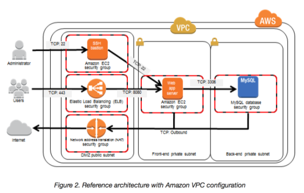

## **L2 AWS Bastion Host**

### **1 Bastion Host Overview**

* **Bastion means a structure for Fortification to protect things behind it**
* In AWS, a **Bastion host (also referred to as a Jump server) can be used to securely access instances in the private subnets**.
* **Bastion host launched in the Public subnet**s would act as a **primary access point from the Internet and acts as a proxy to other instances**.

### **2 Key points**

* **<mark>Bastion host is deployed in the Public subnet and acts as a proxy or a gateway between you and your instances</mark>**
* **Bastion host is a security measure that helps to reduce attack on your infrastructure** and you have to concentrate to hardening a single layer
* **Bastion host allows you to login to instances in the Private subnet securely without having to store the private keys on the Bastion host (using ssh-agent forwarding or RDP gateways)**
* Bastion host security can be further tightened to allow SSH/RDP access from specific trusted IPs or corporate IP ranges
* Bastion host for your AWS infrastructure shouldn’t be used for any other purpose, as that could open unnecessary security holes
* **Security for all the Instances in the private subnet should be hardened to accept SSH/RDP connections only from the Bastion host**
* Deploy a Bastion host within each Availability Zone for HA, cause if the Bastion instance or the AZ hosting the Bastion server goes down the ability to connect to your private instances is lost completely

### **3 Exam**

1. A customer is running a multi-tier web application farm in a virtual private cloud (VPC) that is not connected to their corporate network. They are connecting to the VPC over the Internet to manage all of their Amazon EC2 instances running in both the public and private subnets. They have only authorized the bastion-security-group with Microsoft Remote Desktop Protocol (RDP) access to the application instance security groups, but the company wants to further limit administrative access to all of the instances in the VPC. Which of the following Bastion deployment scenarios will meet this requirement?
	* Deploy a Windows Bastion host on the corporate network that has RDP access to all instances in the VPC.
	* Deploy a Windows Bastion host with an Elastic IP address in the public subnet and allow SSH access to the bastion from anywhere.
	* Deploy a Windows Bastion host with an Elastic IP address in the private subnet, and restrict RDP access to the bastion from only the corporate public IP addresses.
	* **Deploy a Windows Bastion host with an auto-assigned Public IP address in the public subnet, and allow RDP access to the bastion from only the corporate public IP addresses**.

2. You are designing a system that has a Bastion host. This component needs to be highly available without human intervention. Which of the following approaches would you select?
	* Run the bastion on two instances one in each AZ
	* Run the bastion on an active Instance in one AZ and have an AMI ready to boot up in the event of failure
	* **Configure the bastion instance in an Auto Scaling group Specify the Auto Scaling group to include multiple AZs but have a min-size of 1 and max-size of 1**
	* Configure an ELB in front of the bastion instance
3. You’ve been brought in as solutions architect to assist an enterprise customer with their migration of an ecommerce platform to Amazon Virtual Private Cloud (VPC) The previous architect has already deployed a 3- tier VPC. The configuration is as follows: 

	* VPC vpc-2f8t>C447
	* IGW ig-2d8bc445
	* NACL acl-2080c448
	* Subnets and Route Tables:
	* Web server’s subnet-258bc44d
	* Application server’s subnet-248DC44c
	* Database server’s subnet-9189c6f9
	* Route Tables:
	* rtb-2i8bc449
	* rtb-238bc44b
	* Associations:
	* Subnet-258bc44d: rtb-2i8bc449
	* Subnet-248DC44c: rtb-238bc44b
	* Subnet-9189c6f9: rtb-238bc44b

	* You are now ready to begin deploying EC2 instances into the VPC. Web servers must have direct access to the internet Application and database servers cannot have direct access to the internet. Which configuration below will allow you the ability to remotely administer your application and database servers, as well as allow these servers to retrieve updates from the Internet?

	* Create a bastion and NAT Instance in subnet-258bc44d and add a route from rtb-238bc44b to subnet-258bc44d. (Route should point to the NAT)
	* Add a route from rtb-238bc44b to igw-2d8bc445 and add a bastion and NAT instance within Subnet-248DC44c. (Adding IGW to routertb-238bc44b would expose the Application and Database server to internet. Bastion and NAT should be in public subnet)
	* Create a Bastion and NAT Instance in subnet-258bc44d. Add a route from rtb-238bc44b to igw-2d8bc445. And a new NACL that allows access between subnet-258bc44d and subnet-248bc44c. (Route should point to NAT and not Internet Gateway else it would be internet accessible.)
	* **Create a Bastion and NAT instance in subnet-258bc44d and add a route from rtb-238bc44b to the NAT instance. (Bastion and NAT should be in the public subnet. As Web Server has direct access to Internet, the subnet subnet-258bc44d should be public and Route rtb-2i8bc449 pointing to IGW. Route rtb-238bc44b for private subnets should point to NAT for outgoing internet access)**

4. You are tasked with setting up a Linux bastion host for access to Amazon EC2 instances running in your VPC. Only clients connecting from the corporate external public IP address 72.34.51.100 should have SSH access to the host. Which option will meet the customer requirement?
	* **Security Group Inbound Rule: Protocol – TCP. Port Range – 22, Source 72.34.51.100/32**
	* Security Group Inbound Rule: Protocol – UDP, Port Range – 22, Source 72.34.51.100/32
	* Network ACL Inbound Rule: Protocol – UDP, Port Range – 22, Source 72.34.51.100/32
	* Network ACL Inbound Rule: Protocol – TCP, Port Range-22, Source 72.34.51.100/0