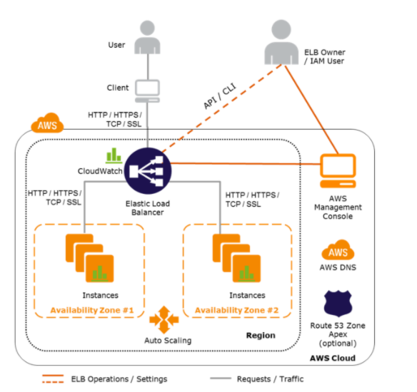
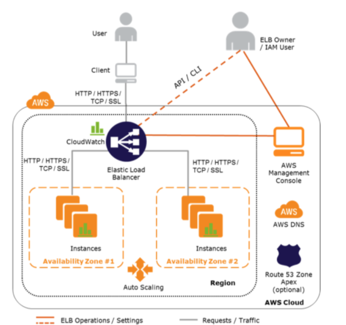

# **L4 AWS Elastic Load Balancer – ELB**

## **1、AWS Elastic Load Balancer – ELB**

Elastic Load Balancer allows the **incoming traffic to be distributed automatically across multiple healthy EC2 instances**.

ELB serves as a single point of contact to the client

**ELB helps to being transparent and increases the application availability by allowing the addition or removal of multiple EC2 instances across one or more AZs**, without disrupting the overall flow of information.

### **1-1 ELB benefits**

* **is a distributed system that is fault-tolerant and actively monitored**
* abstracts out the complexity of managing, maintaining, and scaling load balancers
* can also serve as the first line of defense against attacks on network\
* **can offload the work of encryption and decryption (SSL termination)** so that the EC2 instances can focus on their main work
* offers integration with Auto Scaling, which ensures enough back-end capacity available to meet varying traffic levels
* are engineered to not be a single point of failure

### **1-2 Load Balancers only work across AZs within a region**

## **2、AWS Elastic Load Balancer Types**

Elastic Load Balancing supports three types of load balancers:

* Application Load Balancer
* Network Load Balancer
* Elastic Load Balancer 

## **3、Elastic Load Balancer Features**

Following ELB key concepts apply to all the Elastic Load Balancer types

### **3-1 Scaling ELB**

* Each ELB is allocated and configured with a default capacity
* **ELB Controller** is the service that *stores all the configurations and also monitors the load balancer and manages the capacity that is used to handle the client requests*
* As the traffic profile changes, the controller service scales the load balancers to handle more requests, **scaling equally in all AZs**.
* **<mark>ELB increases its capacity by utilizing either larger resources (scale up – resources with higher performance characteristics) or more individual resources (scale-out)</mark>**.
* **AWS itself handles the scaling of the ELB capacity and this scaling is different to scaling of the EC2 instances to which the ELB routes its request, which is handled by Auto Scaling**
* *Time required for Elastic Load Balancing to scale can range from 1 to 7 minutes, depending on the changes in the traffic profile*
* When an Availability Zone is enabled for the load balancer, **Elastic Load Balancing creates a load balancer node in the Availability Zone.**
* By default, each load balancer node distributes traffic across the registered targets in its Availability Zone only.

### **3-2 Pre-Warming ELB**

**NOTE – AWS documentation does not include Pre-warming now**

* **<mark>ELB works best with a gradual increase in traffic</mark>**
* AWS is able to scale automatically and handle a vast majority of use cases
* However, in certain scenarios, if there is a flash traffic spike expected or a load test cannot be configured to gradually increase traffic, **recommended to contact AWS support to have the load balancer “pre-warmed”**
* A**WS will help Pre-warming the ELB, by configuring the load balancer to have the appropriate level of capacity based on the expected traffic**
* AWS would need the information for the start, end dates, and the expected request rate per second with the total size of request/response.

### **3-3 DNS Resolution**

* ELB is scaled automatically depending on the traffic profile
* **<mark>When scaled, Elastic Load Balancing service will update the Domain Name System (DNS) record of the load balancer so that the new resources have their respective IP addresses registered in DNS</mark>**.
* **DNS record created includes a Time-to-Live (TTL) setting of 60 seconds**
* By default, ELB will return multiple IP addresses when clients perform a DNS resolution, with the records being randomly ordered on each DNS resolution request.
* It is recommended that clients will re-lookup the DNS at least every 60 seconds to take advantage of the increased capacity

## **4、Load Balancer Types**

**Internet Load Balancer**

An Internet-facing load balancer takes requests from clients over the Internet and distributes them across the EC2 instances that are registered with the load balancer

**Internal Load Balancer –** 

Internal load balancer **routes traffic to EC2 instances in private subnets**

## **5、Availability Zones/Subnets**

* **Elastic Load Balancer should have at least one subnet attached**
* Elastic Load Balancing allows subnets to be added and creates a load balancer node in each of the Availability Zone where the subnet resides.
* **Only one subnet per AZ can be attached to the ELB.** Attaching a subnet with an AZ already attached replaces the existing subnet
* Each Subnet must have a CIDR block with at least a /27 bitmask and h**as at least 8 free IP addresses**, which ELB uses to establish connections with the back-end instances.
* For High Availability, it is recommended to attach one subnet per AZ for at least two AZs, even if the instances are in a single subnet.
* **Subnets can be attached or detached from the ELB and it would start or stop sending requests to the instances in the subnet accordingly**

## **6、Security Groups & NACL**

* Security groups & NACLs should allow Inbound traffic, on the load balancer listener port, from the Client for an Internet ELB or VPC CIDR for an Internal ELB
* Security groups & NACLs should allow Outbound traffic to the back-end instances on both the instance listener port and the health check port
* NACLs, in addition, should allow responses on the ephemeral ports
* **All EC2 instances should allow incoming traffic from ELB**

## **7、SSL Negotiation Configuration**

* For HTTPS load balancer, Elastic Load Balancing uses a Secure Socket Layer (SSL) negotiation configuration, known as a security policy, **to negotiate SSL connections between a client and the load balancer.**
* A security policy is a combination of **SSL protocols, SSL ciphers, and the Server Order Preference option**
	* Elastic Load Balancing supports the following versions of the SSL protocol TLS 1.2, TLS 1.1,  TLS 1.0, SSL 3.0
	* **SSL protocols use several SSL ciphers to encrypt data over the Internet**.
	* Elastic Load Balancing supports the **Server Order Preference** option for negotiating connections between a client and a load balancer.
	* During the SSL connection negotiation process, this allows the load balancer to control and select the first cipher in its list that is in the client’s list of ciphers instead of the default behavior of checking matching first cipher in client’s list with server’s list.

* Elastic Load Balancer allows using a **Predefined Security Policies or creating a Custom Security Policy for specific needs**. If none is specified, ELB selects the latest Predefined Security Policy.
* **Elastic Load Balancer support multiple certificates using Server Name Indication (SNI)**
	* **If the hostname provided by a client matches a single certificate in the certificate list, the load balancer selects this certificate**.
	* If a hostname provided by a client matches multiple certificates in the certificate list, the load balancer selects the best certificate that the client can support.

* **<mark>Classic Load Balancer does not support multiple certificates</mark>**
* **ALB and NLB support multiple certificates**

## **8、Health Checks**

* Load balancer performs health checks on all registered instances, whether the instance is in a healthy state or an unhealthy state.
* Load balancer performs health checks to discover the availability of the EC2 instances, the load balancer periodically sends pings, attempts connections, or sends request to health check the EC2 instances.
* **<mark>Health check is InService for status of healthy instances and OutOfService for unhealthy ones</mark>**
* Load balancer sends a request to each registered instance at the **Ping Protocol, Ping Port and Ping Path every HealthCheck Interval seconds*. 
	* It waits for the instance to respond within the Response Timeout period. **If the health checks exceed the Unhealthy Threshold for consecutive failed responses, the load balancer takes the instance out of service**. 
	* When the health checks exceed the **Healthy Threshold** for consecutive successful responses, the load balancer puts the instance back in service.
* Load balancer only sends requests to the healthy EC2 instances and stops routing requests to the unhealthy instances
* All ELB types support health checks

## **9、Listeners**

* Listeners is the process that checks for connection requests from client
* Listeners are configured with a protocol and a port for front-end (client to load balancer) connections, and a protocol and a port for back-end (load balancer to back-end instance) connections.
* Listeners support HTTP, HTTPS, SSL, TCP protocols
* **An X.509 certificate is required for HTTPS or SSL connections and load balancer uses the certificate to terminate the connection and then decrypt requests from clients before sending them to the back-end instances.**
* **If you want to use SSL, but don’t want to terminate the connection on the load balancer, use TCP for connections from the client to the load balancer, use the SSL protocol for connections from the load balancer to the back-end application**, and deploy certificates on the back-end instances handling requests.
* If you use an HTTPS/SSL connection for your back end, you can enable authentication on the back-end instance. This authentication can be used to ensure that back-end instances accept only encrypted communication, and to ensure that the back-end instance has the correct certificates.
* **ELB HTTPS listener does not support Client-Side SSL certificates**

## **10、Idle Connection Timeout**

* For each request that a client makes through a load balancer, it maintains two connections, for each client request, one connection is with the client, and the other connection is to the back-end instance.
* For each connection, **<mark>the load balancer manages an idle timeout that is triggered when no data is sent over the connection for a specified time period</mark>**. If no data has been sent or received, it closes the connection after the idle timeout period (defaults to 60 seconds) has elapsed
* For lengthy operations, such as file uploads, the idle timeout setting for the connections should be adjusted to ensure that lengthy operations have time to complete.

## **11、X-Forwarded Headers & Proxy Protocol Support**

* **As the Elastic Load Balancer intercepts the traffic between the client and the back-end servers, the back-end server does not know the IP address, Protocol, and the Port used between the Client and the Load balancer.**

* ELB provides X-Forwarded headers support to help back end servers track the same when using the HTTP protocol
	* **X-Forwarded-For request** header to help back-end servers identify the IP address of a client when you use an HTTP or HTTPS load balancer.
	* **X-Forwarded-Proto request** header to help back end servers identify the protocol (HTTP/S) that a client used to connect to the server
	* **X-Forwarded-Port request** header to help back-end servers identify the port that an HTTP or HTTPS load balancer uses to connect to the client.

* ELB provides **Proxy Protocol** support to help back-end servers track the same when using non-HTTP protocol or when using HTTPS and not terminating the SSL connection on the load balancer.
	* Proxy Protocol is an Internet protocol used to carry connection information from the source requesting the connection to the destination for which the connection was requested.
	* **Elastic Load Balancing uses Proxy Protocol version 1, which uses a human-readable header format with connection information such as the source IP address, destination IP address, and port numbers**
	* If the ELB is already behind a Proxy with the Proxy protocol enabled, enabling the Proxy Protocol on ELB would add the header twice

## **12、Cross-Zone**

* By default, the load balancer distributes incoming requests **evenly across its enabled Availability Zones for e.g. If AZ-a has 5 instances and AZ-b has 2 instances, the load will still be distributed 50% across each of the AZs**
* Enabling Cross-Zone load balancing allows the **ELB to distribute incoming requests evenly across all the back-end instances**, regardless of the AZ
* Elastic Load Balancing creates a load balancer node in the AZ. By default, each load balancer node distributes traffic across the registered targets in its AZ only. If you enable cross-zone load balancing, each load balancer node distributes traffic across the registered targets in all enabled AZs.
* Cross-zone load balancer reduces the need to maintain equivalent numbers of back-end instances in each Availability Zone, and improves application’s ability to handle the loss of one or more back-end instances.
* It is still recommended to maintain approximately equivalent numbers of instances in each Availability Zone for higher fault tolerance.
* With cross-zone load balancing, each load balancer node distributes traffic across the registered targets in all enabled Availability Zones
* .
* ALB -> Cross Zone load balancing is enabled by default and free
* CLB -> **Cross Zone load balancing is disabled, by default, and can be enabled and free**
* NLB -> Cross Zone load balancing is disabled, by default, and can be enabled and but charged for inter-az data transfer.

## **13、Connection Draining (Deregistration Delay)**

* By default, if a registered EC2 instance with the ELB is deregistered or becomes unhealthy, the load balancer immediately closes the connection
* **Connection draining can help the load balancer to complete the in-flight requests made while keeping the existing connections open, and preventing any new requests from being sent to the instances that are de-registering or unhealthy**.
* Connection draining helps perform maintenance such as **deploying software upgrades or replacing back-end instances without affecting customers’ experience**
* Connection draining allows you to specify a maximum time (between 1 and 3,600 seconds and default 300 seconds) to keep the connections alive before reporting the instance as de-registered. The maximum timeout limit does not apply to connections to unhealthy instances.
* If the instances are part of an Auto Scaling group and connection draining is enabled for your load balancer, **Auto Scaling waits for the in-flight requests to complete, or for the maximum timeout to expire, before terminating instances due to a scaling event or health check replacement.**

## **14、sticky Sessions (Session Affinity)**

* ELB can be configured to use **Sticky Session feature (also called session affinity) which enables it to bind a user’s session to an instance and ensures all requests are sent to the same instance.**
* Stickiness remains for a period of time which can be controlled by the application’s session cookie if one exists, or through a cookie, **named AWSELB , created through Elastic Load balancer**.
* **Sticky sessions for CLB and ALB are disabled, by default**.
* NLB does not support sticky sessions

### **14-1 Requirements**

* **An HTTP/HTTPS load balancer.**
* **SSL traffic should be terminated on the ELB.**
* ELB does session stickiness on an HTTP/HTTPS listener by utilizing an HTTP cookie. ELB has no visibility into the HTTP headers if the SSL traffic is not terminated on the ELB and is terminated on the back-end instance.“
* At least one healthy instance in each Availability Zone.

### **14-2 Duration-Based Session Stickiness**

* Duration-Based Session Stickiness is maintained by ELB using a special cookie created to track the instance for each request to each listener.
* When the load balancer receives a request,
	* **it first checks to see if this cookie is present in the request. If so, the request is sent to the instance specified in the cookie.**
	* **If there is no cookie, the ELB chooses an instance based on the existing load balancing algorithm and a cookie is inserted into the response for binding subsequent requests from the same user to that instance.**
* Stickiness policy configuration defines a cookie expiration, which establishes the duration of validity for each cookie.
* Cookie is automatically updated after its duration expires.

### **14-3 Application-Controlled Session Stickiness**

* Load balancer uses a special cookie only to associate the session with the instance that handled the initial request, but follows the lifetime of the application cookie specified in the policy configuration.
* Load balancer only inserts a new stickiness cookie if the application response includes a new application cookie. The load balancer stickiness cookie does not update with each request.
* If the application cookie is explicitly removed or expires, the session stops being sticky until a new application cookie is issued.
* If an instance fails or becomes unhealthy, the load balancer stops routing request to that instance, instead chooses a new healthy instance based on the existing load balancing algorithm.
* The load balancer treats the session as now “stuck” to the new healthy instance, and continues routing requests to that instance even if the failed instance comes back.

### **14-4 Load Balancer Deletion**

Deleting a load balancer does not affect the instances registered with the load balancer and they would continue to run

## **15 ELB with Autoscaling**

### **15-1 Auto Scaling & ELB**

* Auto Scaling dynamically adds and removes EC2 instances, while Elastic Load Balancing manages incoming requests **by optimally routing traffic so that no one instance is overwhelmed**
* Auto Scaling helps to automatically increase the number of EC2 instances when the user demand goes up, and decrease the number of EC2 instances when demand goes down
* ELB service helps to distribute the incoming web traffic (called the load) automatically among all the running EC2 instances
* **<mark>ELB uses load balancers to monitor traffic and handle requests that come through the Internet.</mark>**
	* makes it easy to route traffic across a dynamically changing fleet of EC2 instances
	* load balancer acts as a single point of contact for all incoming traffic to the instances in an Auto Scaling group.

### **15-2 Attaching/Detaching ELB with Auto Scaling Group**

* Auto Scaling integrates with Elastic Load Balancing and enables to attach one or more load balancers to an existing Auto Scaling group.
* **ELB registers the EC2 instance using its IP address and routes requests to the primary IP address of the primary interface (eth0) of the instance**.
* After the ELB is attached, it automatically registers the instances in the group and distributes incoming traffic across the instances
* **<mark>When ELB is detached, it enters the Removing state while deregistering the instances in the group</mark>**.
* **If connection draining is enabled, ELB waits for in-flight requests to complete before deregistering the instances**.
* Instances remain running after they are deregistered from the ELB
* Auto Scaling adds instances to the ELB as they are launched, but this can be suspended. **Instances launched during the suspension period are not added to the load balancer, after the resumption, and must be registered manually.**

### **15-3 High Availability & Redundancy**

* **Auto Scaling can span across multiple AZs, within the same region**
* **When one AZ becomes unhealthy or unavailable, Auto Scaling launches new instances in an unaffected AZ**
* When the unhealthy AZs recovers, Auto Scaling redistributes the traffic across all the healthy AZs
* Elastic Load balancer can be setup to distribute incoming requests across EC2 instances in a single AZ or multiple AZs within a region
* Using Auto Scaling & ELB by **<mark>spanning Auto Scaling groups across multiple AZs within a region and then setting up ELB to distribute incoming traffic across those AZs helps take advantage of the safety and reliability of geographic redundancy</mark>**
* Incoming traffic is load balanced equally across all the AZs enabled for ELB

### **15-4 Health Checks**

* Auto Scaling group determines the health state of each instance by **periodically checking** the results of EC2 instance status checks
* Auto Scaling marks the instance as unhealthy and replaces the instance, **if the instance fails the EC2 instance status check**
* ELB also performs health checks on the EC2 instances that are registered with the it for e.g. *application is available by pinging an health check page*
* *<mark>Auto Scaling, by default, does not replace the instance, if the ELB health check fails</mark>*
* **ELB health check with the instances should be used to ensure that traffic is routed only to the healthy instances**
* After a load balancer is registered with an Auto Scaling group, it can be configured to use the results of the ELB health check in addition to the EC2 instance status checks to determine the health of the EC2 instances in the Auto Scaling group.

### **15-5 Monitoring**

* Elastic Load Balancing sends data about the load balancers and EC2 instances to Amazon CloudWatch. **CloudWatch collects data about the performance of your resources and presents it as metrics**.
* After registering one or more load balancers with the Auto Scaling group, Auto Scaling group can be configured to use ELB metrics (such as request latency or request count) to scale the application automatically

### **15-6 ELB with Autoscaling Exam**

1. A company is building a two-tier web application to serve dynamic transaction-based content. The data tier is leveraging an Online Transactional Processing (OLTP) database. What services should you leverage to enable an elastic and scalable web tier?
	* **Elastic Load Balancing, Amazon EC2, and Auto Scaling**
	* Elastic Load Balancing, Amazon RDS with Multi-AZ, and Amazon S3
	* Amazon RDS with Multi-AZ and Auto Scaling
	* Amazon EC2, Amazon DynamoDB, and Amazon S3
2. You have been given a scope to deploy some AWS infrastructure for a large organization. The requirements are that you will have a lot of EC2 instances but may need to add more when the average utilization of your Amazon EC2 fleet is high and conversely remove them when CPU utilization is low. Which AWS services would be best to use to accomplish this?
	* Amazon CloudFront, Amazon CloudWatch and Elastic Load Balancing
	* Auto Scaling, Amazon CloudWatch and AWS CloudTrail
	* **Auto Scaling, Amazon CloudWatch and Elastic Load Balancing**
	* Auto Scaling, Amazon CloudWatch and AWS Elastic Beanstalk
3. A user has configured ELB with Auto Scaling. The user suspended the Auto Scaling AddToLoadBalancer, which adds instances to the load balancer. process for a while. **What will happen to the instances launched during the suspension period**?
	* **The instances will not be registered with ELB and the user has to manually register when the process is resumed**
	* The instances will be registered with ELB only once the process has resumed
	* Auto Scaling will not launch the instance during this period due to process suspension
	* It is not possible to suspend only the AddToLoadBalancer process
4. You have an Auto Scaling group associated with an Elastic Load Balancer (ELB). **You have noticed that instances launched via the Auto Scaling group are being marked unhealthy due to an ELB health check, but these unhealthy instances are not being terminated**. What do you need to do to ensure trial instances marked unhealthy by the ELB will be terminated and replaced?
	* Change the thresholds set on the Auto Scaling group health check
	* **Add an Elastic Load Balancing health check to your Auto Scaling group**
	* Increase the value for the Health check interval set on the Elastic Load Balancer
	* Change the health check set on the Elastic Load Balancer to use TCP rather than HTTP checks
5. You are responsible for a web application that consists of an Elastic Load Balancing (ELB) load balancer in front of an Auto Scaling group of Amazon Elastic Compute Cloud (EC2) instances. For a recent deployment of a new version of the application, a new Amazon Machine Image (AMI) was created, and the Auto Scaling group was updated with a new launch configuration that refers to this new AMI. During the deployment, you received complaints from users that the website was responding with errors. All instances passed the ELB health checks. What should you do in order to avoid errors for future deployments? (Choose 2 answer) [**PROFESSIONAL**]
Add an Elastic Load Balancing health check to the Auto Scaling group. Set a short period for the health checks to operate as soon as possible in order to prevent premature registration of the instance to the load balancer.
	* Enable EC2 instance CloudWatch alerts to change the launch configuration’s AMI to the previous one. Gradually terminate instances that are using the new AMI.
	* Set the Elastic Load Balancing health check configuration to target a part of the application that fully tests application health and returns an error if the tests fail.
	* **Create a new launch configuration that refers to the new AMI, and associate it with the group. Double the size of the group, wait for the new instances to become healthy, and reduce back to the original size. If new instances do not become healthy, associate the previous launch configuration**.
	* **Increase the Elastic Load Balancing Unhealthy Threshold to a higher value to prevent an unhealthy instance from going into service behind the load balancer**.
6. What is the order of most-to-least rapidly-scaling (fastest to scale first)? A) EC2 + ELB + Auto Scaling B) Lambda C) RDS
	* **B, A, C (Lambda is designed to scale instantly. EC2 + ELB + Auto Scaling require single-digit minutes to scale out. RDS will take at least 15 minutes, and will apply OS patches or any other updates when applied.)**
	* C, B, A
	* C, A, B
	* A, C, B
7. A user has hosted an application on EC2 instances. The EC2 instances are configured with ELB and Auto Scaling. The application server session time out is 2 hours. The user wants to configure connection draining to ensure that all in-flight requests are supported by ELB even though the instance is being deregistered. **What time out period should the user specify for connection draining**?
	* 5 minutes
	* **1 hour (max allowed is 3600 secs that is close to 2 hours to keep the in flight requests alive)**
	* 30 minutes
	* 2 hours

## **16、ELB Exams**
	
1. A user has configured an HTTPS listener on an ELB. The user has not configured any security policy which can help to negotiate SSL between the client and ELB. What will ELB do in this scenario?
	* By default ELB will select the first version of the security policy
	* **By default ELB will select the latest version of the policy**
	* ELB creation will fail without a security policy
	* It is not required to have a security policy since SSL is already installed
2. A user has configured ELB with SSL using a security policy for secure negotiation between the client and load balancer. The ELB security policy supports various ciphers. Which of the below mentioned options **helps identify the matching cipher at the client side to the ELB cipher list when client is requesting ELB DNS over SSL**
	* Cipher Protocol
	* Client Configuration Preference
	* **Server Order Preference**
	* Load Balancer Preference
3. A user has configured ELB with SSL using a security policy for secure negotiation between the client and load balancer. Which of the below mentioned security policies is supported by ELB?
	* Dynamic Security Policy
	* All the other options
	* **Predefined Security Policy**
	* Default Security Policy
4. A user has configured ELB with SSL using a security policy for secure negotiation between the client and load balancer. Which of the below mentioned SSL protocols is **not supported by the security policy**?
	* **TLS 1.3**
	* TLS 1.2
	* SSL 2.0
	* SSL 3.0
5. A user has configured ELB with a TCP listener at ELB as well as on the back-end instances. The user wants to enable a proxy protocol to capture the source and destination IP information in the header. **Which of the below mentioned statements helps the user understand a proxy protocol with TCP configuration**?
	* **If the end user is requesting behind a proxy server then the user should not enable a proxy protocol on ELB**
	* ELB does not support a proxy protocol when it is listening on both the load balancer and the back-end instances
	* Whether the end user is requesting from a proxy server or directly, it does not make a difference for the proxy protocol
	* If the end user is requesting behind the proxy then the user should add the “isproxy” flag to the ELB Configuration
6. A user has enabled session stickiness with ELB. The user does not want ELB to manage the cookie; instead he wants the application to manage the cookie. What will happen when the server instance, which is bound to a cookie, crashes?
	* The response will have a cookie but stickiness will be deleted
	* **The session will not be sticky until a new cookie is inserted**
	* ELB will throw an error due to cookie unavailability
	* The session will be sticky and ELB will route requests to another server as ELB keeps replicating the Cookie
7. A user has created an ELB with Auto Scaling. Which of the below mentioned offerings from ELB helps the user to stop sending new requests traffic from the load balancer to the EC2 instance when the instance is being deregistered while continuing in-flight requests?
	* ELB sticky session
	* ELB deregistration check
	* **ELB connection draining**
	* ELB auto registration Off
8. When using an Elastic Load Balancer to serve traffic to web servers, which one of the following is true?
	* Web servers must be publicly accessible
	* The same security group must be applied to both the ELB and EC2 instances
	* ELB and EC2 instance must be in the same subnet
	* **ELB and EC2 instances must be in the same VPC**
9. A user has configured Elastic Load Balancing by enabling a Secure Socket Layer (SSL) negotiation configuration known as a Security Policy. Which of the below mentioned options is not part of this secure policy while negotiating the SSL connection between the user and the client?
	* SSL Protocols
	* **Client Order Preference**
	* SSL Ciphers
	* Server Order Preference
10. A user has created an ELB with the availability zone us-east-1. The user wants to add more zones to ELB to achieve High Availability. How can the user add more zones to the existing ELB?
	* It is not possible to add more zones to the existing ELB
	* Only option is to launch instances in different zones and add to ELB
	* The user should stop the ELB and add zones and instances as required
	* **The user can add zones on the fly from the AWS console**
11. A user has launched an ELB which has 5 instances registered with it. The user deletes the ELB by mistake. What will happen to the instances?
	* ELB will ask the user whether to delete the instances or not
	* Instances will be terminated
	* ELB cannot be deleted if it has running instances registered with it
	* **Instances will keep running**
12. A Sys-admin has created a shopping cart application and hosted it on EC2. The EC2 instances are running behind ELB. The admin wants to ensure that the end user request will always go to the EC2 instance where the user session has been created. How can the admin configure this?
	* Enable ELB cross zone load balancing
	* Enable ELB cookie setup
	* **Enable ELB sticky session**
	* Enable ELB connection draining
13. A user has setup connection draining with ELB to allow in-flight requests to continue while the instance is being deregistered through Auto Scaling. If the user has not specified the draining time, how long will ELB allow inflight requests traffic to continue?
	* 600 seconds
	* 3600 seconds
	* **300 seconds**
	* 0 seconds
14. A customer has a web application that uses cookie Based sessions to track logged in users. It is deployed on AWS using ELB and Auto Scaling. The customer observes that when load increases Auto Scaling launches new Instances but the load on the existing Instances does not decrease, causing all existing users to have a sluggish experience. Which two answer choices independently describe a behavior that could be the cause of the sluggish user experience?
	* ELB’s normal behavior sends requests from the same user to the same backend instance (its not by default)
	* **ELB’s behavior when sticky sessions are enabled causes ELB to send requests in the same session to the same backend**
	* A faulty browser is not honoring the TTL of the ELB DNS name (DNS TTL would only impact the ELB instances if scaled and not the EC2 instances to which the traffic is routed)
	* **The web application uses long polling such as comet or websockets. Thereby keeping a connection open to a web server tor a long time**
15. A customer has an online store that uses the cookie-based sessions to track logged-in customers. It is deployed on AWS using ELB and autoscaling. When the load increases, Auto scaling automatically launches new web servers, but the load on the web servers do not decrease. This causes the customers a poor experience. What could be causing the issue ?
	* ELB DNS records Time to Live is set too high (DNS TTL would only impact the ELB instances if scaled and not the EC2 instances to which the traffic is routed)
	* **ELB is configured to send requests with previously established sessions**
	* Website uses CloudFront which is keeping sessions alive
	* New Instances are not being added to the ELB during the Auto Scaling cool down period
16. You are designing a multi-platform web application for AWS. The application will run on EC2 instances and will be accessed from PCs, tablets and smart phones. Supported accessing platforms are Windows, MACOS, IOS and Android. Separate sticky session and SSL certificate setups are required for different platform types. Which of the following describes the most cost effective and performance efficient architecture setup?
	* Setup a hybrid architecture to handle session state and SSL certificates on-prem and separate EC2 Instance groups running web applications for different platform types running in a VPC.
	* Set up one ELB for all platforms to distribute load among multiple instance under it. Each EC2 instance implements all functionality for a particular platform.
	* Set up two ELBs. The first ELB handles SSL certificates for all platforms and the second ELB handles session stickiness for all platforms for each ELB run separate EC2 instance groups to handle the web application for each platform.
	* **Assign multiple ELBs to an EC2 instance or group of EC2 instances running the common components of the web application, one ELB for each platform type. Session stickiness and SSL termination are done at the ELBs. (Session stickiness requires HTTPS listener with SSL termination on the ELB and ELB does not support multiple SSL certs so one is required for each cert)**
17. You are migrating a legacy client-server application to AWS. The application responds to a specific DNS domain (e.g. www.example.com) and has a 2-tier architecture, with multiple application servers and a database server. Remote clients use TCP to connect to the application servers. The application servers need to know the IP address of the clients in order to function properly and are currently taking that information from the TCP socket. A Multi-AZ RDS MySQL instance will be used for the database. During the migration you can change the application code but you have to file a change request. How would you implement the architecture on AWS in order to maximize scalability and high availability?
	* **File a change request to implement Proxy Protocol support In the application. Use an ELB with a TCP Listener and Proxy Protocol enabled to distribute load on two application servers in different AZs. (ELB with TCP listener and proxy protocol will allow IP to be passed )**
	* File a change request to Implement Cross-Zone support in the application. Use an ELB with a TCP Listener and Cross-Zone Load Balancing enabled, two application servers in different AZs.
	* File a change request to implement Latency Based Routing support in the application. Use Route 53 with Latency Based Routing enabled to distribute load on two application servers in different AZs.
	* File a change request to implement Alias Resource support in the application Use Route 53 Alias Resource Record to distribute load on two application servers in different AZs.
18. A user has created an ELB with three instances. How many security groups will ELB create by default?
	* 3
	* 5
	* **2 (One for ELB to allow inbound and Outbound to listener and health check port of instances and One for the Instances to allow inbound from ELB)**
	* 1
19. You have a web-style application with a stateless but CPU and memory-intensive web tier running on a cc2 8xlarge EC2 instance inside of a VPC The instance when under load is having problems returning requests within the SLA as defined by your business The application maintains its state in a DynamoDB table, but the data tier is properly provisioned and responses are consistently fast. How can you best resolve the issue of the application responses not meeting your SLA?
	* **Add another cc2 8xlarge application instance, and put both behind an Elastic Load Balancer**
	* Move the cc2 8xlarge to the same Availability Zone as the DynamoDB table (Does not improve the response time and performance)
	* Cache the database responses in ElastiCache for more rapid access (Data tier is responding fast)
	* Move the database from DynamoDB to RDS MySQL in scale-out read-replica configuration (Data tier is responding fast)
20. An organization has configured a VPC with an Internet Gateway (IGW). pairs of public and private subnets (each with one subnet per Availability Zone), and an Elastic Load Balancer (ELB) configured to use the public subnets. The applications web tier leverages the ELB, Auto Scaling and a Multi-AZ RDS database instance. The organization would like to eliminate any potential single points of failure in this design. What step should you take to achieve this organization’s objective?
	* **Nothing, there are no single points of failure in this architecture**.
	* Create and attach a second IGW to provide redundant internet connectivity. (VPC can be attached only 1 IGW)
	* Create and configure a second Elastic Load Balancer to provide a redundant load balancer. (ELB scales by itself with multiple availability zones configured with it)
	* Create a second multi-AZ RDS instance in another Availability Zone and configure replication to provide a redundant database. (Multi AZ requires 2 different AZ for setup and already has a standby)
21. Your application currently leverages AWS Auto Scaling to grow and shrink as load Increases/ decreases and has been performing well. Your marketing team expects a steady ramp up in traffic to follow an upcoming campaign that will result in a 20x growth in traffic over 4 weeks. Your forecast for the approximate number of Amazon EC2 instances necessary to meet the peak demand is 175. What should you do to avoid potential service disruptions during the ramp up in traffic?
	* Ensure that you have pre-allocated 175 Elastic IP addresses so that each server will be able to obtain one as it launches (max limit 5 EIP and a service request needs to be submitted)
	* **Check the service limits in Trusted Advisor and adjust as necessary so the forecasted count remains within limits**.
	* Change your Auto Scaling configuration to set a desired capacity of 175 prior to the launch of the marketing campaign (Will cause 175 instances to be launched and running but not gradually scale)
	* Pre-warm your Elastic Load Balancer to match the requests per second anticipated during peak demand (Does not need pre warming as the load is increasing steadily)
22. Which of the following features ensures even distribution of traffic to Amazon EC2 instances in multiple Availability Zones registered with a load balancer?
	* Elastic Load Balancing request routing
	* An Amazon Route 53 weighted routing policy (does not control traffic to EC2 instance)
	* **Elastic Load Balancing cross-zone load balancing**
	* An Amazon Route 53 latency routing policy (does not control traffic to EC2 instance)
23. Your web application front end consists of multiple EC2 instances behind an Elastic Load Balancer. You configured ELB to perform health checks on these EC2 instances, if an instance fails to pass health checks, which statement will be true?
	* The instance gets terminated automatically by the ELB (it is done by Autoscaling)
	* The instance gets quarantined by the ELB for root cause analysis.
	* The instance is replaced automatically by the ELB. (it is done by Autoscaling)
	* **The ELB stops sending traffic to the instance that failed its health check**
24. You have a web application running on six Amazon EC2 instances, consuming about 45% of resources on each instance. You are using auto-scaling to make sure that six instances are running at all times. The number of requests this application processes is consistent and does not experience spikes. The application is critical to your business and you want high availability at all times. You want the load to be distributed evenly between all instances. You also want to use the same Amazon Machine Image (AMI) for all instances. Which of the following architectural choices should you make?
	* Deploy 6 EC2 instances in one availability zone and use Amazon Elastic Load Balancer. (Single AZ will not provide High Availability)
	* Deploy 3 EC2 instances in one region and 3 in another region and use Amazon Elastic Load Balancer. (Different region, AMI would not be available unless copied)
	* **Deploy 3 EC2 instances in one availability zone and 3 in another availability zone and use Amazon Elastic Load Balancer.**
	* Deploy 2 EC2 instances in three regions and use Amazon Elastic Load Balancer. (Different region, AMI would not be available unless copied)
25. You are designing an SSL/TLS solution that requires HTTPS clients to be authenticated by the Web server using client certificate authentication. The solution must be resilient. Which of the following options would you consider for configuring the web server infrastructure? (Choose 2 answers)
	* **Configure ELB with TCP listeners on TCP/443. And place the Web servers behind it. (terminate SSL on the instance using client-side certificate)**
	* **Configure your Web servers with EIPs. Place the Web servers in a Route53 Record Set and configure health checks against all Web servers. (Remove ELB and use Web Servers directly with Route 53**)
	* Configure ELB with HTTPS listeners, and place the Web servers behind it. (ELB with HTTPs does not support Client-Side certificates)
	* Configure your web servers as the origins for a CloudFront distribution. Use custom SSL certificates on your CloudFront distribution (CloudFront does not Client-Side ssl certificates)
26. You are designing an application that contains protected health information. Security and compliance requirements for your application mandate that all protected health information in the application use encryption at rest and in transit. The application uses a three-tier architecture where data flows through the load balancer and is stored on Amazon EBS volumes for processing, and the results are stored in Amazon S3 using the AWS SDK. Which of the following two options satisfy the security requirements? Choose 2 answers
	* Use SSL termination on the load balancer, Amazon EBS encryption on Amazon EC2 instances, and Amazon S3 with server-side encryption. (connection between ELB and EC2 not encrypted)
	* Use SSL termination with a SAN SSL certificate on the load balancer, Amazon EC2 with all Amazon EBS volumes using Amazon EBS encryption, and Amazon S3 with server-side encryption with customer-managed keys.
	* **Use TCP load balancing on the load balancer, SSL termination on the Amazon EC2 instances, OS-level disk encryption on the Amazon EBS volumes, and Amazon S3 with server-side encryption.**
	* Use TCP load balancing on the load balancer, SSL termination on the Amazon EC2 instances, and Amazon S3 with server-side encryption. (Does not mention EBS encryption)
	* **Use SSL termination on the load balancer, an SSL listener on the Amazon EC2 instances, Amazon EBS encryption on EBS volumes containing PHI, and Amazon S3 with server-side encryption.**
27. A startup deploys its photo-sharing site in a VPC. An elastic load balancer distributes web traffic across two subnets. The load balancer session stickiness is configured to use the AWS-generated session cookie, with a session TTL of 5 minutes. The web server Auto Scaling group is configured as min-size=4, max-size=4. The startup is preparing for a public launch, by running load-testing software installed on a single Amazon Elastic Compute Cloud (EC2) instance running in `us-west-2a`. After 60 minutes of load-testing, the web server logs show the following:WEBSERVER LOGS | # of HTTP requests from load-tester | # of HTTP requests from private beta users || webserver #1 (subnet in us-west-2a): | 19,210 | 434 || webserver #2 (subnet in us-west-2a): | 21,790 | 490 || webserver #3 (subnet in us-west-2b): | 0 | 410 || webserver #4 (subnet in us-west-2b): | 0 | 428 |Which recommendations can help ensure that load-testing HTTP requests are evenly distributed across the four web servers? Choose 2 answers
	* Launch and run the load-tester Amazon EC2 instance from us-east-1 instead.
	* Configure Elastic Load Balancing session stickiness to use the app-specific session cookie.
	* **Re-configure the load-testing software to re-resolve DNS for each web request**. 
	* Configure Elastic Load Balancing and Auto Scaling to distribute across us-west-2a and us-west-2b.
	* **Use a third-party load-testing service which offers globally distributed test clients.** 
28. To serve Web traffic for a popular product your chief financial officer and IT director have purchased 10 m1.large heavy utilization Reserved Instances (RIs) evenly spread across two availability zones: Route 53 is used to deliver the traffic to an Elastic Load Balancer (ELB). After several months, the product grows even more popular and you need additional capacity As a result, your company purchases two c3.2xlarge medium utilization RIs You register the two c3.2xlarge instances with your ELB and quickly find that the ml large instances are at 100% of capacity and the c3.2xlarge instances have significant capacity that’s unused Which option is the most cost effective and uses EC2 capacity most effectively?
	* **Use a separate ELB for each instance type and distribute load to ELBs with Route 53 weighted round robin**
	* Configure Autoscaling group and Launch Configuration with ELB to add up to 10 more on-demand mi large instances when triggered by CloudWatch shut off c3.2xlarge instances (increase cost as you still pay for the RI)
	* Route traffic to EC2 m1.large and c3.2xlarge instances directly using Route 53 latency based routing and health checks shut off ELB (will not still use the capacity effectively)
	* Configure ELB with two c3.2xlarge Instances and use on-demand Autoscailng group for up to two additional c3.2xlarge instances Shut on m1.large instances(Increases cost, as you still pay for the 10 m1.large RI)
29. Which header received at the EC2 instance identifies the port used by the client while requesting ELB?
	* X-Forwarded-Proto
	* X-Requested-Proto
	* **X-Forwarded-Port**
	* X-Requested-Port
30. A user has configured ELB with two instances running in separate AZs of the same region? Which of the below mentioned statements is true?
	* **Multi AZ instances will provide HA with ELB (ELB provides HA to route traffic to healthy instances only it does not provide scalability)**
	* Multi AZ instances are not possible with a single ELB
	* Multi AZ instances will provide scalability with ELB
	* The user can achieve both HA and scalability with ELB
31. A user is configuring the HTTPS protocol on a front end ELB and the SSL protocol for the back-end listener in ELB. What will ELB do?
	* It will allow you to create the configuration, but the instance will not pass the health check
	* Receives requests on HTTPS and sends it to the back end instance on SSL
	* **It will not allow you to create this configuration (Will give error “Load Balancer protocol is an application layer protocol, but instance protocol is not. Both the Load Balancer protocol and the instance protocol should be at the same layer. Please fix.”)**
	* It will allow you to create the configuration, but ELB will not work as expected
32. An ELB is diverting traffic across 5 instances. One of the instances was unhealthy only for 20 minutes. What will happen after 20 minutes when the instance becomes healthy?
	* ELB will never divert traffic back to the same instance
	* ELB will not automatically send traffic to the same instance. However, the user can configure to start sending traffic to the same instance
	* **ELB starts sending traffic to the instance once it is healthy**
	* ELB terminates the instance once it is unhealthy. Thus, the instance cannot be healthy after 10 minutes
33. A user has hosted a website on AWS and uses ELB to load balance the multiple instances. The user application does not have any cookie management. How can the user bind the session of the requestor with a particular instance?
	* Bind the IP address with a sticky cookie
	* Create a cookie at the application level to set at ELB
	* Use session synchronization with ELB
	* **Let ELB generate a cookie for a specified duration**
34. A user has configured a website and launched it using the Apache web server on port 80. The user is using ELB with the EC2 instances for Load Balancing. What should the user do to ensure that the EC2 instances accept requests only from ELB?
	* Open the port for an ELB static IP in the EC2 security group
	* **Configure the security group of EC2, which allows access to the ELB source security group**
	* Configure the EC2 instance so that it only listens on the ELB port
	* Configure the security group of EC2, which allows access only to the ELB listener
35. AWS Elastic Load Balancer supports SSL termination.
	* For specific availability zones only
	* False
	* For specific regions only
	* **For all regions**
36. User has launched five instances with ELB. How can the user add the sixth EC2 instance to ELB?
	* **The user can add the sixth instance on the fly.**
	* The user must stop the ELB and add the sixth instance.
	* The user can add the instance and change the ELB config file.
	* The ELB can only have a maximum of five instances.