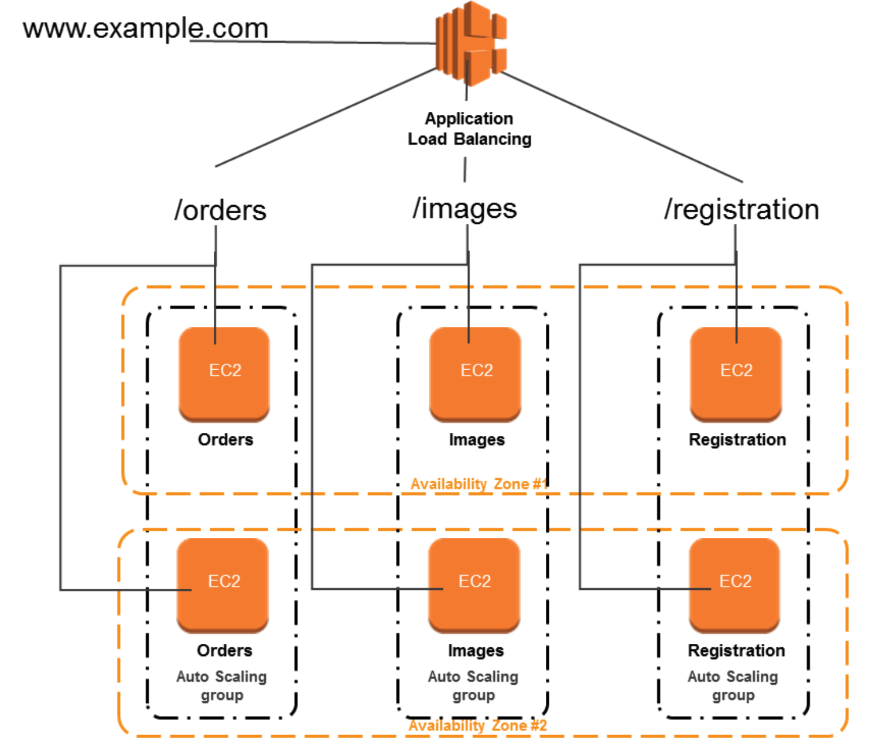
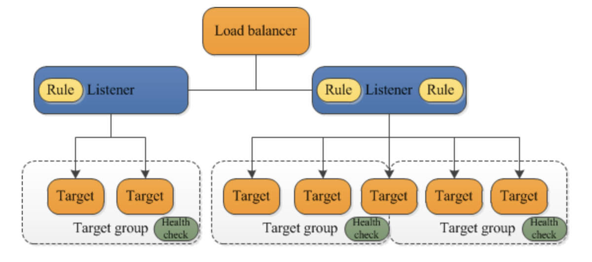

# **L5 AWS Application Load Balancer – ALB**

## **1 AWS Application Load Balancer - ALB**

**Application Load Balancer operates at layer 7** (application layer) and allows defining routing rules based on content **across multiple services or containers running on one or more EC2 instances**

* scales the load balancer as traffic to the application changes over time.
* **can scale to the vast majority of workloads automatically.**
* **supports health checks, used to monitor the health of registered targets so that the load balancer can send requests only to the healthy targets.**

## **2、Application Load Balancer Components**

### **2-1 A load balancer**

* serves as the single point of contact for clients.
* distributes incoming application traffic across multiple targets, such as EC2 instances, in multiple AZs, which increases the availability of the application.
* one or more listeners can be added to the load balancer.

### **2-2 A listener**

* checks for connection requests from clients, **using the configured protocol and port**
* rules defined determine, how the load balancer routes requests to its registered targets.
* each rule consists of a priority, one or more actions, and one or more conditions.
* when the conditions for a rule are met, its actions are performed.
* a default rule for each listener must be defined, and optionally additional rules can be defined

### **2-3 Target group**

* routes requests to one or more registered targets, such as EC2 instances, using the specified protocol and port number
* **a target can be registered with multiple target groups**.
* health checks can be configured on a per target group basis.
* Health checks are performed on all targets registered to a target group that is specified in a listener rule for the load balancer.
* target group supports
	* **EC2 instances (can be managed as a part of Autoscaling group)**
	* **ECS tasks**
	* **Lambda functions**
	* **IP Addresses – must be private IP**

	
* When a load balancer receives a request, it evaluates the listener rules in priority order to **determine which rule to apply and then selects a target from the target group for the rule action.**
* Listener rules can be configured to r**oute requests to different target groups** based on the content of the application traffic.
* Routing is performed independently for each target group, even when a target is registered with multiple target groups.
* **Routing algorithm used can be configured at the target group level**.
* **Default routing algorithm is round-robin**; alternatively, the least outstanding requests routing algorithm can also be specified

## **3、Application Load Balancer Benefits**

* **Support for Path-based routing,  where listener rules can be configured to forward requests based on the URL in the request**. 
	* This enables structuring application as smaller services (microservices), and route requests to the correct service based on the content of the URL.
* Support for routing requests to multiple services on a single EC2 instance by registering the instance **using multiple ports**.
* **Support for containerized applications**. 
	* EC2 Container Service (ECS) can select an unused port when scheduling a task and register the task with a target group using this port, enabling efficient use of the clusters.
* Support for monitoring the health of each service independently, as health checks are defined at the target group level and many CloudWatch metrics are reported at the target group level.
* **Attaching a target group to an Auto Scaling group enables scaling each service dynamically based on demand**.

## **4、Application Load Balancer Features**

* supports load balancing of applications **using HTTP and HTTPS (Secure HTTP) protocols**
* supports **HTTP/2**, which is enabled natively. Clients that support HTTP/2 can connect over TLS
* supports **WebSockets** and **Secure WebSockets** natively
* supports **Request tracing**, by default.
	* request tracing can be used to track HTTP requests from clients to targets or other services.
	* Load balancer upon receiving a request from a client, adds or updates the **X-Amzn-Trace-Id** header before sending the request to the target
	* Any services or applications between the load balancer and the target can also add or update this header.
* supports **Sticky Sessions (Session Affinity)** using load balancer generated cookies, to route requests from the same client to the same target
* supports **SSL termination**, to decrypt the request on ALB before sending it to the underlying targets.
	* an SSL certificate can be installed on the load balancer.
	* the load balancer uses this certificate to terminate the connection and then decrypt requests from clients before sending them to targets.
* **<mark>supports layer 7 specific features like X-Forwarded-For headers to help determine the actual client IP, port and protocol</mark>**
* automatically **scales** its request handling capacity in response to incoming application traffic.
* supports **hybrid load balancing**,
	* If an application runs on targets distributed between a VPC and an on-premises location, they can be added to the same target group using their IP addresses
* provides **High Availability**, by allowing you to specify more than one AZ and distribution of incoming traffic across multiple AZs.
* integrates with **ACM** to provision and bind an SSL/TLS certificate to the load balancer thereby making the entire SSL offload process very easy
* **supports multiple certificates for the same domain to a secure listener**
* supports **IPv6** addressing, for an Internet-facing load balancer
* supports **Cross-zone load balancing, by default**
* supports **Security Groups** to control the traffic allowed to and from the load balancer.
* provides **Access Logs**, to record all requests sent to the load balancer, and store the logs in S3 for later analysis in compressed format
* provides **Delete Protection**, to prevent the ALB from accidental deletion
* supports **Connection Idle Timeout** – ALB maintains two connections for each request one with the Client (front end) and one with the target instance (back end). If no data has been sent or received by the time that the idle timeout period elapses, ALB closes the front-end connection
* integrates with **CloudWatch** to provide metrics, such as request counts, error counts, error types, and request latency
* integrates with **AWS WAF**, a web application firewall that helps protect web applications from attacks by allowing rules configuration based on IP addresses, HTTP headers, and custom URI strings
* integrates with **CloudTrail** to receive a history of ALB API calls made on the AWS account‘’

## **5、Application Load Balancer Listeners**

* A listener is a process that checks for connection requests, using the configured protocol and port
* Listener supports HTTP & HTTPS protocol with Ports from 1-65535
* ALB supports SSL Termination for HTTPS listener, which helps to offload the work of encryption and decryption so that the targets can focus on their main work.

* **<mark>HTTPS listener must have at least one SSL server certificate on the listener</mark>**
* WebSockets with both HTTP and HTTPS listeners (Secure WebSockets)
* Supports HTTP/2 with HTTPS listeners
* 128 requests can be sent in parallel using one HTTP/2 connection.
	* ALB converts these to individual HTTP/1.1 requests and distributes them across the healthy targets in the target group using the round robin routing algorithm.
	* HTTP/2 uses front-end connections more efficiently resulting in fewer connections between clients and the load balancer.
	* Server-push feature of HTTP/2 is not supported
* Each listener has a default rule, and can optionally define additional rules.
* **Each rule consists of a priority, action, optional host condition, and optional path condition**.
	* **Priority** – Rules are evaluated in priority order, from the lowest value to the highest value. The default rule has the lowest priority
	* **Action** – Each rule action has a type and a target group. Currently, the only supported type is forward, which forwards requests to the target group. You can change the target group for a rule at any time.
	* **Condition** – There are two types of rule conditions: host and path. When the conditions for a rule are met, then its action is taken

### **5-1 Host Condition or Host-based routing**

* Host conditions can be used to define rules that forward requests to different target groups based on the hostname in the host header
* **This enables support for multiple domains using a single ALB for e.g. `orders.example.com`, `images.example.com`, `registration.example.com`**
* Each host condition has one hostname. If the hostname in

### **5-2 Path Condition or path-based routing**

* Path conditions can be used to define rules that forward requests to different target groups based on the URL in the request
* **Each path condition has one path pattern for e.g. `example.com/orders`, `example.com/images`, `example.com/registration`**
* If the URL in a request matches the path pattern in a listener rule exactly, the request is routed using that rule.

## **6、Advantages over Classic Load Balancer**

* Support for **path-based routing**, where rules can be configured for the listener to forward requests based on the content of the URL
* Support for **host-based routing**, where rules can be configured for the listener to forward requests based on the host field in the HTTP header.
* Support for **routing based on fields** in the request, such as standard and custom HTTP headers and methods, query parameters, and source IP address
* Support for routing requests to multiple applications on a single EC2 instance. Each instance or IP address can be registered with the same target group using multiple ports
* Support for **registering targets by IP address**, including targets outside the VPC for the load balancer.
* Support for **redirecting requests from one URL to another**.
* Support for **returning a custom HTTP response.**
* Support for **registering Lambda functions** as targets.
* Support for the load balancer to authenticate users of the applications through their corporate or social identities before routing requests.
* Support **containerized** applications with ECS using Dynamic port mapping
* Support **monitoring the health of each service independently**, as health checks and many CloudWatch metrics are defined at the target group level
* Attaching the target group to an Auto Scaling group enables scaling of each service dynamically based on demand
* Access logs contain additional information & stored in compressed format
* **Improved load balancer performance**.

## **7、Application Load Balancer Pricing**

* charged for each hour or partial hour that an ALB is running and the number of Load Balancer Capacity Units (LCU) used per hour.
* An LCU is a new metric for determining ALB pricing
* An LCU defines the maximum resource consumed in any one of the dimensions (new connections, active connections, bandwidth and rule evaluations) the Application Load Balancer processes the traffic.

## **8、Application Load Balancer Exam**

1. You are designing an application which requires websockets support, to **exchange real-time messages with end-users without the end users having to request (or poll) the server **for an update? Which ELB option should you choose?

	* Use Application Load Balancer and enable comet support
	* Use Classic Load Balancer which supports WebSockets
	* **Use Application Load Balancer which supports WebSockets**
	* Use Classic Load Balancer and enable comet support

2. Which of the following Internet protocols does an AWS Application Load Balancer Support? Choose 2 answers

	* A. ICMP
	* B. UDP
	* C. **HTTP**
	* D. SNTP
	* E. **Websocket**

3. Your organization has configured an application behind ALB. However, Clients are complaining that they cannot connect to an Internet-facing load balancer. What cannot be the issue?

	* Internet-facing load balancer is attached to a private subnet
	* ALB Security Groups does not allow the traffic
	* Subnet NACLs do not allow the traffic
	* **ALB was not assigned an EIP**

4. To protect your ALB from accidental deletion, you should
	
	* enable Multi-Factor Authentication (MFA) protected access
	* **enable Delete Protection on the ALB**
	* enabled Termination Protection on the ALB
	* ALB does not provide any feature to prevent accidental deletion

5. Your organization is using ALB for servicing requests. One of the API request is facing consistent performance issues. Upon checking the flow, you find that the request flows through multiple services. How can you track the performance or timing issues in the application stack at the granularity of an individual request?

	* **Track the request using “X-Amzn-Trace-Id” HTTP header**
	* Track the request using “X-Amzn-Track-Id” HTTP header
	* Track the request using “X-Aws-Track-Id” HTTP header
	* Track the request using “X-Aws-Trace-Id” HTTP header