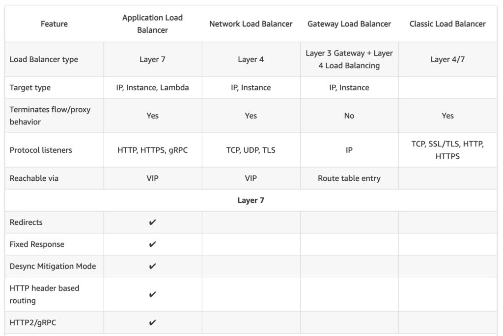
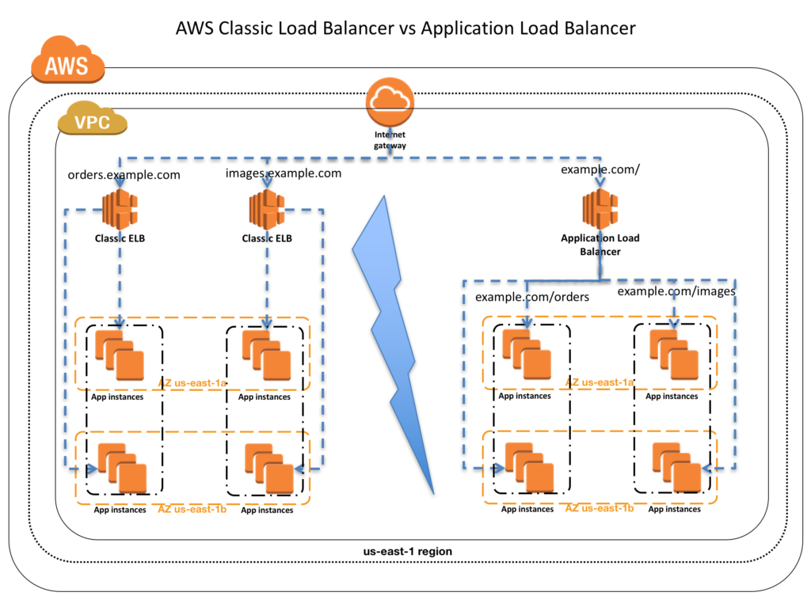
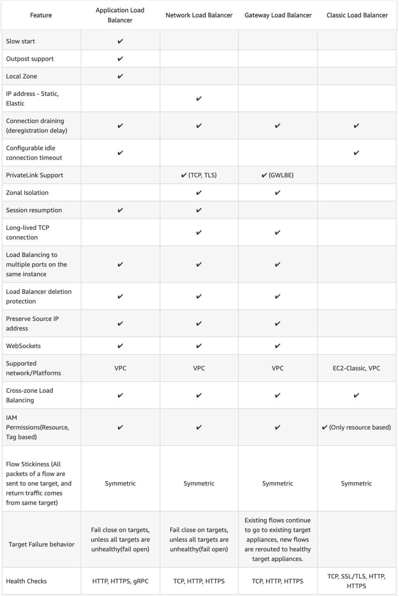
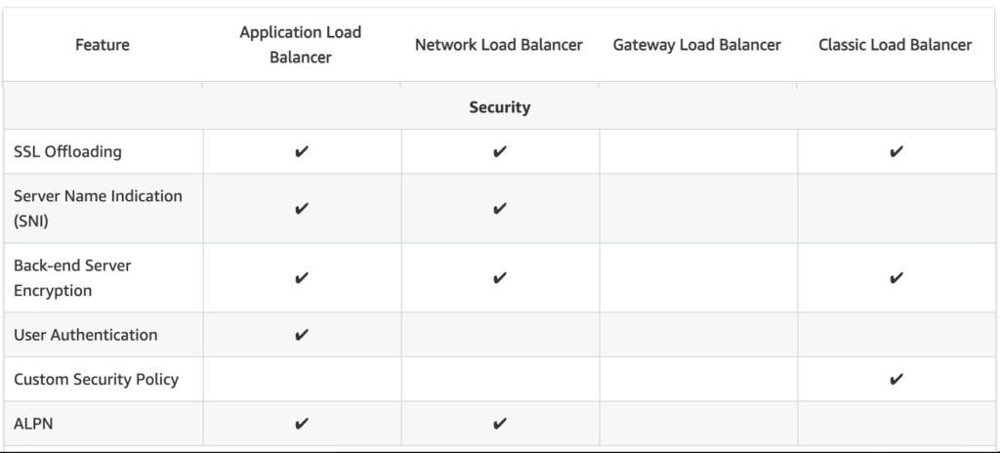

# **L7 AWS Classic Load Balancer vs Application Load Balancer vs Network Load Balancer**

## **1 AWS Classic Load Balancer vs Application Load Balancer vs Network Load Balancer**

Elastic Load Balancing supports three types of load balancers:

* Application Load Balancer,
* Network Load Balancer and
* Classic Load Balancers.

While there is some overlap in the features, AWS does not maintain feature parity between the different types of load balancers.

## **2 Classic Load Balancer vs Application Load Balancer vs Network Load Balancer Usage Patterns**

### **2-1 Classic Load Balancer**

* provides basic load balancing across multiple EC2 instances and operates at both the request level and connection level.
* is intended for applications that were built within the EC2-Classic network.
* **is ideal for simple load balancing of traffic across multiple EC2 instances**.

### **2-2 Application Load Balancer**

* **is ideal for microservices or container-based architectures where there is a need to route traffic to multiple services or load balance across multiple ports on the same EC2 instance**.
* **operates at the request level (layer 7), routing traffic to targets – EC2 instances, containers, IP addresses, and Lambda functions based on the content of the request**.
* is ideal for advanced load balancing of HTTP and HTTPS traffic, and provides advanced request routing targeted at delivery of modern application architectures, including microservices and container-based applications.
* simplifies and improves the security of the application, by ensuring that the latest SSL/TLS ciphers and protocols are used at all times.

### **2-3 Network Load Balancer**

* **operates at the connection level (Layer 4), routing connections to targets – EC2 instances, microservices, and containers – within VPC based on IP protocol data.**
* **is ideal for load balancing of both TCP and UDP traffic**,
* is capable of handling millions of requests per second while maintaining ultra-low latencies.
* is optimized to handle sudden and volatile traffic patterns while using a single static IP address per AZ
* **is integrated with other popular AWS services such as Auto Scaling, ECS, CloudFormation, and AWS Certificate Manager (ACM).**

**<mark>AWS recommends using Application Load Balancer for Layer 7 and Network Load Balancer for Layer 4 when using VPC.</mark>**

## **3、Supported Protocols**

* Classic ELB operates at **layer 4** and supports HTTP, HTTPS, **TCP, SSL**
* ALB operates at **layer 7 and supports HTTP, HTTPS, HTTP/2, WebSockets**
* NLB operates at the **<mark>connection level (Layer 4)</mark>**

## **4、Load Balancing to multiple ports on the same instance**

**Only ALB & NLB supports Load Balancing to multiple ports on the same instance**

## **5、Host-based Routing & Path-based Routing**

* Host-based routing use host conditions to define rules that forward requests to different target groups based on the hostname in the host header. This enables ALB to support multiple domains using a single load balancer.
* Path-based routing use path conditions to define rules that forward requests to different target groups based on the URL in the request. Each path condition has one path pattern. If the URL in a request matches the path pattern in a listener rule exactly, the request is routed using that rule.
* **Only ALB supports Host-based & Path-based routing.**

## **5、Classic Load Balancer vs Application Load Balancer vs Network Load Balancer Common Features**

### **5-1 Slow Start**

* By default, a target starts to receive its full share of requests as soon as it is registered with a target group and passes an initial health check.
* Using slow start mode gives targets time to warm up before the load balancer sends them a full share of requests.
* **<mark>Only ALB supports slow start mode</mark>**

### **5-2 Static IP and Elastic IP Address**

* NLB automatically provides a static IP per AZ (subnet) that can be used by applications as the front-end IP of the load balancer.
* **NLB also allows the option to assign an Elastic IP per AZ (subnet) thereby providing your own fixed IP.**
* **Classic ELB and ALB does not support Static and Elastic IP address**

### **5-3 Connection Draining**

* Connection draining enables the load balancer to complete in-flight requests made to instances that are de-registering or unhealthy
* **All Load Balancer types support connection draining**

### **5-4 Idle Connection Timeout**

* Idle Connection Timeout helps specify a time period, which ELB uses to close the connection if no data has been sent or received by the time that the idle timeout period elapses
* **Both Classic ELB & ALB supports idle connection timeout**
* **NLB does not support idle connection timeout**

### **5-5 PrivateLink Support**

* **CLB and ALB does not support PrivateLink (TCP, TLS)**
* **Only NLB supports PrivateLink (TCP, TLS)**

### **5-6 Zonal Isolation**

* **<mark>Only NLB supports Zonal Isolation which supports application architectures in a single zone. It automatically fails-over to other healthy AZs, if something fails in an AZ</mark>**
* **<mark>CLB and ALB does not support Zonal Isolation</mark>**

### **5-7 Deletion Protection**

* **<mark>Only ALB & NLB supports Deletion Protection, wherein a load balancer can’t be deleted if deletion protection is enabled</mark>**
* **<mark>CLB does not support deletion protection</mark>**

### **5-8 Preserve source IP address**

* **NLB preserves the client-side source IP allowing the back-end to see the IP address of the client**.
* **<mark>Classic ELB and ALB do not preserve the client-side source IP.  It needs to be retrieved using X-Forward-Header or proxy protocol</mark>**

### **5-9 Health Checks**

* All Load Balancer types support Health checks to determine if the instance is healthy or unhealthy
* ALB provides health check improvements that allow detailed error codes from 200-399 to be configured

### **5-10 Supported Platforms**

* **Classic ELB supports both EC2-Classic and EC2-VPC**
* **ALB and NLB supports only EC2-VPC**

### **5-11 WebSockets**

* CLB does not support WebSockets
* Only ALB and NLB supports WebSockets

### **5-12 Cross-zone Load Balancing**

* By default, Load Balancer will evenly distribute requests evenly across its enabled AZs, irrespective of the instances it hosts.
* Cross-zone Load Balancing help distribute incoming requests evenly across all instances in its enabled AZs.
* **All Load Balancer types support Cross-zone load balancing, however, for Classic it needs to be enabled while for ALB it is always enabled**

### **5-13 Stick Sessions (Cookies)**

* Stick Sessions (Session Affinity) enables the load balancer to bind a user’s session to a specific instance, which ensures that all requests from the user during the session are sent to the same instance
* **Classic ELB, ALB, and NLB supports sticky sessions to maintain session affinity**
* **NLB now supports sticky sessions**

### **5-14 Classic Load Balancer vs Application Load Balancer vs Network Load Balancer Security Features**

### **5-14 SSL Termination/Offloading**

* SSL Termination helps decrypt requests from clients before sending them to targets and hence reducing the load. SSL certificate must be installed on the load balancer.
* **All load balancers types support SSL Termination**

### **5-15 Server Name Indication**

* **<mark>CLB only supports a single certificate and does not support SNI</mark>**
* **ALB and NLB support multiple certificates and uses SNI to serve multiple secure websites using a single TLS listener**. If the hostname in the client matches multiple certificates, the load balancer selects the best certificate to use based on a smart selection algorithm.

## **6、Classic Load Balancer vs Application Load Balancer vs Network Load Balancer Operational Features**

### **6-1 CloudWatch Metrics**

* All Load Balancer types integrate with CloudWatch to provide metrics, with ALB providing additional metrics

### **6-2 Access Logs**

* Access logs capture detailed information about requests sent to the load balancer. Each log contains information such as request received time, client’s IP address, latencies, request paths, and server responses
* All Load Balancer types provide access logs, with ALB providing additional attributes

## **7、AWS Certification Exam Practice Questions**

1. A company wants to use load balancer for their application. However, the company wants to **forward the requests without any header modification**. What service should the company use?

	* Classic Load Balancer
	* **Network Load Balancer**
	* Application Load Balancer
	* Use Route 53

2. Solutions Architect is building an Amazon ECS-based web application that requires that headers are not modified when being forwarded to Amazon ECS. Which load balancer should the Architect use?
	* Application Load Balancer
	* **Network Load Balancer**
	* A virtual load balancer appliance from AWS marketplace
	* Classic Load Balancer
3. An application tier currently hosts two web services on the same set of instances, listening on different ports. Which AWS service should a solutions architect use to route traffic to the service based on the incoming request?
	* **AWS Application Load Balancer**
	* Amazon CloudFront
	* Amazon Route 53
	* AWS Classic Load Balancer
4. A Solutions Architect needs to deploy an HTTP/HTTPS service on Amazon EC2 instances with support for WebSockets using load balancers. How can the Architect meet these requirements?
	* Configure a Network Load balancer.
	* **Configure an Application Load Balancer.**
	* Configure a Classic Load Balancer.
	* Configure a Layer-4 Load Balancer.
5. A company is hosting an application in AWS for third party access. The third party needs to whitelist the application based on the IP. Which AWS service can the company use in the whitelisting of the IP address?
	* AWS Application Load Balancer
	* AWS Classic Load balancer
	* **AWS Network Load Balancer**
	* AWS Route 53
