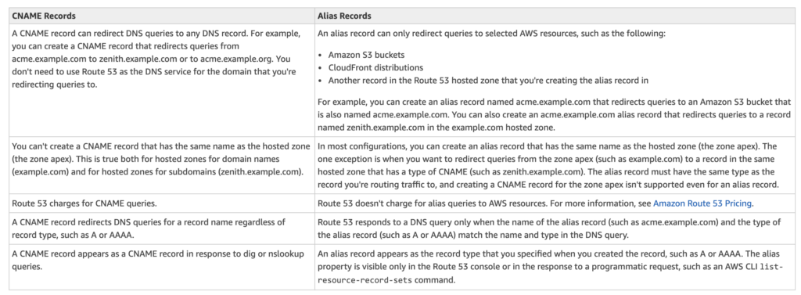

# **L9 AWS Certification – Route 53 Overview**

## **1 Route 53**

Amazon Route 53 is a highly available and scalable Domain Name System (DNS) web service.

Amazon Route 53 provides three main functions:

### **1-1 Domain registration**

* allows you to register domain names

### **1-2 Domain Name System (DNS) service**

* translates friendly domains names like www.example.com into IP addresses like 192.0.2.1
* responds to DNS queries using a global network of authoritative DNS servers, which reduces latency
* **can route Internet traffic to CloudFront, Elastic Beanstalk, ELB, or S3**. There’s no charge for DNS queries to these resources

### **1-3 Health checking**

* can monitor the health of resources such as web and email servers.
* sends automated requests over the Internet to the application to
* verify that it’s reachable, available, and functional
* CloudWatch alarms can be configured for the health checks to send notification when a resource becomes unavailable.
* can be configured to route Internet traffic away from resources that are unavailable

## **2 Supported DNS Resource Record Types**

* **A (Address) Format**
	* is an IPv4 address in dotted decimal notation for e.g. *192.0.2.1*

* **AAAA Format**
	* is an IPv6 address in colon-separated hexadecimal format

* **CNAME Format**

* is the same format as a domain name
* **<mark>DNS protocol does not allow creation of a CNAME record for the top node of a DNS namespace, also known as the zone apex for e.g. the DNS name example.com registration, the zone apex is example.com, a CNAME record for example.com cannot be created, but CNAME records can be created for www.example.com, newproduct.example.com etc</mark>**.
* **<mark>If a CNAME record is created for a subdomain, any other resource record sets for that subdomain cannot be created for e.g. if a CNAME created for www.example.com, not other resource record sets for which the value of the Name field is www.example.com can be created</mark>**

* MX (Mail Xchange) Format
	* contains a decimal number that represents the priority of the MX record, and the domain name of an email server

* NS (Name Server) Format
	* An NS record identifies the name servers for the hosted zone. The value for an NS record is the domain name of a name server.
P
* TR Format
	* A PTR record Value element is the same format as a domain name.

* SOA (Start of Authority) Format
	* SOA record provides information about a domain and the corresponding Amazon Route 53 hosted zone

* SPF (Sender Policy Framework) Format
	* SPF records were formerly used to verify the identity of the sender of email messages, however is not recommended
	* Instead of an SPF record, a TXT record that contains the applicable value is recommended

* SRV Format
	* An SRV record Value element consists of four space-separated values.The first three values are decimal numbers representing priority, weight, and port. The fourth value is a domain name for e.g. 10 5 80 hostname.example.com

* TXT (Text) Format
	* A TXT record contains a space-separated list of double-quoted strings. A single string include a maximum
of 255 characters. In addition to the characters that are permitted unescaped in domain names, space
is allowed in TXT strings

## **3 Alias resource record sets**

* Route 53 supports alias resource record sets, which enables routing of queries to a CloudFront distribution, Elastic Beanstalk, ELB, an S3 bucket configured as a static website, or another Route 53 resource record set
* Alias records are not standard for DNS RFC and are a Route 53 extension to DNS functionality
* **Alias record is similar to a CNAME record, but can create an alias record both for the root domain or apex zone, such as example.com, and for subdomains, such as www.example.com. CNAME records can be used only for subdomains**.
* Route 53 automatically recognizes changes in the resource record sets that the alias resource record set refers to for e.g. **for a site pointing to an load balancer, if the ip of the load balancer changes, Route 53 will reflect those changes automatically in the DNS answers without any changes to the hosted zone that contains resource record sets**
* If an alias resource record set points to a CloudFront distribution, a load balancer, or an S3 bucket, the time to live (TTL) can’t be set; Route 53 uses the CloudFront, load balancer, or Amazon S3 TTLs.

## **4 Route 53 Hosted Zone**

* **Hosted Zone is A container for records, which include information about how to route traffic for a domain (such as example.com) and all of its subdomains (such as www.example.com, retail.example.com, and seattle.accounting.example.com).**
* A hosted zone has the same name as the corresponding domain.
* Routing Traffic to the Resources
	* **Create a hosted zone with either a public hosted zone or a private hosted zone:**
		* **Public Hosted Zone** – for routing internet traffic to your resources for a specific domain and its subdomains
		* **Private hosted zone** – for routing traffic within an VPC
	* **Create records in the hosted zone**
		* Records define where to route traffic for each domain name or subdomain name.
		* name of each record in a hosted zone must end with the name of the hosted zone.

		

## **5 Route 53 Split-view (Split-horizon) DNS**

* Route 53 Split-view (Split-horizon) DNS enables you to access an internal version of your website using the same domain name that is used publicly
* You can maintain both a private and public hosted zone with the same domain name for split-view DNS with Route 53
* Ensure that DNS resolution and DNS hostnames are enabled on the source VPC.
* DNS queries will respond with answers based on the source of the request. From within the VPC, answers will come from the private hosted zone, while public queries will return answers from the public hosted zone.

## **6 AWS Certification Exam Practice Questions**

1. What does Amazon Route53 provide?
	*** A global Content Delivery Network.**
	* None of these.
	* A scalable Domain Name System
	* An SSH endpoint for Amazon EC2.
2. Does Amazon Route 53 support NS Records?
	* Yes, it supports Name Service records.
	* No
	* It supports only MX records.
	* **Yes, it supports Name Server records**. 
3. Does Route 53 support MX Records?
	* **Yes**
	* It supports CNAME records, but not MX records.
	* No
	* Only Primary MX records. Secondary MX records are not supported.
4. Which of the following statements are true about Amazon Route 53 resource records? Choose 2 answers
	* **An Alias record can map one DNS name to another Amazon Route 53 DNS name.**
	* A CNAME record can be created for your zone apex.
	* **An Amazon Route 53 CNAME record can point to any DNS record hosted anywhere**.
	* TTL can be set for an Alias record in Amazon Route 53.
	* An Amazon Route 53 Alias record can point to any DNS record hosted anywhere.

5. Which statements are true about Amazon Route 53? (Choose 2 answers)
	* Amazon Route 53 is a region-level service
	* **You can register your domain name**
	* **Amazon Route 53 can perform health checks and failovers to a backup site in the even of the primary site failure**
	* Amazon Route 53 only supports Latency-based routing
6. A customer is hosting their company website on a cluster of web servers that are behind a public-facing load balancer. The customer also uses Amazon Route 53 to manage their public DNS. How should the customer configure the DNS zone apex record to point to the load balancer?
	* Create an A record pointing to the IP address of the load balancer
	* Create a CNAME record pointing to the load balancer DNS name.
	* Create a CNAME record aliased to the load balancer DNS name.
	* **Create an A record aliased to the load balancer DNS name**
7. A user has configured ELB with three instances. The user wants to achieve High Availability as well as redundancy with ELB. Which of the below mentioned AWS services helps the user achieve this for ELB?
	* **Route 53**
	* AWS Mechanical Turk
	* Auto Scaling
	* AWS EMR
8. How can the **domain’s zone apex** for example “myzoneapexdomain com” be pointed towards an Elastic Load Balancer?
	* By using an AAAA record
	* By using an A record
	* By using an Amazon Route 53 CNAME record
	* **By using an Amazon Route 53 Alias record**
9. You need to create a simple, holistic check for your system’s general availability and uptime. Your system presents itself as an HTTP-speaking API. What is the simplest tool on AWS to achieve this with?
	* **Route53 Health Checks**
	* CloudWatch Health Checks
	* AWS ELB Health Checks
	* EC2 Health Checks
10. Your organization’s corporate website must be available on www.acme.com and acme.com. How should you configure Amazon Route 53 to meet this requirement?
	* **Configure acme.com with an ALIAS record targeting the ELB. www.acme.com with an ALIAS record targeting the ELB**.
	* Configure acme.com with an A record targeting the ELB. www.acme.com with a CNAME record targeting the acme.com record.
	* Configure acme.com with a CNAME record targeting the ELB. www.acme.com with a CNAME record targeting the acme.com record.
	* Configure acme.com using a second ALIAS record with the ELB target. www.acme.com using a PTR record with the acme.com record target.