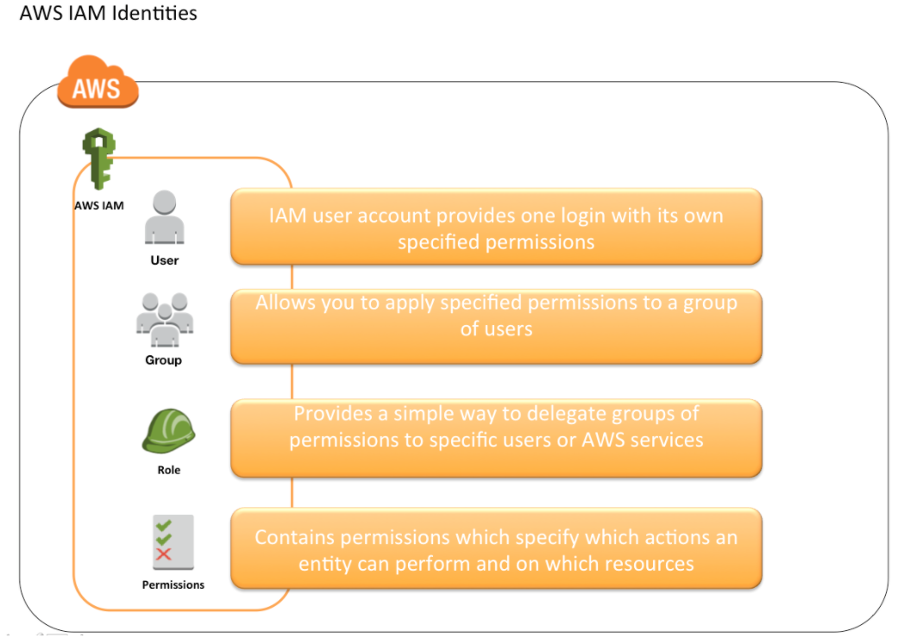
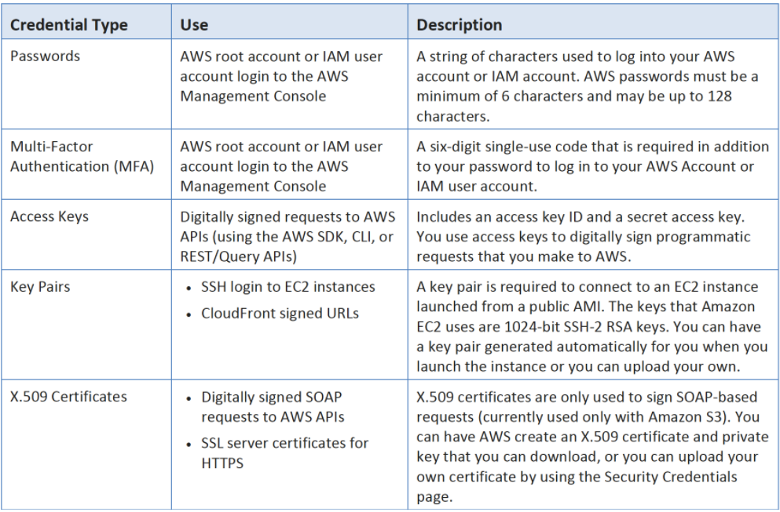
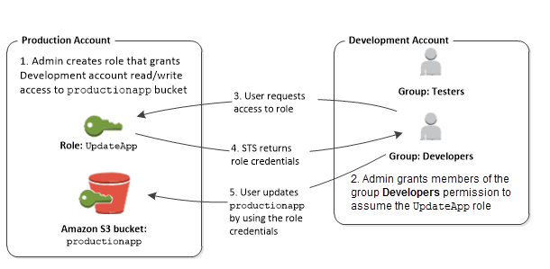
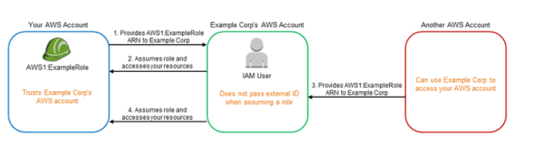
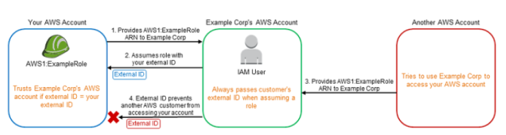
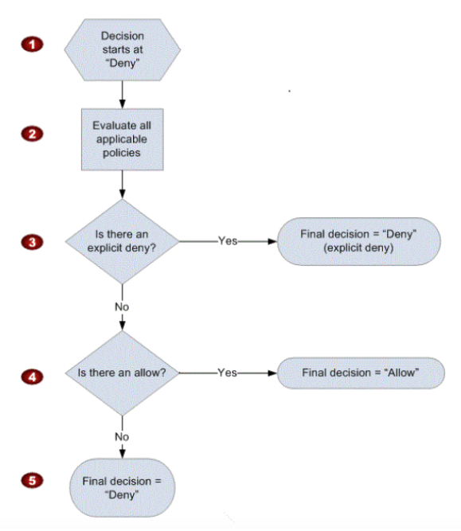

# **L1 AWS Identity Access Management – IAM**

## **1 AWS IAM Overview**

AWS Identity and Access Management (IAM) is a web service that helps you securely control access to AWS resources for your users.

**IAM is used to control**

* **Identity – who can use your AWS resources (authentication)**
* Identity – who can use your AWS resources (authentication)


IAM also enables access to resources across AWS accounts.


## **2 IAM Features**

* **Shared access to your AWS account**

Grant other people permission to administer and use resources in your AWS account without having to share your password or access key.


* **Granular permissions**

Each user can be granted with different set granular permissions as required to perform their job


* **Secure access to AWS resources for applications that run on EC2**

IAM can help provide applications running on EC2 instance temporary credentials that they need in order to access other AWS resources


* **Identity federation**

IAM allows users to access AWS resources, without requiring the user to have accounts with AWS, by providing temporary credentials for e.g. through corporate network or Google or Amazon authentication 

* **Identity information for assurance**

CloudTrail can be used to receive log records that include information about those who made requests for resources in the account.

* **PCI DSS Compliance**

IAM supports the processing, storage, and transmission of credit card data by a merchant or service provider, and **has been validated as being Payment Card Industry Data Security Standard (PCI DSS) complian**t


* **Integrated with many AWS services**

IAM integrates with almost all the AWS services


* **Eventually Consistent**

	* IAM, like many other AWS services, is eventually consistent and achieves high availability by replicating data across multiple servers within Amazon’s data centers around the world.
	* Changes made to IAM would be eventually consistent and hence would take some time to reflect

* **Free to use**

IAM is offered at no additional charge and charges are applied only for use of other AWS products by your IAM users.


* **AWS Security Token Service**

	* IAM provide STS which is an included feature of the AWS account offered at no additional charge.
	* AWS charges only for the use of other AWS services accessed by the AWS STS temporary security credentials.

## **3 Identities**

IAM identities determine who can access and help to provide authentication for people and processes in your AWS account





## **4 Account Root User**

* Root Account Credentials are the email address and password with which you sign-in into the AWS account
* Root Credentials has full unrestricted access to AWS account including the account security credentials which include sensitive information
* **_IAM Best Practice – Do not use or share the Root account once the AWS account is created, instead create a separate user with admin privilege_**
* An Administrator account can be created for all the activities which too has full access to the AWS account except the accounts security credentials, billing information and ability to change password


## **5 IAM Users**

* IAM user represents the person or service who uses the access to interact with AWS.
* **<mark>IAM Best Practice – Create Individual Users</mark>**
* User credentials can consist of the following
	* **Password to access AWS services through AWS Management Console**
	* **Access Key/Secret Access Key to access AWS services through API, CLI or SDK**
* IAM user starts with no permissions and is not authorized to perform any AWS actions on any AWS resources and should be granted permissions as per the job function requirement
* **<mark>IAM Best Practice – Grant least Privilege</mark>**
* Each IAM user is associated with one and only one AWS account.
* IAM User cannot be renamed from AWS management console and has to be done from CLI or SDK tools.
* IAM handles the renaming of user w.r.t unique id, groups, policies where the user was mentioned as a principal. However, you need to handle the renaming in the policies where the user was mentioned as a resource



## **6 IAM Groups**

* IAM group is a collection of IAM users
* IAM groups can be used to specify permissions for a collection of users sharing the same job function making it easier to manage
* **_IAM Best Practice – Use groups to assign permissions to IAM Users_**
* A group is not truly an identity because it cannot be identified as a Principal in an access policy. It is only a way to attach policies to multiple users at one time
* A group can have multiple users, while a user can belong to multiple groups (10 max)
* Groups cannot be nested and can only have users within it
* AWS does not provide any default group to hold all users in it and if one is required it should be created with all users assigned to it.
* Renaming of a group name or path, IAM handles the renaming w.r.t to policies attached to the group, unique ids, users within the group. However, IAM does not update the policies where the group is mentioned as a resource and must be handled manually
* Deletion of the groups requires you to detach users and managed policies and delete any inline policies before deleting the group. With AWS management console, the deletion and detachment is taken care of.


## **7 IAM Roles**

### **7-1 AWS IAM Role**


* IAM role is very similar to a user, in that it is an identity with permission policies that determine what the identity can and cannot do in AWS.
* IAM role is not intended to be uniquely associated with a particular user, group or service and is intended to be assumable by anyone who needs it.
* Role does not have any credentials (password or access keys) associated with it and whoever assumes the role is provided with a dynamic temporary credentials
* Role helps in access delegation to grant permissions to someone that allows access to resources that you control
* Roles can help to prevent accidental access to or modification of sensitive resources
* Modification of a Role can be done anytime and the changes are reflected across all the entities associated with the Role immediately
	* IAM Role plays a very important role in the following scenarios
	* Services like EC2 instance running an application that needs to access other AWS services
	* Allowing users from different AWS accounts have access to AWS resources in different account, instead of having to create users
	* Company uses a Corporate Authentication mechanism and don’t want the User to authenticate twice or create duplicate users in AWS
	* Applications allowing login through ***external authentication mechanism e.g. Amazon, Facebook, Google etc***
* Role can be assumed by
	* IAM user within the same AWS account
	* IAM user from a different AWS account
	* AWS service such as EC2, EMR to interact with other services
	* An external user authenticated by an external identity provider (IdP) service that is compatible with SAML 2.0 or OpenID Connect (OIDC), or a custom-built identity broker.
* Role involves defining two policies
	* **Trust policy**
		* Trust policy defines – who can assume the role
		* Trust policy involves setting up a trust between the account that owns the resource (trusting account) and the account who owns the user that needs access to the resources (trusted account)
	* **Permissions policy**
		* Permissions policy defines – what they can access
		* Permissions policy determines authorization, which grants the user of the role with the needed permissions to carry out the desired tasks on the resource
* **Federation** is creating a trust relationship between an external Identity Provider (IdP) and AWS
	* Users can also sign in to an enterprise identity system that is compatible with SAML
	* Users can sign in to a web identity provider, such as Login with Amazon, Facebook, Google, or any IdP that is compatible with OpenID connect (OIDC).
	* When using OIDC and SAML 2.0 to configure a trust relationship between these external identity providers and AWS, the user is assigned to an IAM role and receives temporary credentials that enables the user to access AWS resources
* **IAM Best Practice – Use roles for applications running on EC2 instances**
* **IAM Best Practice – Delegate using roles instead of sharing credentials**

### **7-2 Role types**

* AWS Security Token Service (STS) helps create and provide trusted users with temporary security credentials that control access to AWS resources
* STS is a global service with a single endpoint `https://sts.amazonaws.com`
* AWS STS API calls can be made either to a global endpoint or to one of the regional endpoints. Regional endpoint can help reduce latency and improve the performance of the API calls
* **Temporary Credentials are similar to Long Term Credentials except for**
	* are short term and are regularly rotated
	* can be configured to last from few minutes to several hours
	* do not have to be embedded or distributed
	* are not stored or attached with the User, but are generated dynamically and provided to the user as and when requested

### **7-3 Role types**

#### **AWS Service Roles**

* Some AWS services need to interact with other AWS services ***for e.g. EC2 interacting with S3, SQS etc***
* Best practice is to assign these services with IAM roles instead of embedding or passing IAM user credentials directly into an instance, because distributing and rotating long-term credentials to multiple instances is challenging to manage and a potential security risk.
* AWS automatically provides temporary security credentials for these services ***e.g. Amazon EC2 instance to use on behalf of its applications***
* Deleting a role or instance profile that is associated with a running EC2 instance will break any applications running on the instance

#### **Complete Process Flow**

* Create a IAM role with services who would use it for e.g. *EC2 as trusted entity and define permission policies with the access the service needs*
* **Associated a Role (actually an Instance profile) with the EC2 service when the instance is launched**
* Temporary security credentials are available on the instance and are automatically rotated before they expire so that a valid set is always available
* Application can retrieve the temporary credentials either using the Instance metadata directly or through AWS SDK
* Applications running on the EC2 instance can now use the permissions defined in the Role to access other AWS resources
* Application, if caching the credentials, needs to make sure it uses the correct credentials before they expire

#### **Instance Profile**

* An instance profile is a container for an IAM role that you can use to pass role information to an EC2 instance when the instance starts.
* If a Role is created for EC2 instance or any other service that uses EC2 through AWS Management Console, AWS creates a Instance profile automatically with the same name as the Role. However, if the Role is created through CLI the instance profile needs to created as well
* An instance profile can contain only one IAM role. However, a role can be included in multiple instance profiles.

### **7-4 Cross-Account access Roles**

* IAM users can be granted permission to switch roles within the same AWS account or to roles defined in other AWS accounts that you own.
* Roles can also be used to delegate permissions to IAM users from AWS accounts owned by Third parties
	* You must explicitly grant the users permission to assume the role.
	* Users must actively switch to the role using the AWS Management Console.
	* Multi-factor authentication (MFA) protection can be enabled for the role so that only users who sign in with an MFA device can assume the role
* However, only One set of permissions are applicable at a time. User who assumes a role temporarily gives up his or her own permissions and instead takes on the permissions of the role. When the user exits, or stops using the role, the original user permissions are restored.

### **7-5 Complete Process Flow**





* Trusting account creates a IAM Role with a
	* Trust policy which defines the account (trusted account) as a principal who can access the resources and a
	* Permissions policy to define what resources can the user in the trusted account access
* Trusting account provides the Account ID and the Role name (or the ARN) to the trusted account
* If the Trusting account is own by Third Party it can optionally provide an External ID (recommended for additional security), required to uniquely identify the trusted account, which can be added to the trust policy as a condition
* Trusted account creates a IAM user who has permissions (Permission to call the ***AWS Security Token Service (AWS STS) AssumeRole API for the role) to assume the role/switch to the role.***
* IAM User in the Trusted account switches to the Role/assumes the role and passes the ARN of the role
* Trusted account belonging to the Third party would also pass the External ID mapped to the Trusting account
* **<mark>AWS STS verifies the request for the role ARN, External ID if any and if it is from the trusted resource matching the roles’s trust policy and</mark>**
* AWS STS upon successful verification returns temporary credentials
* Temporary credentials allow the user to access the resources of the Trusting account
* When the user exits the role, the user’s permissions revert to the original permissions held before switching to the role

### **7-6 External ID and Confused Deputy Problem**

* External ID allows the user that is assuming the role to assert the circumstances in which they are operating.
* External ID provides a way for the account owner to permit the role to be assumed only under specific circumstances and prevents an unauthorized customer from gaining access to your resources
* Primary function of the external ID is to address and prevent the “confused deputy” problem.

#### **Confused Deputy Problem**




1. Example Corp’s AWS Account provides the services (access, analyze and process data and provide back reports) to multiple different AWS accounts
2. Preferred mechanism is to have each AWS account customer define a Role which Example Corp’s AWS Account users can assume and act upon
3. You provide Example Corp’s AWS Account access to your AWS account through Role and providing Role ARN
4. Example Corp when working on your account assumes the IAM role and provides the ARN with the request
5. As Example Corp is already trusted by your account it will received the temporary security credentials and gain access to your resources
6. If an other AWS account is able to know or guess your ARN (Role with Account ID), it can provide the same to Example Corp
7. Example Corp’s would use the ARN (belonging to your AWS account) to process the data but would provide the same data to the other AWS account
8. This form of privilege escalation is known as the confused deputy problem

### **7-7 Address Confused Deputy Problem using External ID**




1. Using External ID, Example Corp’s generates a unique External ID for each of its Customer which is known only to them and is kept secret
2. Example Corp provides you an External ID which needs to added as a condition while defining the trust policy
3. You provide Example Corp’s AWS Account access to your AWS account through Role and providing Role ARN
4. Example Corp when working on your account uses the IAM role and provides the ARN along with the External ID and as it is already trusted would be able to gain access
5. Other AWS account registered with Example Corp would have a Unique External ID assigned to it
6. If the Other AWS account is able to know or guess your ARN (Role with Account ID), it can provide the same to Example Corp
7. Example Corp’s would request access to your Account using the ARN (belonging to your AWS account) but with the External ID belonging to Other AWS account as the request was made on its behalf
8. As the External ID provided by Example Corp does not match the condition defined in the Role trust policy, the authentication would fail and hence denied access


### **7-8 AWS Certification Exam for IAM Role**

1. A company is building software on AWS that requires access to various AWS services. Which configuration should be used to ensure that AWS credentials (i.e., Access Key ID/Secret Access Key combination) are not compromised?
	* Enable Multi-Factor Authentication for your AWS root account.
	* **Assign an IAM role to the Amazon EC2 instance.**
	* Store the AWS Access Key ID/Secret Access Key combination in software comments.
	* Assign an IAM user to the Amazon EC2 Instance.
2. A company is preparing to give AWS Management Console access to developers. Company policy mandates identity federation and role-based access control. Roles are currently assigned using groups in the corporate Active Directory. What combination of the following will give developers access to the AWS console? (Select 2) Choose 2 answers
	* **AWS Directory Service AD Connector**
	* AWS Directory Service Simple AD
	* AWS Identity and Access Management groups
	* **AWS identity and Access Management roles**
	* AWS identity and Access Management users
3. A customer needs corporate IT governance and cost oversight of all AWS resources consumed by its divisions. The divisions want to maintain administrative control of the discrete AWS resources they consume and keep those resources separate from the resources of other divisions. Which of the following options, when used together will support the autonomy/control of divisions while enabling corporate IT to maintain governance and cost oversight? Choose 2 answers
	* Use AWS Consolidated Billing and disable AWS root account access for the child accounts.
	* **Enable IAM cross-account access for all corporate IT administrators in each child account. (Provides IT governance)**
	* Create separate VPCs for each division within the corporate IT AWS account.
	* **Use AWS Consolidated Billing to link the divisions’ accounts to a parent corporate account. (Will provide cost oversight)**
	* Write all child AWS CloudTrail and Amazon CloudWatch logs to each child account’s Amazon S3 ‘Log’ bucket.
4. Which of the following items are required to allow an application deployed on an EC2 instance to write data to a DynamoDB table? Assume that no security keys are allowed to be stored on the EC2 instance. (Choose 2 answers)
	* **Create an IAM Role that allows write access to the DynamoDB table**
	* **Add an IAM Role to a running EC2 instance. (With latest enhancement from AWS, IAM role can be assigned to a running EC2 instance)**
	* Create an IAM User that allows write access to the DynamoDB table.
	* Add an IAM User to a running EC2 instance.
	* Launch an EC2 Instance with the IAM Role included in the launch configuration (This was the correct answer before, as AWS did not allow IAM role to be added to an existing instance)
5. You are looking to migrate your Development (Dev) and Test environments to AWS. You have decided to use separate AWS accounts to host each environment. You plan to link each accounts bill to a Master AWS account using Consolidated Billing. To make sure you Keep within budget you would like to implement a way for administrators in the Master account to have access to stop, delete and/or terminate resources in both the Dev and Test accounts. Identify which option will allow you to achieve this goal. [PROFESSIONAL]
	* Create IAM users in the Master account with full Admin permissions. Create cross-account roles in the Dev and Test accounts that grant the Master account access to the resources in the account by inheriting permissions from the Master account.
	* Create IAM users and a cross-account role in the Master account that grants full Admin permissions to the Dev and Test accounts.
	* **Create IAM users in the Master account Create cross-account roles in the Dev and Test accounts that have full Admin permissions and grant the Master account access**
	* Link the accounts using Consolidated Billing. This will give IAM users in the Master account access to resources in the Dev and Test accounts
6. You have an application running on an EC2 Instance which will allow users to download flies from a private S3 bucket using a pre-assigned URL. Before generating the URL the application should verify the existence of the file in S3. How should the application use AWS credentials to access the S3 bucket securely? [PROFESSIONAL]
	* Use the AWS account access Keys the application retrieves the credentials from the source code of the application.
	* Create a IAM user for the application with permissions that allow list access to the S3 bucket launch the instance as the IAM user and retrieve the IAM user’s credentials from the EC2 instance user data.
	* **Create an IAM role for EC2 that allows list access to objects in the S3 bucket. Launch the instance with the role, and retrieve the role’s credentials from the EC2 Instance metadata**
	* Create an IAM user for the application with permissions that allow list access to the S3 bucket. The application retrieves the IAM user credentials from a temporary directory with permissions that allow read access only to the application user.
7. An administrator is using Amazon CloudFormation to deploy a three tier web application that consists of a web tier and application tier that will utilize Amazon DynamoDB for storage when creating the CloudFormation template which of the following would allow the application instance access to the DynamoDB tables without exposing API credentials?  [PROFESSIONAL]
	* Create an Identity and Access Management Role that has the required permissions to read and write from the required DynamoDB table and associate the Role to the application instances by referencing an instance profile.
	* Use the Parameter section in the Cloud Formation template to nave the user input Access and Secret Keys from an already created IAM user that has me permissions required to read and write from the required DynamoDB table.
	* **Create an Identity and Access Management Role that has the required permissions to read and write from the required DynamoDB table and reference the Role in the instance profile property of the application instance**.
	* Create an identity and Access Management user in the CloudFormation template that has permissions to read and write from the required DynamoDB table, use the GetAtt function to retrieve the Access and secret keys and pass them to the application instance through user-data.

8. An enterprise wants to use a third-party SaaS application. The SaaS application needs to have access to issue several API commands to discover Amazon EC2 resources running within the enterprise’s account. The enterprise has internal security policies that require any outside access to their environment must conform to the principles of least privilege and there must be controls in place to ensure that the credentials used by the SaaS vendor cannot be used by any other third party. Which of the following would meet all of these conditions? [PROFESSIONAL]
	* From the AWS Management Console, navigate to the Security Credentials page and retrieve the access and secret key for your account.
	* Create an IAM user within the enterprise account assign a user policy to the IAM user that allows only the actions required by the SaaS application create a new access and secret key for the user and provide these credentials to the SaaS provider.
	* **Create an IAM role for cross-account access allows the SaaS provider’s account to assume the role and assign it a policy that allows only the actions required by the SaaS application.**
	* Create an IAM role for EC2 instances, assign it a policy mat allows only the actions required tor the SaaS application to work, provide the role ARM to the SaaS provider to use when launching their application instances.
9. A user has created an application which will be hosted on EC2. The application makes calls to DynamoDB to fetch certain data. The application is using the DynamoDB SDK to connect with from the EC2 instance. Which of the below mentioned statements is true with respect to the best practice for security in this scenario?
	* **The user should attach an IAM role with DynamoDB access to the EC2 instance**
	* The user should create an IAM user with DynamoDB access and use its credentials within the application to connect with DynamoDB
	* The user should create an IAM role, which has EC2 access so that it will allow deploying the application
	* The user should create an IAM user with DynamoDB and EC2 access. Attach the user with the application so that it does not use the root account credentials
10. A customer is in the process of deploying multiple applications to AWS that are owned and operated by different development teams. Each development team maintains the authorization of its users independently from other teams. The customer’s information security team would like to be able to delegate user authorization to the individual development teams but independently apply restrictions to the users permissions based on factors such as the users device and location. For example, the information security team would like to grant read-only permissions to a user who is defined by the development team as read/write whenever the user is authenticating from outside the corporate network. What steps can the information security team take to implement this capability? [PROFESSIONAL]
	* Operate an authentication service that generates AWS STS tokens with IAM policies from application-defined IAM roles. (no user separation, will just help generate temporary tokens)
	* **Add additional IAM policies to the application IAM roles that deny user privileges based on information security policy. (Different policy with deny rules based on location, device and more restrictive wins)**
	* Configure IAM policies that restrict modification of the application IAM roles only to the information security team. (Authorization should still be in developers control)
	* Enable federation with the internal LDAP directory and grant the application teams permissions to modify users.

11. You are creating an Auto Scaling group whose Instances need to insert a custom metric into CloudWatch. Which method would be the best way to authenticate your CloudWatch PUT request?
	* **Create an IAM role with the Put MetricData permission and modify the Auto Scaling launch configuration to launch instances in that role**
	* Create an IAM user with the PutMetricData permission and modify the Auto Scaling launch configuration to inject the users credentials into the instance User Data
	* Modify the appropriate Cloud Watch metric policies to allow the Put MetricData permission to instances from the Auto Scaling group
	* Create an IAM user with the PutMetricData permission and put the credentials in a private repository and have applications on the server pull the credentials as needed

## **7 MultiFactor Authentication (MFA)**

* For increased security and to help protect the AWS resources, Multi-Factor authentication can be configured
* **IAM Best Practice – Enable MFA on Root accounts and privilege users**
* Multi-Factor Authentication can be configured using
	* **Security token-based**
		* AWS Root user or IAM user can be assigned a hardware/virtual MFA device
		* Device generates a six digit numeric code based upon a time-synchronized one-time password algorithm which needs to be provided during authentication
	* **SMS text message-based (Preview Mode)**
		* IAM user can be configured with the phone number of the user’s SMS-compatible mobile device which would receive a 6 digit code from AWS
		* SMS-based MFA is available only for IAM users and does not work for AWS root account
* MFA needs to enabled on the Root user and IAM user separately as they are distinct entities. Enabling MFA on Root does not enable it for all other users
* MFA device can be associated with only one AWS account or IAM user and vice versa
* If the MFA device stops working or is lost, you won’t be able to login into the AWS console and would need to reach out to AWS support to deactivate MFA
* **MFA protection can be enabled for service api’s calls using `“Condition”: {“Bool”: {“aws:MultiFactorAuthPresent”: “true”}}`** and is available only if the service supports temporary security credentials.


## **8 AWS IAM Access Management**

* IAM Access Management is all about Permissions and Policies
* Permission allows you to define who has access and what actions can they perform
* IAM Policy helps to fine tune the permissions granted to the policy owner
* IAM Policy is a document that formally states one or more permissions.
* Most restrictive Policy always wins
* IAM Policy is defined in the JSON (JavaScript Object Notation) format
* IAM policy basically states “**Principal A is allowed or denied (effect) to perform Action B on Resource C given Conditions D are satisfied”**

```
{
    “Version”: “2012-10-17”,
    “Statement”: {
       “Principal“: {“AWS”: [“arn:aws:iam::ACCOUNT-ID-WITHOUT-HYPHENS:root”]},
       “Action“: “s3:ListBucket”,
       “Effect“: “Allow”,
       “Resource“: “arn:aws:s3:::example_bucket”,
       “Condition“: {“StringLike”: {
           “s3:prefix”: [ “home/${aws:username}/” ]
              }
          }
    }
}
```

* An Entity can be associated with Multiple Policies and a Policy can have multiple statements where each statement in a policy refers to a single permission. If your policy includes multiple statements, a logical OR is applied across the statements at evaluation time. Similarly, if multiple policies are applicable to a request, a logical OR is applied across the policies at evaluation time.
* Principal can either be specified within the Policy for resource Based policies while for user bases policies the principal is the user, group or role to which the policy is attached

### **8-1 Identity-Based vs Resource-Based Permissions**

**Identity-based, or IAM permissions**

* Identity-based, or IAM permissions are attached to an IAM user, group, or role and specify what the user, group or role can do
* User, group, or role itself acts as a Principal
* IAM permissions can be applied to almost all the AWS services
* IAM Policies can either be inline or managed
* IAM Policy version has to be 2012-10-17

**Resource-based permissions**

* Resource-based permissions are attached to a resource for e.g. S3, SNS 
* Resource-based permissions specifies both who has access to the resource (Principal) and what actions they can perform on it (Actions)
* Resource-based policies are inline only, not managed.
* Resource-based permissions are supported only by some AWS services
* Resource-based policies are always attached inline policy and are not managed
* Resource-based policies can be defined with version 2012-10-17 or 2008-10-17

### **8-2 Managed Policies and Inline Policies**

**Managed policies**

* Managed policies are Standalone policies that can be attached to multiple users, groups, and roles in an AWS account.
* Managed policies apply only to identities (users, groups, and roles) but not to resources.
* Managed policies allow reusability
* Managed policy changes are implemented as **versions** (limited to 5), an new change to the existing policy creates a new version which is useful to compare the changes and revert back, if needed
* Managed policies have their own ARN
* Two types of managed policies:
	* **AWS managed policies**
		* Managed policies that are created and managed by AWS.
		* AWS maintains and can upgrades these policies for e.g. if a new service is introduced, the changes automatically effects all the existing principals attached to the policy
		* AWS takes care of not breaking the policies for e.g. adding an restriction of removal of permission
		* Managed policies cannot be modified
	* **Customer managed policies**
		* Managed policies are standalone and custom policies created and administered by you.
		* Customer managed policies allows more precise control over the policies than when using AWS managed policies.


**Inline policies**

* Inline policies are created and managed by you, and are embedded directly into a single user, group, or role.
* Deletion of the Entity (User, Group or Role) or Resource deletes the In-Line policy as well


### **8-3 IAM Policy Simulator**

* IAM Policy Simulator helps test and troubleshoot IAM and resource-based policies
* IAM Policy Simulator can help test the following ways :-
	* Test IAM based policies. If multiple policies attached, you can test all the policies, or select individual policies to test. You can test which actions are allowed or denied by the selected policies for specific resources.
	* Test Resource based policies. However, Resource based policies cannot be tested standalone and have to be attached with the Resource
	* Test new IAM policies that are not yet attached to a user, group, or role by typing or copying them into the simulator. These are used only in the simulation and are not saved.
	* Test the policies with selected services, actions, and resources
	* Simulate real-world scenarios by providing context keys, such as an IP address or date, that are included in Condition elements in the policies being tested.
	* Identify which specific statement in a policy results in allowing or denying access to a particular resource or action.
* IAM Policy Simulator does not make an actual AWS service request and hence does not make unwanted changes to the AWS live environment
* **IAM Policy Simulator just reports the result Allowed or Denied**
* IAM Policy Simulator allows to you modify the policy and test. These changes are not propogated to the actual policies attached to the entities
* Introductory Video for Policy Simulator


### **8-4 IAM Policy Evaluation**

When determining if permission is allowed, the hierarchy is followed



1. Decision allows starts with Deny
2. IAM combines and evaluates all the policies
3. **Explicit Deny**
	* First IAM checks for an explicit denial policy.
	* Explicit Deny overrides everything and if something is explicitly deined it can never be allowed
4. **Explicit Allow**
	* If one does not exist, it then checks for an explicit allow policy.
	* For granting User any permission, the permission must be explicitly allowed
5. **Implicit Deny**
	* If neither an explicit deny or explicit allow policy exist, it reverts to the default: implicit deny.
	* All permissions are implicity denied by default


### **8-5 IAM Policy Variables**

* Policy variables provide a feature to specify placeholders in a policy.
* When the policy is evaluated, the policy variables are replaced with values that come from the request itself
* Policy variables allow a single policy to be applied to a group of users to control access for ***e.g. all user having access to S3 bucket folder with their name only***
* Policy variable is marked using a `$ prefix followed by a pair of curly braces ({ })`. Inside the `${ }`  characters, with the name of the value from the request that you want to use in the policy
* Policy variables work only with policies defined with Version 2012-10-17
* Policy variables can only be used in the Resource element and in string comparisons in the Condition element
* Policy variables are **case sensitive** and include variables like aws:username, aws:userid, aws:SourceIp, aws:CurrentTime etc.

### **8-6 IAM Policy Variables**

1. IAM’s Policy Evaluation Logic always starts with a default ____________ for every request, except for those that use the AWS account’s root security credentials b
	* Permit
	* **Deny**
	* Cancel
2. An organization has created 10 IAM users. The organization wants each of the IAM users to have access to a separate DynamoDB table. All the users are added to the same group and the organization wants to setup a group level policy for this. How can the organization achieve this?
	* Define the group policy and add a condition which allows the access based on the IAM name
	* **Create a DynamoDB table with the same name as the IAM user name and define the policy rule which grants access based on the DynamoDB ARN using a variable**
	* Create a separate DynamoDB database for each user and configure a policy in the group based on the DB variable
	* It is not possible to have a group level policy which allows different IAM users to different DynamoDB Tables
3. An organization has setup multiple IAM users. The organization wants that each IAM user accesses the IAM console only within the organization and not from outside. How can it achieve this?
	* Create an IAM policy with the security group and use that security group for AWS console login
	* **Create an IAM policy with a condition which denies access when the IP address range is not from the organization**
	* Configure the EC2 instance security group which allows traffic only from the organization’s IP range
	* Create an IAM policy with VPC and allow a secure gateway between the organization and AWS Console
4. Can I attach more than one policy to a particular entity?
	* **Yes always**
	* Only if within GovCloud
	* No
	* Only if within VPC
5. A __________ is a document that provides a formal statement of one or more permissions.
	* **policy**
	* permission
	* Role
	* resource
6. A __________ is the concept of allowing (or disallowing) an entity such as a user, group, or role some type of access to one or more resources.
	* user
	* AWS Account
	* resource
	* **permission**
7. True or False: When using IAM to control access to your RDS resources, the key names that can be used are case sensitive. For example, aws:CurrentTime is NOT equivalent to AWS:currenttime.
	* TRUE
	* **FALSE**
8. A user has set an IAM policy where it allows all requests if a request from IP 10.10.10.1/32. Another policy allows all the requests between 5 PM to 7 PM. What will happen when a user is requesting access from IP 10.10.10.1/32 at 6 PM?
	* IAM will throw an error for policy conflict
	* It is not possible to set a policy based on the time or IP
	* It will deny access
	* **It will allow access**
9. Which of the following are correct statements with policy evaluation logic in AWS Identity and Access Management? Choose 2 answers.
	* **By default, all requests are denied**
	* An explicit allow overrides an explicit deny
	* **An explicit allow overrides default deny**
	* An explicit deny does not override an explicit allow
	* By default, all request are allowed
10. A web design company currently runs several FTP servers that their 250 customers use to upload and download large graphic files. They wish to move this system to AWS to make it more scalable, but they wish to maintain customer privacy and keep costs to a minimum. What AWS architecture would you recommend? [PROFESSIONAL]
	* **Ask their customers to use an S3 client instead of an FTP client. Create a single S3 bucket. Create an IAM user for each customer. Put the IAM Users in a Group that has an IAM policy that permits access to subdirectories within the bucket via use of the ‘username’ Policy variable**.
	* Create a single S3 bucket with Reduced Redundancy Storage turned on and ask their customers to use an S3 client instead of an FTP client. Create a bucket for each customer with a Bucket Policy that permits access only to that one customer. (Creating bucket for each user is not a scalable model, also 100 buckets are a limit earlier without extending which has since changed link)
	* Create an auto-scaling group of FTP servers with a scaling policy to automatically scale-in when minimum network traffic on the auto-scaling group is below a given threshold. Load a central list of ftp users from S3 as part of the user Data startup script on each Instance (Expensive)
	* Create a single S3 bucket with Requester Pays turned on and ask their customers to use an S3 client instead of an FTP client. Create a bucket tor each customer with a Bucket Policy that permits access only to that one customer. (Creating bucket for each user is not a scalable model, also 100 buckets are a limit earlier without extending which has since changed link)


## **8 Credential Report**


* IAM allows you to generate and download a credential report that lists all users in the account and the status of their various credentials, including passwords, access keys, and MFA devices.
* Credential report can be used to assist in auditing and compliance efforts
* Credential report can be used to audit the effects of credential lifecycle requirements, such as password and access key rotation.
* **IAM Best Practice – Perform Audits and Remove all unused users and credentials**
* Credential report is generated as often as once every four hours. If the existing report was generated less than four hours, the same is available for download. If more then four hours, IAM generates and downloads a new report.


## **9 AWS IAM AWS Certification**


1. Which service enables AWS customers to manage users and permissions in AWS?
	* AWS Access Control Service (ACS)
	* **AWS Identity and Access Management (IAM)**
	* AWS Identity Manager (AIM)
	* 2. IAM provides several policy templates you can use to automatically assign permissions to the groups you create. The _____ policy template gives the Admins group permission to access all account resources, except your AWS account information
	* Read Only Access
	* Power User Access
	* AWS Cloud Formation Read Only Access
	* **Administrator Access**
3. Every user you create in the IAM system starts with _________.
	* Partial permissions
	* Full permissions
	* **No permissions**
4. Groups can’t _____.
	* be nested more than 3 levels
	* **be nested at all**
	* be nested more than 4 levels
	* be nested more than 2 levels
5. The _____ service is targeted at organizations with multiple users or systems that use AWS products such as Amazon EC2, Amazon SimpleDB, and the AWS Management Console.
	* Amazon RDS
	* AWS Integrity Management
	* **AWS Identity and Access Management**
	* Amazon EMR
6. An AWS customer is deploying an application that is composed of an AutoScaling group of EC2 Instances. The customers security policy requires that every outbound connection from these instances to any other service within the customers Virtual Private Cloud must be authenticated using a unique x.509 certificate that contains the specific instanceid. In addition an x.509 certificates must be designed by the customer’s Key management service in order to be trusted for authentication. Which of the following configurations will support these requirements?
	* Configure an IAM Role that grants access to an Amazon S3 object containing a signed certificate and configure the Auto Scaling group to launch instances with this role. Have the instances bootstrap get the certificate from Amazon S3 upon first boot.
	* Embed a certificate into the Amazon Machine Image that is used by the Auto Scaling group. Have the launched instances generate a certificate signature request with the instance’s assigned instance-id to the Key management service for signature.
	* **Configure the Auto Scaling group to send an SNS notification of the launch of a new instance to the trusted key management service. Have the Key management service generate a signed certificate and send it directly to the newly launched instance.**
	* Configure the launched instances to generate a new certificate upon first boot. Have the Key management service poll the AutoScaling group for associated instances and send new instances a certificate signature that contains the specific instance-id.
7. When assessing an organization AWS use of AWS API access credentials which of the following three credentials should be evaluated? Choose 3 answers
	* Key pairs
	* **Console passwords**
	* **Access keys**
	* **Signing certificates**
	* Security Group memberships (required for EC2 instance access)
8. An organization has created 50 IAM users. The organization wants that each user can change their password but cannot change their access keys. How can the organization achieve this?
	* The organization has to create a special password policy and attach it to each user
	* The root account owner has to use CLI which forces each IAM user to change their password on first login
	* By default each IAM user can modify their passwords
	* **Root account owner can set the policy from the IAM console under the password policy screen**
9. An organization has created 50 IAM users. The organization has introduced a new policy which will change the access of an IAM user. How can the organization implement this effectively so that there is no need to apply the policy at the individual user level?
	* **Use the IAM groups and add users as per their role to different groups and apply policy to group**
	* The user can create a policy and apply it to multiple users in a single go with the AWS CLI
	* Add each user to the IAM role as per their organization role to achieve effective policy setup
	* Use the IAM role and implement access at the role level
10. Your organization’s security policy requires that all privileged users either use frequently rotated passwords or one-time access credentials in addition to username/password. Which two of the following options would allow an organization to enforce this policy for AWS users? Choose 2 answers
	* **Configure multi-factor authentication for privileged IAM users**
	* **Create IAM users for privileged accounts (can set password policy)**
	* Implement identity federation between your organization’s Identity provider leveraging the IAM Security Token Service
	* Enable the IAM single-use password policy option for privileged users (no such option the password expiration can be set from 1 to 1095 days)
11. Your organization is preparing for a security assessment of your use of AWS. In preparation for this assessment, which two IAM best practices should you consider implementing? Choose 2 answers
	* Create individual IAM users for everyone in your organization
	* **Configure MFA on the root account and for privileged IAM users**
	* **Assign IAM users and groups configured with policies granting least privilege access**
	* Ensure all users have been assigned and are frequently rotating a password, access ID/secret key, and X.509 certificate
12. A company needs to deploy services to an AWS region which they have not previously used. The company currently has an AWS identity and Access Management (IAM) role for the Amazon EC2 instances, which permits the instance to have access to Amazon DynamoDB. The company wants their EC2 instances in the new region to have the same privileges. How should the company achieve this?
	* Create a new IAM role and associated policies within the new region
	* **Assign the existing IAM role to the Amazon EC2 instances in the new region**
	* Copy the IAM role and associated policies to the new region and attach it to the instances
	* Create an Amazon Machine Image (AMI) of the instance and copy it to the desired region using the AMI Copy feature
13. After creating a new IAM user which of the following must be done before they can successfully make API calls?
	* Add a password to the user.
	* Enable Multi-Factor Authentication for the user.
	* Assign a Password Policy to the user.
	* **Create a set of Access Keys for the user**
14. An organization is planning to create a user with IAM. They are trying to understand the limitations of IAM so that they can plan accordingly. Which of the below mentioned statements is not true with respect to the limitations of IAM?
	* **One IAM user can be a part of a maximum of 5 groups**
	* Organization can create 100 groups per AWS account
	* One AWS account can have a maximum of 5000 IAM users
	* One AWS account can have 250 roles
15. Within the IAM service a GROUP is regarded as a:
	* A collection of AWS accounts
	* It’s the group of EC2 machines that gain the permissions specified in the GROUP.
	* There’s no GROUP in IAM, but only USERS and RESOURCES.
	* **A collection of users**.
16. Is there a limit to the number of groups you can have?
	* Yes for all users except root
	* No
	* Yes unless special permission granted
	* **Yes for all users**
17. What is the default maximum number of MFA devices in use per AWS account (at the root account level)?
	* **1**
	* 5
	* 15
	* 10
18. When you use the AWS Management Console to delete an IAM user, IAM also deletes any signing certificates and any access keys belonging to the user.
	* FALSE
	* This is configurable
	* **TRUE**
19. You are setting up a blog on AWS. In which of the following scenarios will you need AWS credentials? (Choose 3)
	* **Sign in to the AWS management console to launch an Amazon EC2 instance**
	* Sign in to the running instance to instance some software (needs ssh keys)
	* **Launch an Amazon RDS instance**
	* Log into your blog’s content management system to write a blog post (need to authenticate using blog authentication)
	* **Post pictures to your blog on Amazon S3**
20. An organization has 500 employees. The organization wants to set up AWS access for each department. Which of the below mentioned options is a possible solution?
	* Create IAM roles based on the permission and assign users to each role
	* Create IAM users and provide individual permission to each
	* **Create IAM groups based on the permission and assign IAM users to the groups**
	* It is not possible to manage more than 100 IAM users with AWS
21. An organization has hosted an application on the EC2 instances. There will be multiple users connecting to the instance for setup and configuration of application. The organization is planning to implement certain security best practices. Which of the below mentioned pointers will not help the organization achieve better security arrangement?
	* Apply the latest patch of OS and always keep it updated.
	* **Allow only IAM users to connect with the EC2 instances with their own secret access key**.
	* Disable the password-based login for all the users. All the users should use their own keys to connect with the instance securely.
	* Create a procedure to revoke the access rights of the individual user when they are not required to connect to EC2 instance anymore for the purpose of application configuration.


