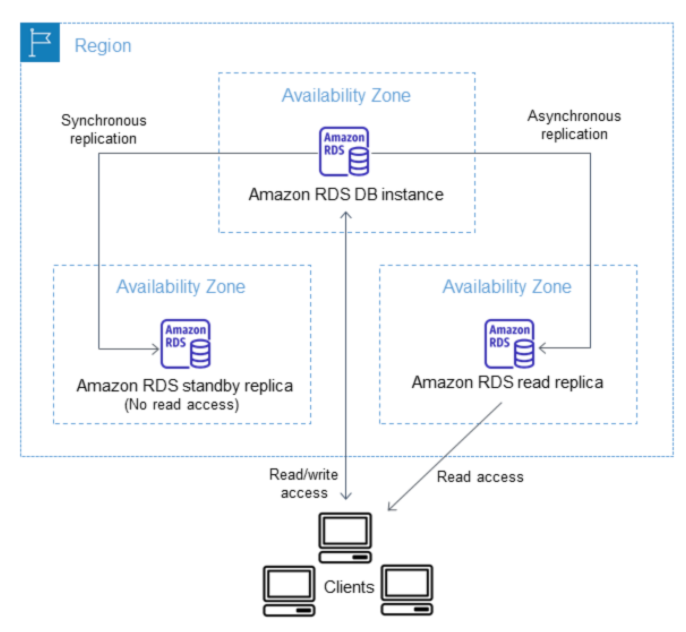
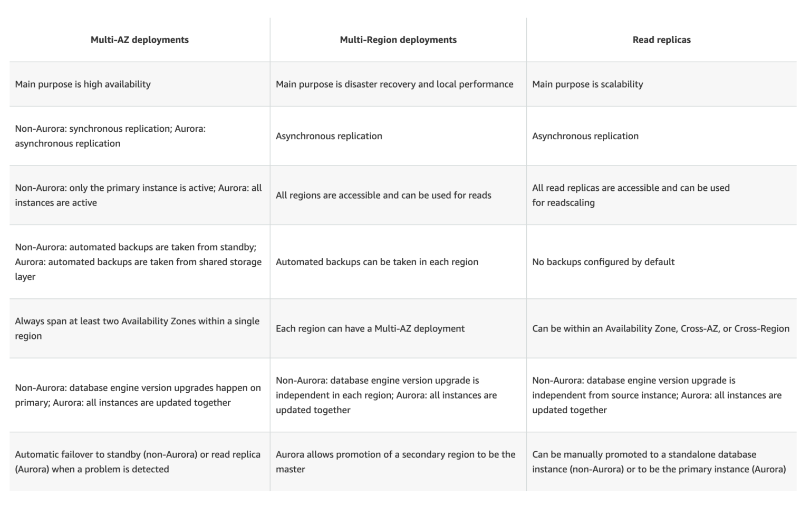

# **L1 AWS RDS**

## **1 Intro**

### **1-1 Relational Database Service – RDS**

* Relational Database Service (RDS) is a web service that makes it easier to set up, operate, and scale a relational database in the cloud.
* RDS provides cost-efficient, resizable capacity for an industry-standard relational database and manages common database administration tasks such as **hardware provisioning, database setup, patching, and backups**.
* RDS features & benefits
	* **CPU, memory, storage, and IOPs can be scaled independently.**
	* **manages backups, software patching, automatic failure detection, and recovery.**
	* **automated backups can be performed as needed, or manual backups can be triggered as well.** Backups can be used to restore a database, and the RDS restore process works reliably and efficiently.
	* provides high availability with a primary instance and a synchronous standby secondary instance that can be failover to seamlessly when a problem occurs.
	* **provides elasticity & scalability by enabling Read Replicas to increase read scaling.**
	* supports MySQL, MariaDB, PostgreSQL, Oracle, Microsoft SQL Server, and the new, MySQL-compatible Aurora DB engine
	* **supports IAM users and permissions to control who has access to the RDS database service**
	* **databases can be further protected by putting them in a VPC**, using SSL for data in transit and encryption for data in rest
	* However, **as it is a managed service, shell (root ssh) access to DB instances is not provided,** and this restricts access to certain system procedures and tables that require advanced privileges.

### **1-2 RDS Components**

**DB Instance**

* is a basic building block of RDS
* is an isolated database environment in the cloud
* each DB instance runs a DB engine. AWS currently supports MySQL, MariaDB, PostgreSQL, Oracle, and Microsoft SQL Server & Aurora DB engines
* can be accessed from AWS command-line tools, RDS APIs, or the AWS Management RDS Console.
* computation and memory capacity of a DB instance is determined by its DB instance class, which can be selected as per the needs
* supports three storage types: Magnetic, General Purpose (SSD), and Provisioned IOPS (SSD), which differ in performance and price
* each DB instance has a DB instance identifier, which is a customer-supplied name and must be unique for that customer in an AWS region. It uniquely identifies the DB instance when interacting with the RDS API and AWS CLI commands.
* each DB instance can host multiple user-created databases or a single Oracle database with multiple schemas.
* can be hosted in an AWS VPC environment for better control

**Regions and Availability Zones**

* AWS resources are housed in highly available data center facilities in different areas of the world, **these data centers are called regions which further contain multiple distinct locations called Availability Zones**
* Each AZ is engineered to be i**solated from failures in other AZs** and to provide inexpensive, low-latency network connectivity to other AZs in the same region
* DB instances can be hosted in different AZs, an option called a Multi-AZ deployment.
	* RDS automatically provisions and maintains a **synchronous** standby replica of the DB instance in a different AZ.
	* Primary DB instance is synchronously replicated across AZs to the standby replica
	* **Provides data redundancy, failover support, eliminates I/O freezes, and minimizes latency spikes during system backups.**

**Security Groups**

* security group controls the access to a DB instance, by allowing access to the specified IP address ranges or EC2 instances

**DB Parameter Groups**

* A DB parameter group contains engine configuration values that can be applied to one or more DB instances of the same instance type
* **help define configuration values specific to the selected DB Engine for e.g. `max_connections`, `force_ssl` , `autocommit`**
* supports default parameter group, which cannot be edited.
* supports custom parameter group, to override values
* supports static and dynamic parameter groups
	* changes to dynamic parameters are applied immediately (irrespective of apply immediately setting)
	* changes to static parameters are **NOT** applied immediately and require a manual reboot.

**DB Option Groups**

* Some DB engines offer tools or optional features that simplify managing the databases and making the best use of data.
* RDS makes such tools available through option groups for e.g. Oracle **Application Express (APEX), SQL Server Transparent Data Encryption, and MySQL Memcached support.**

### **1-3 RDS Interfaces**

RDS can be interacted with multiple interfaces

* AWS RDS Management console
* Command Line Interface
* Programmatic Interfaces which include SDKs, libraries in different languages, and RDS API

### **1-4 RDS Pricing**

* **Instance class**
	* Pricing is based on the class (e.g., micro, small, large, xlarge) of the DB instance consumed.
* **Running time**
	* Usage is billed in one-second increments, with a minimum of 10 **minutes**
* Storage
	* Storage capacity provisioned for the DB instance is billed per GB per month
	* If the provisioned storage capacity is scaled within the month, the bill will be pro-rated.
* I/O requests per month
	* Total number of storage I/O requests made in a billing cycle.
* Provisioned IOPS (per IOPS per month)
	* Provisioned IOPS rate, regardless of IOPS consumed, for RDS Provisioned IOPS (SSD) storage only.
	* Provisioned storage for EBS volumes is billed in one-second increments, with a minimum of 10 minutes.
* **Backup storag**e
	* Automated backups & any active database snapshots consume storage
	* Increasing backup retention period or taking additional database snapshots increases the backup storage consumed by the database.
	* RDS provides backup storage up to 100% of the provisioned database storage at no additional charge for e.g., if you have 10 GB-months of provisioned database storage, RDS provides up to 10 GB-months of backup storage at no additional charge.
	* Most databases require less raw storage for a backup than for the primary dataset, so if multiple backups are not maintained, you will never pay for backup storage.
		* Backup storage is free only for active DB instances.
* **Data transfer**
	* Internet data transfer in and out of your DB instance.
* **Reserved Instances**
	* In addition to regular RDS pricing, reserved DB instances can be purchased

	
### **1-5 QA**

1. What does Amazon RDS stand for?
	* Regional Data Server.
	* **Relational Database Service**
	* Regional Database Service.
2. How many relational database engines does RDS currently support?
	* **MySQL, Postgres, MariaDB, Oracle, and Microsoft SQL Server**
	* Just two: MySQL and Oracle.
	* Five: MySQL, PostgreSQL, MongoDB, Cassandra and SQLite.
	* Just one: MySQL.
3. If I modify a DB Instance or the DB parameter group associated with the instance, should I reboot the instance for the changes to take effect?
	* No
	* **Yes**
4. What is the name of licensing model in which I can use your existing Oracle Database licenses to run Oracle deployments on Amazon RDS?
	* **Bring Your Own License**
	* Role Bases License
	* Enterprise License
	* License Included
5. Will I be charged if the DB instance is idle?
	* No
	* **Yes**
	* Only is running in GovCloud
	* Only if running in VPC
6. What is the minimum charge for the **data transferred between Amazon RDS and Amazon EC2 Instances in the same Availability Zone**?
	* USD 0.10 per GB
	* **No charge. It is free.**
	* USD 0.02 per GB
	* USD 0.01 per GB
7. Does Amazon RDS allow direct host access via Telnet, Secure Shell (SSH), or Windows Remote Desktop Connection?
	* Yes
	* **No**
	* Depends on if it is in VPC or not
8. What are the two types of licensing options available for using Amazon RDS for Oracle?
	* BYOL and Enterprise License
	* **BYOL and License Included**
	* Enterprise License and License Included
	* Role based License and License Included
9. A user plans to use RDS as a managed DB platform. Which of the below mentioned features is not supported by RDS?
	* Automated backup
	* **Automated scaling to manage a higher load**
	* Automated failure detection and recovery
	* Automated software patching
10. A user is launching an AWS RDS with MySQL. Which of the below mentioned options allows the user to configure the InnoDB engine parameters?
	* Options group
	* Engine parameters
	* **Parameter groups**
	* DB parameters
11. A user is planning to use the AWS RDS with MySQL. Which of the below mentioned services the user is not going to pay?
	* Data transfer
	* **RDS CloudWatch metrics**
	* Data storage
	* I/O requests per month

## **2 AWS RDS Replication – Multi-AZ vs Read Replica**

### **2-1 RDS Multi-AZ vs Read Replica**
	
DB instances replicas can be created in two ways Multi-AZ & Read Replica, which provide high availability, durability, and scalability to RDS.

### **2-2 Multi-AZ deployments**

* RDS Multi-AZ deployment provides **high availability, durability, and failover support**
* RDS automatically provisions and manages a **synchronous** standby instance in a different AZ (independent infrastructure in a physically separate location)
* **RDS automatically fails over to the standby so that database operations can resume quickly without administrative intervention in case of**
	* **Planned** database maintenance
	* Software patching
	* **Rebooting of the Primary instance**
	* Primary DB instance connectivity or host failure, or an
	* Availability Zone failure
* RDS maintains the same endpoint for the DB Instance after a failover, so the application can resume database operation without the need for manual administrative intervention.

### **2-3 RDS Read Replicas**

* Read replicas enable increased scalability and database availability in the case of an **AZ failure.**
* Read Replicas allow elastic scaling beyond the capacity constraints of a single DB instance for read-heavy database workloads
* **RDS read replicas can be Multi-AZ i.e. set up with their own standby instances in a different AZ**.
* **Load on the source DB instance can be reduced by routing read queries from applications to the Read Replica.**
* one or more replicas of a given source DB Instance and serve high-volume application read traffic from multiple copies of your data, thereby increasing aggregate read throughput. **Read replicas can also be promoted when needed to become standalone DB instances.**
* RDS uses DB engines’ built-in replication functionality to create a special type of DB instance called a Read Replica from a source DB instance. It uses the engines’ native asynchronous replication to update the read replica whenever there is a change to the source DB instance.
* Read replicas are available in RDS for MySQL, MariaDB, PostgreSQL, Oracle, and SQL Server as well as Aurora.

### **2-4 QAs**

1. You are running a successful multi-tier web application on AWS and your marketing department has asked you to add a reporting tier to the application. The reporting tier will aggregate and publish status reports every 30 minutes from user-generated information that is being stored in your web applications database. You are currently running a Multi-AZ RDS MySQL instance for the database tier. You also have implemented ElastiCache as a database caching layer between the application tier and database tier. Please select the answer that will allow you to successfully implement the reporting tier with as little impact as possible to your database.
	* Continually send transaction logs from your master database to an S3 bucket and generate the reports of the S3 bucket using S3 byte range requests.
	* Generate the reports by querying the synchronously replicated standby RDS MySQL instance maintained through Multi-AZ (Standby instance cannot be used as a scaling solution)
	* **Launch an RDS Read Replica connected to your Multi-AZ master database and generate reports by querying the Read Replica.**
	* Generate the reports by querying the ElastiCache database caching tier. (ElasticCache does not maintain full data and is simply a caching solution)
2. A company is deploying a new two-tier web application in AWS. The company has limited staff and requires high availability, and the application requires complex queries and table joins. Which configuration provides the solution for the company’s requirements?
	* MySQL Installed on two Amazon EC2 Instances in a single Availability Zone (does not provide High Availability out of the box)
	* **Amazon RDS for MySQL with Multi-AZ**
	* Amazon ElastiCache (Just a caching solution)
	* Amazon DynamoDB (Not suitable for complex queries and joins)
3. Your company is getting ready to do a major public announcement of a social media site on AWS. The website is running on EC2 instances deployed across multiple Availability Zones with a Multi-AZ RDS MySQL Extra Large DB Instance. The site performs a high number of small reads and writes per second and relies on an eventual consistency model. After comprehensive tests you discover that there is read contention on RDS MySQL. Which are the best approaches to meet these requirements? (Choose 2 answers)
	* **Deploy ElastiCache in-memory cache running in each availability zone**
	* Implement sharding to distribute load to multiple RDS MySQL instances (this is only a read contention, the writes work fine)
	* Increase the RDS MySQL Instance size and Implement provisioned IOPS (not scalable, this is only a read contention, the writes work fine)
	* **Add an RDS MySQL read replica in each availability zone**
4. Your company has HQ in Tokyo and branch offices all over the world and is using logistics software with a multi-regional deployment on AWS in Japan, Europe and US. The logistic software has a 3-tier architecture and currently uses MySQL 5.6 for data persistence. Each region has deployed its own database. In the HQ region you run an hourly batch process reading data from every region to compute cross-regional reports that are sent by email to all offices this batch process must be completed as fast as possible to quickly optimize logistics. How do you build the database architecture in order to meet the requirements?
	* **For each regional deployment, use RDS MySQL with a master in the region and a read replica in the HQ region**
	* For each regional deployment, use MySQL on EC2 with a master in the region and send hourly EBS snapshots to the HQ region
	* For each regional deployment, use RDS MySQL with a master in the region and send hourly RDS snapshots to the HQ region
	* For each regional deployment, use MySQL on EC2 with a master in the region and use S3 to copy data files hourly to the HQ region
	* Use Direct Connect to connect all regional MySQL deployments to the HQ region and reduce network latency for the batch process
5. What would happen to an RDS (Relational Database Service) Multi-Availability Zone deployment if the primary DB instance fails?
	* IP of the primary DB Instance is switched to the standby DB Instance.
	* A new DB instance is created in the standby availability zone.
	* **The canonical name record (CNAME) is changed from primary to standby.**
	* The RDS (Relational Database Service) DB instance reboots.
6. Your business is building a new application that will store its entire customer database on a RDS MySQL database, and will have various applications and users that will query that data for different purposes. Large analytics jobs on the database are likely to cause other applications to not be able to get the query results they need to, before time out. Also, as your data grows, these analytics jobs will start to take more time, increasing the negative effect on the other applications. How do you solve the contention issues between these different workloads on the same data?
	* Enable Multi-AZ mode on the RDS instance
	* Use ElastiCache to offload the analytics job data
	* **Create RDS Read-Replicas for the analytics work**
	* Run the RDS instance on the largest size possible
7. Will my standby RDS instance be in the same Availability Zone as my primary?
	* Only for Oracle RDS types
	* Yes
	* Only if configured at launch
	* **No**
8. A user is planning to set up the Multi-AZ feature of RDS. Which of the below mentioned conditions won’t take advantage of the Multi-AZ feature?
	* Availability zone outage
	* A manual failover of the DB instance using Reboot with failover option
	* **Region outage**
	* When the user changes the DB instance’s server type
9. When you run a DB Instance as a Multi-AZ deployment, the “_____” serves database writes and reads
	* secondary
	* backup
	* stand by
	* **primary**
10. When running my DB Instance as a Multi-AZ deployment, can I use the standby for read or write operations?
	* Yes
	* Only with MSSQL based RDS
	* Only for Oracle RDS instances
	* **No**
11. Read Replicas require a transactional storage engine and are only supported for the _________ storage engine
	* OracleISAM
	* MSSQLDB
	* **InnoDB**
	* MyISAM
12. A user is configuring the Multi-AZ feature of an RDS DB. The user came to know that this RDS DB does not use the AWS technology, but uses server mirroring to achieve replication. Which DB is the user using right now?
	* MySQL
	* Oracle
	* **MS SQL**
	* PostgreSQL
13. If I have multiple Read Replicas for my master DB Instance and I promote one of them, what happens to the rest of the Read Replicas?
	* **The remaining Read Replicas will still replicate from the older master DB Instance**
	* The remaining Read Replicas will be deleted
	* The remaining Read Replicas will be combined to one read replica
14. If you have chosen Multi-AZ deployment, in the event of a planned or unplanned outage of your primary DB Instance, Amazon RDS automatically switches to the standby replica. The automatic failover mechanism simply changes the ______ record of the main DB Instance to point to the standby DB Instance.
	* DNAME
	* **CNAME**
	* TXT
	* MX
15. When automatic failover occurs, Amazon RDS will emit a DB Instance event to inform you that automatic failover occurred. You can use the _____ to return information about events related to your DB Instance
	* FetchFailure
	* DescriveFailure
	* **DescribeEvents**
	* FetchEvents
16. The new DB Instance that is created when you promote a Read Replica retains the backup window period.
	* **TRUE**
	* FALSE
17. Will I be alerted when automatic failover occurs?
	* **Only if SNS configured**
	* No
	* Yes
	* 1Only if Cloudwatch configured
18. Can I initiate a “forced failover” for my MySQL Multi-AZ DB Instance deployment?
	* Only in certain regions
	* Only in VPC
	* **Yes**
	* No
19. A user is accessing RDS from an application. The user has enabled the Multi-AZ feature with the MS SQL RDS DB. **During a planned outage how will AWS ensure that a switch from DB to a standby replica will not affect access to the application**?
	* RDS will have an internal IP which will redirect all requests to the new DB
	* **RDS uses DNS to switch over to standby replica for seamless transition**
	* The switch over changes Hardware so RDS does not need to worry about access
	* RDS will have both the DBs running independently and the user has to manually switch over
20. Which of the following is part of the failover process for a Multi-AZ Amazon Relational Database Service (RDS) instance?
	* 	The failed RDS DB instance reboots.
	* 	The IP of the primary DB instance is switched to the standby DB instance.
	* 	**The DNS record for the RDS endpoint is changed from primary to standby**.
	* A new DB instance is created in the standby availability zone.
21. Which of these is not a reason a Multi-AZ RDS instance will failover?
	* An Availability Zone outage
	* A manual failover of the DB instance was initiated using Reboot with failover
	* To autoscale to a higher instance class
	* **Master database corruption occurs**
	* The primary DB instance fails
22. You need to scale an RDS deployment. You are operating at 10% writes and 90% reads, based on your logging. How best can you scale this in a simple way?
	* Create a second master RDS instance and peer the RDS groups.
	* Cache all the database responses on the read side with CloudFront.
	* **Create read replicas for RDS since the load is mostly reads**.
	* Create a Multi-AZ RDS installs and route read traffic to standby.
23. How does Amazon RDS multi Availability Zone model work?
	* **A second, standby database is deployed and maintained in a different availability zone from master, using synchronous replication.** 
	* A second, standby database is deployed and maintained in a different availability zone from master using asynchronous replication.
	* A second, standby database is deployed and maintained in a different region from master using asynchronous replication.
	* A second, standby database is deployed and maintained in a different region from master using synchronous replication.
24. A customer is running an application in US-West (Northern California) region and wants to setup disaster recovery failover to the Asian Pacific (Singapore) region. The customer is interested in achieving a low Recovery Point Objective (RPO) for an Amazon RDS multi-AZ MySQL database instance. Which approach is best suited to this need?
	* Synchronous replication
	* **Asynchronous replication**
	* Route53 health checks
	* Copying of RDS incremental snapshots
25. A user is using a small MySQL RDS DB. The user is experiencing high latency due to the Multi AZ feature. Which of the below mentioned options may not help the user in this situation?
	* Schedule the automated back up in non-working hours
	* Use a large or higher size instance
	* Use PIOPS
	* **Take a snapshot from standby Replica**
26. Are Reserved Instances available for Multi-AZ Deployments?
	* Only for Cluster Compute instances
	* **Yes for all instance types**
	* Only for M3 instance types
27. My Read Replica appears “stuck” after a Multi-AZ failover and is unable to obtain or apply updates from the source DB Instance. What do I do?
	* **You will need to delete the Read Replica and create a new one to replace it.**
	* You will need to disassociate the DB Engine and re-associate it.
	* The instance should be deployed to Single AZ and then moved to Multi-AZ once again
	* You will need to delete the DB Instance and create a new one to replace it.
28. What is the charge for the data transfer incurred in replicating data between your primary and standby?
	* **No charge. It is free**.
	* Double the standard data transfer charge
	* Same as the standard data transfer charge
	* Half of the standard data transfer charge
29. A user has enabled the Multi-AZ feature with the MS SQL RDS database server. Which of the below mentioned statements will help the user understand the Multi-AZ feature better?
	* In a Multi-AZ, AWS runs two DBs in parallel and copies the data asynchronously to the replica copy
	* In a Multi-AZ, AWS runs two DBs in parallel and copies the data synchronously to the replica copy
	* **In a Multi-AZ, AWS runs just one DB but copies the data synchronously to the standby replic**a
	* AWS MS SQL does not support the Multi-AZ feature
30. A company is running a batch analysis every hour on their main transactional DB running on an RDS MySQL instance to populate their central Data Warehouse running on Redshift. During the execution of the batch their transactional applications are very slow. When the batch completes they need to update the top management dashboard with the new data. The dashboard is produced by another system running on-premises that is currently started when a manually sent email notifies that an update is required The on-premises system cannot be modified because is managed by another team. How would you optimize this scenario to solve performance issues and automate the process as much as possible?
	* Replace RDS with Redshift for the batch analysis and SNS to notify the on-premises system to update the dashboard
	* Replace RDS with Redshift for the batch analysis and SQS to send a message to the on-premises system to update the dashboard
	* **Create an RDS Read Replica for the batch analysis and SNS to notify me on-premises system to update the dashboard**
	* Create an RDS Read Replica for the batch analysis and SQS to send a message to the on-premises system to update the dashboard.

	
## **3 AWS RDS Storage – Certification**

### **3-1 AWS RDS Storage**

* RDS storage uses Elastic Block Store (EBS) volumes for database and log storage.
* RDS automatically stripes across multiple EBS volumes to enhance IOPS performance, depending on the amount of storage requested

### **3-2 RDS Storage Types**

* RDS storage provides three storage types: **Magnetic, General Purpose (SSD), and Provisioned IOPS (input/output operations per second)**.
* These storage types differ in performance characteristics and price, which allows tailoring of storage performance and cost to the database needs
* MySQL, MariaDB, PostgreSQL, and Oracle RDS DB instances can be created with up to 6TB of storage and SQL Server RDS DB instances with **up to 4TB of storage when using the Provisioned IOPS and General Purpose (SSD)** storage types.
* Existing MySQL, PostgreSQL, and Oracle RDS database instances can be scaled to these new database storage limits without any downtime.

#### **Magnetic (Standard)**

* Magnetic storage, also called standard storage, offers cost-effective storage that is ideal for applications with light or burst I/O requirements.
* They deliver approximately 100 IOPS on average, with burst capability of up to hundreds of IOPS, and they can range in size from 5 GB to 3 TB, depending on the DB instance engine.
* Magnetic storage is not reserved for a single DB instance, so performance can vary greatly depending on the demands placed on shared resources by other customers.

#### **MGeneral Purpose (SSD)**

* General purpose, SSD-backed storage, also called gp2, can provide faster access than disk-based storage.
* They can deliver single-digit millisecond latencies, with a base performance of 3 IOPS per Gigabyte (GB) and the ability to burst to 3,000 IOPS for extended periods of time up to a maximum of 10,000 PIOPS.
* Gp2 volumes can range in size from 5 GB to 6 TB for MySQL, MariaDB, PostgreSQL, and Oracle DB instances, and from 20 GB to 4 TB for SQL Server DB instances.
* Gp2 is excellent for small to medium-sized databases.

#### **Provisioned IOPS**

* Provisioned IOPS storage is designed to meet the needs of I/O-intensive workloads, particularly database workloads, that are sensitive to storage performance and consistency in random access I/O throughput.
* Provisioned IOPS storage is a storage type that delivers fast, predictable, and consistent throughput performance.
* For any production application that requires fast and consistent I/O performance, Amazon recommends Provisioned IOPS (input/output operations per second) storage.
* Provisioned IOPS storage is optimized for I/O intensive, online transaction processing (OLTP) workloads that have consistent performance requirements.
* Provisioned IOPS helps performance tuning.
* Provisioned IOPS volumes can range in size from 100 GB to 6 TB for MySQL, MariaDB, PostgreSQL, and Oracle DB engines. SQL Server Express and Web editions can range in size from 100 GB to 4 TB, while SQL Server Standard and Enterprise editions can range in size from 200 GB to 4 TB.
* Dedicated IOPS rate and storage space allocation is specified, when a DB instance is created. RDS provisions that IOPS rate and storage for the lifetime of the DB instance or until its changed.
* RDS delivers within 10 percent of the provisioned IOPS performance 99.9 percent of the time over a given year.

#### **Adding Storage and Changing Storage Type**

* DB instance can be modified to use additional storage and converted to a different storage type.
* **However, storage allocated for a DB instance cannot be decreased**
* MySQL, MariaDB, PostgreSQL, and Oracle DB instances can be scaled up for storage, which helps improve I/O capacity.
* **Storage capacity nor the type of storage for a SQL Server DB instance can be changed due to extensibility limitations of striped storage attached to a Windows Server environment.**
* During the scaling process, the DB instance will be available for reads and writes, but may experience performance degradation
* Adding storage may take several hours; the duration of the process depends on several factors such as load, storage size, storage type, amount of IOPS provisioned (if any), and number of prior scale storage operations.
* While storage is being added, nightly backups are suspended and no other RDS operations can take place, including modify, reboot, delete, create Read Replica, and create DB Snapshot

### **3-3 Performance Metrics**

* Amazon RDS provides several metrics that can be used to determine how the DB instance is performing.

* **IOPS**
	* the number of I/O operations completed per second.
	* it is reported as the average IOPS for a given time interval.
	* RDS reports read and write IOPS separately on one minute intervals.
	* Total IOPS is the sum of the read and write IOPS.
	* Typical values for IOPS range from zero to tens of thousands per second.

* **Latency**
	* the elapsed time between the submission of an I/O request and its completion
	* it is reported as the average latency for a given time interval.
	* RDS reports read and write latency separately on one minute intervals in units of seconds.
	* Typical values for latency are in the millisecond (ms)

* **Throughput**

	* the number of bytes per second transferred to or from disk
	* it is reported as the average throughput for a given time interval.
	* RDS reports read and write throughput separately on one minute intervals using units of megabytes per second (MB/s).
	* Typical values for throughput range from zero to the I/O channel’s maximum bandwidth.

* **Queue Depth**
	* the number of I/O requests in the queue waiting to be serviced.
	* these are I/O requests that have been submitted by the application but have not been sent to the device because the device is busy servicing other I/O requests.
	* it is reported as the average queue depth for a given time interval.
	* RDS reports queue depth in one minute intervals. Typical values for queue depth range from zero to several hundred.
	* Time spent waiting in the queue is a component of Latency and
	* Service Time (not available as a metric).

### **3-4 Amazon RDS Storage Facts**

* First time a DB instance is started and accesses an area of disk for the first time, the process can take longer than all subsequent accesses to the same disk area. This is known as the “**first touch penalty**”. Once an area of disk has incurred the first touch penalty, that area of disk does not incur the penalty again for the life of the instance, even if the DB instance is rebooted, restarted, or the DB instance class changes. Note that a DB instance created from a snapshot, a point-in-time restore, or a read replica is a new instance and does incur this first touch penalty.
* RDS manages the DB instance and it reserves overhead space on the instance. While the amount of reserved storage varies by DB instance class and other factors, this reserved space can be as much as one or two percent of the total storage
* Provisioned IOPS provides a way to reserve I/O capacity by specifying IOPS. Like any other system capacity attribute, maximum throughput under load will be constrained by the resource that is consumed first, which could be IOPS, channel bandwidth, CPU, memory, or database internal resources.
* Current maximum channel bandwidth available is 4000 megabits per second (Mbps) full duplex. In terms of the read and write throughput metrics, this equates to about 210 megabytes per second (MB/s) in each direction. A perfectly balanced workload of 50% reads and 50% writes may attain a maximum combined throughput of 420 MB/s, which includes protocol overhead, so the actual data throughput may be less.
* Provisioned IOPS works with an I/O request size of 32 KB. Provisioned IOPS consumption is a linear function of I/O request size above 32 KB. An I/O request smaller than 32 KB is handled as one I/O; for e.g. 1000 16 KB I/O requests are treated the same as 1000 32 KB requests. I/O requests larger than 32 KB consume more than one I/O request; while, a 48 KB I/O request consumes 1.5 I/O requests of storage capacity; a 64 KB I/O request consumes 2 I/O requests

### **3-5 Factors That Impact Storage Performance**

* Several factors can affect the performance of a DB instance, such as instance configuration, I/O characteristics, and workload demand.
* System related activities also consume I/O capacity and may reduce database instance performance while in progress:
	* DB snapshot creation
	* Nightly backups
	* Multi-AZ peer creation
	* Read replica creation
	* Scaling storage
* System resources can constrain the throughput of a DB instance, but there can be other reasons for a bottleneck. Database could be the issue if :
	* Channel throughput limit is not reached
	* Queue depths are consistently low
	* CPU utilization is under 80%
	* Free memory available
	* No swap activity
	* Plenty of free disk space
	* Application has dozens of threads all submitting transactions as fast as the database will take them, but there is clearly unused I/O capacity

### **3-6 QAs**

1. When should I choose Provisioned IOPS over Standard RDS storage?
	* If you have batch-oriented workloads
	* **If you use production online transaction processing (OLTP) workloads**
	* If you have workloads that are not sensitive to consistent performance
2. Is decreasing the storage size of a DB Instance permitted?
	Depends on the RDMS used
	Yes
	No
3. Because of the extensibility limitations of striped storage attached to Windows Server, Amazon RDS does not currently support increasing storage on a _____ DB Instance.
	* **SQL Server**
	* MySQL
	* Oracle
4. If I want to run a database in an Amazon instance, which is the most recommended Amazon storage option?
	* Amazon Instance Storage
	* **Amazon EBS**
	* You can’t run a database inside an Amazon instance.
	* Amazon S3
5. For each DB Instance class, what is the maximum size of associated storage capacity?
	* 1TiB
	* 2TiB
	* 8TiB
	* **16TiB (The limit keeps on changing so please check the latest always)**

## **4 AWS RDS DB Snapshot, Backup & Restore**

### **4-1 RDS BackUp, Restore and Snapshots**

* RDS creates a **storage volume snapshot** of the DB instance, backing up the entire DB instance and not just individual databases.
* RDS provides two different methods Automated and Manual for backing up your DB instances:

### **4-2 Automated backups**

* Backups of the DB instance are **automatically created and retained**
* Automated backups are enabled by default for a new DB instance.
* Automated backups occur during a daily user-configurable period of time, known as **preferred backup window**.
	* If a preferred backup window is not specified when an DB instance is created, RDS assigns a default 30-minute backup window which is selected at random from an 8-hour block of time per region.
	* Changes to the backup window take effect immediately.
	* Backup window cannot overlap with the weekly maintenance window for the DB instance.
* Backups created during the backup window are retained for a user-configurable number of days , **known as backup retention period**
	* If the backup retention period is not set, RDS defaults the period retention period to one day, if created using RDS API or the AWS CLI, or seven days if created AWS Console
	* Backup retention period can be modified with valid values are 0 (for no backup retention) to a maximum of 35 days.
* **Manual snapshot limits (50 per region)** do not apply to automated backups
* If the backup requires more time than allotted to the backup window, the backup will continue to completion.
* An immediate outage occurs if the backup retention period is changed
	* from 0 to a non-zero value as the first backup occurs immediately or
	* from non-zero value to 0 as it turns off automatic backups, and deletes all existing automated backups for the instance.
* **RDS uses the periodic data backups in conjunction with the transaction logs to enable restoration of the DB Instance to any second during the retention period, up to the *LatestRestorableTime* (typically up to the last few minutes).**
* During the backup window,
	*	**for Single AZ instance, storage I/O may be briefly suspended while the backup process initializes** (typically under a few seconds) and a brief period of elevated latency might be experienced.
	* **for Multi-AZ DB deployments, there is No I/O suspension since the backup is taken from the standby instance**
* **First backup is a full backup, while the others are incremental.**
* Automated DB backups are deleted when
	* the retention period expires
	* the automated DB backups for a DB instance is disabled
	* the DB instance is deleted
* **When a DB instance is deleted**,
	* a final DB snapshot can be created upon deletion; which can be used to restore the deleted DB instance at a later date.
	* RDS retains the final user-created DB snapshot along with all other manually created DB snapshots
	* **all automated backups are deleted and cannot be recovered**

### **4-3 Point-In-Time Recovery**

* **In addition to the daily automated backup, RDS archives database change logs. This enables recovery of the database to any point in time during the backup retention period, up to the last five minutes of database usage.**
* Disabling automated backups also disables point-in-time recovery
* RDS stores multiple copies of your data, but for Single-AZ DB instances these copies are stored in a single availability zone.
* If for any reason a Single-AZ DB instance becomes unusable, point-in-time recovery can be used to launch a new DB instance with the latest restorable data

### **4-4 DB Snapshots (User Initiated – Manual)**

* DB snapshots are manual, user-initiated backups that enables to backup a DB instance to a known state, and restore to that specific state at any time
* **RDS keeps all manual DB snapshots until explicitly deleted**

### **4-5 DB Snapshots Creation**

* DB snapshot is a user-initiated storage volume snapshot of DB instance, backing up the entire DB instance and not just individual databases.
* DB snapshots enable backing up of the DB instance in a known state as needed, and can then be restored to that specific state at any time.
* DB snapshots are kept until explicitly deleted
* Creating DB snapshot on a Single-AZ DB instance results in a brief I/O suspension that typically lasting no more than a few minutes.
* Multi-AZ DB instances are not affected by this I/O suspension since the backup is taken on the standby instance

### **4-6 DB Snapshot Restore**

* DB instance can be restored to any specific time during this retention period, creating a new DB instance.
* DB restore creates a New DB instance with a different endpoint
* RDS uses the periodic data backups in conjunction **with the transaction logs to enable restoration of the DB Instance to any second during the retention period,** up to the LatestRestorableTime (typically up to the last few minutes).
* **Option group associated with the DB snapshot is associated with the restored DB instance once it is created**. However, option group is associated with the VPC, so would apply only when the instance is restored in the same VPC as the DB snapshot.
* **Default DB parameter and security groups are associated with the restored instance**. After the restoration is complete, any custom DB parameter or security groups used by the instance restored from should be associated explicitly.
* **A DB instance can be restored with a different storage type than the source DB snapshot.** In this case the restoration process will be slower because of the additional work required to migrate the data to the new storage type for e.g. from GP2 to Provisioned IOPS
* A DB instance can be restored with a different edition of the DB engine only if the DB snapshot has the required storage allocated for the new edition for e.g., to change from SQL Server Web Edition to SQL Server Standard Edition, the DB snapshot must have been created from a SQL Server DB instance that had at least 200 GB of allocated storage, which is the minimum allocated storage for SQL Server Standard edition

### **4-7 DB Snapshot Copy**

* RDS supports two types of DB snapshot copying.
	* Copy an automated DB snapshot to create a manual DB snapshot in the same AWS region. Manual DB snapshot are not deleted automatically and can be kept indefinitely.
	* Copy either an automated or manual DB snapshot from one region to another region. By copying the DB snapshot to another region, a manual DB snapshot is created that is retained in that region
* **Automated backups cannot be shared. They need to be copied to a manual snapshot, and the manual snapshot can be shared**.
* **Manual DB snapshots can be shared with other AWS accounts and copy DB snapshots shared to you by other AWS accounts**
* Snapshot Copy Encryption
	* DB snapshot that has been encrypted using an AWS Key Management System (AWS KMS) encryption key can be copied
	* Copying an encrypted DB snapshot, results in an encrypted copy of the DB snapshot
	* When copying, DB snapshot can either be encrypted with the same KMS encryption key as the original DB snapshot, or a different KMS encryption key to encrypt the copy of the DB snapshot.
	* An unencrypted DB snapshot can be copied to an encrypted snapshot, a quick way to add encryption to a previously encrypted DB instance.
	* Encrypted snapshot can be restored only to an encrypted DB instance
	* If a KMS encryption key is specified when restoring from an unencrypted DB cluster snapshot, the restored DB cluster is encrypted using the specified KMS encryption key
	* Copying an encrypted snapshot shared from another AWS account, requires access to the KMS encryption key that was used to encrypt the DB 
	* **NOTE – AWS now allows copying encrypted DB snapshots between accounts and across multiple regions as seamlessly as unencrypted snapshots. Refer blog post**

### **4-8 DB Snapshot Sharing**

* **Manual DB snapshot or DB cluster snapshot can be shared with up to 20 other AWS accounts**.
* Manual snapshot shared with other AWS accounts can copy the snapshot, or restore a DB instance or DB cluster from that snapshot.
* Manual snapshot can also be shared as public, which makes the snapshot available to all AWS accounts. Care should be taken when sharing a snapshot as public so that none of the private information is included
* **Shared snapshot can be copied to another region**.
* However, following limitations apply when sharing manual snapshots with other AWS accounts:
	* When a DB instance or DB cluster is restored from a shared snapshot using the AWS CLI or RDS API, the Amazon Resource Name (ARN) of the shared snapshot as the snapshot identifier should be specified
	* DB snapshot that uses an option group with permanent or persistent options cannot be shared
	* A permanent option cannot be removed from an option group. Option groups with persistent options cannot be removed from a DB instance once the option group has been assigned to the DB instance.
* **DB snapshots that have been encrypted “at rest” using the AES-256 encryption algorithm can be shared**
* Users can only copy encrypted DB snapshots if they have access to the AWS Key Management Service (AWS KMS) encryption key that was used to encrypt the DB snapshot.
* AWS KMS encryption keys can be shared with another AWS account by adding the other account to the KMS key policy.
* However, KMS key policy must first be updated by adding any accounts to share the snapshot with, before sharing an encrypted DB snapshot

### **4-9 AWS RDS DB Snapshot, Backup & Restore QAs**

1. Amazon RDS **automated backups and DB Snapshots** are currently supported for only the __________ storage engine
	* **InnoDB**
	* MyISAM
2. Automated backups are enabled by default for a new DB Instance.
	* **TRUE**
	* FALSE
3. Amazon RDS DB snapshots and automated backups are stored in
	* **Amazon S3**
	* Amazon EBS Volume
	* Amazon RDS
	* Amazon EMR
4. You receive a frantic call from a new DBA who accidentally dropped a table containing all your customers. Which Amazon RDS feature will allow you to reliably restore your database to within 5 minutes of when the mistake was made?
	* Multi-AZ RDS
	* RDS snapshots
	* RDS read replicas
	* **RDS automated backup**
5. Disabling automated backups ______ **disable the point-in-time recovery**.
	* if configured to can
	* will never
	* **will**
6. Changes to the backup window take effect ______.
	* from the next billing cycle
	* after 30 minutes
	* **immediately**
	* after 24 hours
7. You can modify the backup retention period; valid values are 0 (for no backup retention) to a maximum of ___________ days.
	* 45
	* **35**
	* 15
	* 5
8. Amazon RDS automated backups and DB Snapshots are currently supported for only the ______ storage engine
	* MyISAM
	* **InnoDB** 
9. What happens to the I/O operations while you take a database snapshot?
	* **I/O operations to the database are suspended for a few minutes while the backup is in progress**.
	* I/O operations to the database are sent to a Replica (if available) for a few minutes while the backup is in progress.
	* I/O operations will be functioning normally
	* I/O operations to the database are suspended for an hour while the backup is in progress
10. True or False: When you perform a restore operation to a point in time or from a DB Snapshot, a new DB Instance is created with a new endpoint.
	* FALSE
	* **TRUE** 
11. True or False: Manually created DB Snapshots are deleted after the DB Instance is deleted.
	* TRUE
	* **FALSE**
12. A user is running a MySQL RDS instance. The user will not use the DB for the next 3 months. How can the user save costs?
	* Pause the RDS activities from CLI until it is required in the future
	* Stop the RDS instance
	* **Create a snapshot of RDS to launch in the future and terminate the instance now**
	* Change the instance size to micro

## **5 AWS RDS Security**

### **5-1 AWS RDS Security**

**AWS provides multiple features to provide RDS security:** 

* DB instance can be hosted in a VPC for the greatest possible **network access control**
* **IAM policies can be used to assign permissions** that determine who is allowed to manage RDS resources
* Security groups allow to control what IP addresses or EC2 instances can connect to the databases on a DB instance
* **Secure Socket Layer (SSL) connections with DB instances**
* RDS encryption to secure RDS instances and snapshots at rest.
* Network encryption and transparent data encryption (TDE) with Oracle DB instances

### **5-2 RDS Authentication and Access Control**

* IAM can be used to control which RDS operations each individual user has permission to call

### **5-3 Encrypting RDS Resources**

* RDS encrypted instances use the industry standard **AES-256 encryption algorithm to encrypt data on the server that hosts the RDS instance**
* **RDS handles authentication of access and decryption of the data with a minimal impact on performance**, and with no need to modify the database client applications
* **Data at Rest Encryption**
	* can be enabled on RDS instances to encrypt the **underlying storage**
	* encryption keys are **managed by KMS**
	* can be enabled only during instance creation
	* **once enabled, the encryption keys cannot be changed**
	* if the key is lost, the DB can only be restored from the backup
* **Once encryption is enabled for an RDS instance,**
	* **logs are encrypted**
	* **snapshots are encrypted**
	* automated backups are encrypted
	* **read replicas are encrypted**

* Encrypted snapshot from one AWS Region can be copied to another, by specifing the KMS key identifier of the destination AWS Region as KMS encryption keys are specific to the AWS Region that they are created in.
* RDS DB Snapshot considerations
	* **DB snapshot encrypted using an KMS encryption key can be copied**
	* **Copying an encrypted DB snapshot**, results in an encrypted copy of the DB snapshot
	* When copying, DB snapshot can either be encrypted with the same KMS encryption key as the original DB snapshot, or a different KMS encryption key to encrypt the copy of the DB snapshot.
	* **An unencrypted DB snapshot can be copied to an encrypted snapshot, to add encryption to a previously unencrypted DB instance**.
	* Encrypted snapshot can be restored only to an encrypted DB instance
	* If a KMS encryption key is specified when restoring from an unencrypted DB cluster snapshot, the restored DB cluster is encrypted using the specified KMS encryption key
	* Copying an encrypted snapshot shared from another AWS account, requires access to the KMS encryption key used to encrypt the DB snapshot.
	* Because KMS encryption keys are specific to the region that they are created in, encrypted snapshot cannot be copied to another region
* **Transparent Data Encryption (TDE)**
	* Automatically encrypts the data before it is written to the underlying storage device and decrypts when it is read  from the storage device
	* is supported by Oracle and SQL Server
		* Oracle requires key storage outside of the KMS and integrates with CloudHSM for this
		* SQL Server requires a key but is managed by RDS
	

### **5-4 SSL to Encrypt a Connection to a DB Instance**

* Encrypt connections using **SSL for data in transit between the applications and the DB instance**
* Amazon RDS creates an **SSL certificate and installs the certificate on the DB instance when RDS provisions the instance**.
* SSL certificates are signed by a certificate authority. SSL certificate includes the DB instance endpoint as the Common Name (CN) for the SSL certificate to guard against spoofing attacks
* **While SSL offers security benefits, be aware that SSL encryption is a compute-intensive operation and will increase the latency of the database connection.**

### **5-5 IAM Database Authentication**

* IAM database authentication works with MySQL and PostgreSQL.
* IAM database authentication prevents the need to store static user credentials in the database, because authentication is managed externally using IAM.
* IAM database authentication does not require password, but needs an authentication token
* An authentication token is a unique string of characters that RDS generates on request.
* Authentication tokens are generated using AWS Signature Version 4.
* Each Authentication token has a lifetime of 15 minutes
* IAM database authentication provides the following benefits:
	* Network traffic to and from the database is encrypted using Secure Sockets Layer (SSL).
	* helps centrally manage access to the database resources, instead of managing access individually on each DB instance.
	* enables using IAM Roles to access the database instead of a password, for greater security.

### **5-6 RDS Security Groups**

* Security groups **control the access that traffic has in and out of a DB instance**
* VPC security groups act like a firewall controlling network access to your DB instance.
* VPC security groups can be configured and associated with the DB instance to allow access from an IP address range, port, or EC2 security group
* **Database security groups default to a “deny all” access mode** and customers must specifically authorize network ingress.

### **5-7 RDS Rotating Secrets**

* **RDS supports AWS Secrets Manager to automatically rotate the secret**
* **Secrets Manager uses a Lambda function Secrets Manager provides.**
* **Secrets Manager provides following benefits**
	* **Rotate secrets safely** – rotate secrets automatically without disrupting the applications. Secrets Manager offers built-in integrations for rotating credentials for  RDS databases for MySQL, PostgreSQL, and  Aurora. Secrets Manager can be extended to meet custom rotation requirements by creating an Lambda function to rotate other types of secrets
	* **Manage secrets centrally** – to store, view, and manage all the secrets.
	* **Security** – By default, Secrets Manager encrypts these secrets with encryption keys that you own and control. **Using fine-grained IAM policies, access to secrets can be controlled**
	* **Monitor and audit easily** – Secrets Manager integrates with AWS logging and monitoring services to enable meet your security and compliance requirements.
	* **Pay as you go** – Pay for the secrets stored and for the use of these secrets; there are no long-term contracts or licensing fees.

### **5-8 Master User Account Privileges**

* When you create a new DB instance, the default master user that used gets certain privileges for that DB instance
* Subsequently, other users with permissions can be created

### **5-9 Event Notification**

* Event notifications can be configured for important events that occur on the DB instance
* Notifications of a variety of important events that can occur on the RDS instance, such as whether the instance was shut down, a backup was started, a failover occurred, the security group was changed, or your storage space is low can be received

### **5-10 RDS Encrypted DB Instances Limitations**

* **Encryption can be enabled only during creation of an RDS DB instance**
* For migrating and unencrypted data –
	* **Encrypt a copy of an unencrypted DB snapshot**,
	* **Create an encrypted copy of that snapshot**.
	* **Restore a DB instance from the encrypted snapshot**
* DB instances that are encrypted can’t be modified to disable encryption.
* Unencrypted DB instance or an unencrypted read replica of an encrypted DB instance can’t have an encrypted read replica
* Encrypted read replicas must be encrypted with the same CMK as the source DB instance when both are in the same AWS Region.
* Unencrypted backup or snapshot can’t be restored to an encrypted DB instance.

### **5-11 QAs**

1. Can I encrypt connections between my application and my DB Instance using SSL?
	* No
	* **Yes**
	* Only in VPC
	* Only in certain regions
2. Which of these configuration or deployment practices is a security risk for RDS?
Storing SQL function code in plaintext
	* Non-Multi-AZ RDS instance
	* Having RDS and EC2 instances exist in the same subnet
	* **RDS in a public subnet** (Making RDS accessible to the public internet in a public subnet poses a security risk, by making your database directly addressable and spammable. DB instances deployed within a VPC can be configured to be accessible from the Internet or from EC2 instances outside the VPC. If a VPC security group specifies a port access such as TCP port 22, you would not be able to access the DB instance because the firewall for the DB instance provides access only via the IP addresses specified by the DB security groups the instance is a member of and the port defined when the DB instance was created.)

## **6 AWS RDS DB Maintenance & Upgrades**

### **6-1 RDS DB Instance Maintenance and Upgrades**

**Changes to a DB instance can occur when a DB instance is manually modified for e.g. DB engine version is upgraded, or when Amazon RDS performs maintenance on an instance**

### **6-2 Amazon RDS Maintenance**

* Periodically, Amazon RDS performs maintenance on Amazon RDS resources, such as DB instances and most often involves updates to the DB instance’s operating system (OS).
* Maintenance items can either
	* be applied manually on a DB instance at ones convenience
	* or wait for the automatic maintenance process initiated by Amazon RDS during the defined weekly maintenance window.
* Maintenance window only determines when pending operations start, but does not limit the total execution time of these operations. Maintenance operations are not guaranteed to finish before the maintenance window ends, and can continue beyond the specified end time.
* Maintenance update availability can be checked both on the RDS console and by using the RDS API. And if an update is available, one can
	* Defer the maintenance items.
	* Apply the maintenance items immediately.
	* Schedule them to start during the next defined maintenance window
* **Maintenance items marked as**
	* **Required cannot be deferred indefinitely**, if deferred AWS will send a notify the time when the update will be performed next
	* **Available and can be deferred indefinitely and the update will not be applied to the DB instance.**

* **<mark>Required patching is automatically scheduled only for patches that are related to security and instance reliability</mark>**. Such patching occurs infrequently (typically once every few months) and seldom requires more than a fraction of your maintenance window.
* Maintenance items require that RDS take your DB instance offline for a short time. Maintenance that requires DB instance to be offline include scale compute operations, which generally take only a few minutes from start to finish, and required operating system or database patching.
* **<mark>Multi-AZ deployment for the DB instance reduces the impact of a maintenance event by following these steps: </mark>***
	* **Perform maintenance on the standby**.
	* **Promote the standby to primary**.
	* **Perform maintenance on the old primary, which becomes the new standby**.

* When database engine for the DB instance is modified in a Multi-AZ deployment, RDS upgrades both the primary and secondary DB instances at the same time. In this case, the database engine for the entire Multi-AZ deployment is shut down during the upgrade.

### **6-3 Operating System Updates**

* Upgrades to the operating system are most often for security issues and should be done as soon as possible.
* OS updates on a DB instance can be applied at ones convenience or can wait for the maintenance process initiated by RDS to apply the update during the defined maintenance window
* DB instance is not automatically backed up when an OS update is applied, and should be backup up before the update is applied

### **6-4 Database Engine Version Upgrade**

* DB instance engine version can be upgraded when a new DB engine version is supported by RDS.
* Database version upgrades consist of major and minor version upgrades.
	* **Major database version upgrades**
		* can contain changes that are not backward-compatible
		* **RDS doesn’t apply major version upgrades automatically**
		* **DB instance should be manually modified and thoroughly tested before applying it to the production instances.**

	* **Minor version upgrades**
		* Each DB engine handles minor version upgrade slightly differently
for e.g. RDS automatically apply minor version upgrades to a DB instance running PostgreSQL, but must be manually applied to a DB instance running Oracle.

* Amazon posts an announcement to the forums announcement page and sends a customer e-mail notification before upgrading an DB instance
* Amazon schedule the upgrades at specific times through the year, to help plan around them, because downtime is required to upgrade a DB engine version, even for Multi-AZ instances.
* **RDS takes two DB snapshots during the upgrade process**.
	* **First DB snapshot is of the DB instance before any upgrade changes have been made.** If the upgrade fails, it can be restored from the snapshot to create a DB instance running the old version.
	* **Second DB snapshot is taken when the upgrade completes.** After the upgrade is complete, database engine can’t be reverted to the previous version. For returning to the previous version, restore the first DB snapshot taken to create a new DB instance.

* If the DB instance is using read replication, all of the Read Replicas must be upgraded before upgrading the source instance.
* If the DB instance is in a Multi-AZ deployment, both the primary and standby replicas are upgraded at the same time and would result in an outage. The time for the outage varies based on your database engine, version, and the size of your DB instance.

### **6-5 RDS Maintenance Window**

* Every DB instance has a weekly maintenance window defined during which any system changes are applied.
* Maintenance window is an opportunity to control when DB instance modifications and software patching occur, in the event either are requested or required.
* If a maintenance event is scheduled for a given week, it will be initiated during the 30 minute maintenance window as defined
* Maintenance events mostly complete during the 30 minute maintenance window, although larger maintenance events may take more time
* 30-minute maintenance window is selected at random from an 8-hour block of time per region. If you don’t specify a preferred maintenance window when you create the DB instance, Amazon RDS assigns a 30-minute maintenance window on a randomly selected day of the week.
* RDS will consume some of the resources on the DB instance while maintenance is being applied, minimally effecting performance.
* For some maintenance events, a Multi-AZ failover may be required for a maintenance update to complete.

### **6-6 AWS RDS DB Maintenance & Upgrades QAs**

1. A user has launched an RDS MySQL DB with the Multi AZ feature. The user has scheduled the scaling of instance storage during maintenance window. What is the correct order of events during maintenance window? 1. Perform maintenance on standby 2. Promote standby to primary 3. Perform maintenance on original primary 4. Promote original master back as primary
	* 1, 2, 3, 4
	* **1, 2, 3**
	* 2, 3, 4, 1
2. Can I control if and when MySQL based RDS Instance is upgraded to new supported versions?
	* No
	* Only in VPC
	* **Yes**
3. A user has scheduled the maintenance window of an RDS DB on Monday at 3 AM. Which of the below mentioned events may force to take the DB instance offline during the maintenance window?
	* Enabling Read Replica
	* Making the DB Multi AZ
	* DB password change
	* **Security patching**
4. A user has launched an RDS postgreSQL DB with AWS. The user did not specify the maintenance window during creation. The user has configured RDS to update the DB instance type from micro to large. If the user wants to have it during the maintenance window, what will AWS do?
	* AWS will not allow to update the DB until the maintenance window is configured
	* **AWS will select the default maintenance window if the user has not provided it**
	* AWS will ask the user to specify the maintenance window during the update
	* It is not possible to change the DB size from micro to large with RDS
5. Can I test my DB Instance against a new version before upgrading?
	* No
	* **Yes**
	* Only in VPC

## **7 AWS RDS Monitoring & Notification**

### **7-1 AWS RDS Monitoring & Notification**

* RDS integrates with CloudWatch and provides metrics for monitoring
* CloudWatch alarms can be created over a single metric that sends an SNS message when the alarm changes state
* RDS also provides SNS notification whenever any RDS event occurs

### **7-2 RDS CloudWatch Monitoring**

* RDS DB instance can be monitored using CloudWatch, which collects and processes raw data from RDS into readable, near real-time metrics.
* Statistics are recorded for a period of two weeks, so that you can access historical information and gain a better perspective on how the service is performing.
* By default, RDS metric data is automatically sent to CloudWatch in 1-minute periods
* CloudWatch RDS Metrics
	* BinLogDiskUsage – Amount of disk space occupied by binary logs on the master. Applies to MySQL read replicas.
	* CPUUtilization – Percentage of CPU utilization.
	* DatabaseConnections – Number of database connections in use.
	* DiskQueueDepth – The number of outstanding IOs (read/write requests) waiting to access the disk.
	* FreeableMemory – Amount of available random access memory.
	* FreeStorageSpace – Amount of available storage space.
	* **ReplicaLag** – Amount of time a Read Replica DB instance lags behind the source DB instance.
	* SwapUsage – Amount of swap space used on the DB instance.
	* ReadIOPS – Average number of disk I/O operations per second.
	* WriteIOPS – Average number of disk I/O operations per second.
	* ReadLatency – Average amount of time taken per disk I/O operation.
	* WriteLatency – Average amount of time taken per disk I/O operation.
	* ReadThroughput – Average number of bytes read from disk per second.
	* WriteThroughput – Average number of bytes written to disk per second.
	* NetworkReceiveThroughput – Incoming (Receive) network traffic on the DB instance, including both customer database traffic and Amazon RDS traffic used for monitoring and replication.
	* NetworkTransmitThroughput – Outgoing (Transmit) network traffic on the DB instance, including both customer database traffic and Amazon RDS traffic used for monitoring and replication.

### **7-3 RDS Enhanced Monitoring**

* RDS provides metrics in real time for the operating system (OS) that the DB instance runs on.
* By default, Enhanced Monitoring metrics are stored for 30 days in the CloudWatch Logs, which are different from typical CloudWatch metrics.

### **7-4 CloudWatch vs Enhanced Monitoring Metrics**

* CloudWatch gathers metrics about CPU utilization from the hypervisor for a DB instance, and Enhanced Monitoring gathers its metrics from an agent on the instance.
* Enhanced Monitoring metrics are useful to understand how different processes or threads on a DB instance use the CPU.
* There might be differences between the measurements, because the hypervisor layer performs a small amount of work. The differences can be greater if the DB instances use smaller instance classes, because then there are likely more virtual machines (VMs) that are managed by the hypervisor layer on a single physical instance.

### **7-5 RDS Performance Insights**

* Performance Insights is a database performance tuning and monitoring feature that helps illustrate the database’s performance and help analyze any issues that affect it
* With the Performance Insights dashboard, you can visualize the database load and filter the load by waits, SQL statements, hosts, or users.

### **7-6 RDS CloudTrail Logs**

* CloudTrail provides a record of actions taken by a user, role, or an AWS service in RDS.
* CloudTrail captures all API calls for RDS as events, including calls from the console and from code calls to RDS API operations.
* CloudTrail can help determine the request that was made to RDS, the IP address from which the request was made, who made the request, when it was made, and additional details.

### **7-7 RDS Recommendations**

* RDS provides automated recommendations for database resources.
* The recommendations provide best practice guidance by analyzing DB instance configuration, usage, and performance data.

### **7-8 RDS Event Notification**

* RDS uses the SNS to provide notification when an RDS event occurs
* RDS groups the events into categories, which can be subscribed so that a notification is sent when an event in that category occurs.
* Event category for a DB instance, DB cluster, DB snapshot, DB cluster snapshot, DB security group or for a DB parameter group can be subscribed
* Event notifications are sent to the email addresses provided during subscription creation
* Subscription can be easily turn off notification without deleting a subscription by setting the Enabled radio button to No in the RDS console or by setting the Enabled parameter to false using the CLI or RDS API.

### **7-9 RDS Trusted Advisor**

* Trusted Advisor inspects the AWS environment and then makes recommendations when opportunities exist to save money, improve system availability and performance, or help close security gaps.
* Trusted Advisor has the following RDS-related checks:
	* RDS Idle DB Instances
	* **RDS Security Group Access Risk**
	* RDS Backups
	* RDS Multi-AZ

### **7-10 AWS RDS Monitoring & Notification QAs**

1. You run a web application with the following components Elastic Load Balancer (ELB), 3 Web/Application servers, 1 MySQL RDS database with read replicas, and Amazon Simple Storage Service (Amazon S3) for static content. Average response time for users is increasing slowly. What three CloudWatch RDS metrics will allow you to identify if the database is the bottleneck? Choose 3 answers
	* **The number of outstanding IOs waiting to access the disk**
	* **The amount of write latency**
	* The amount of disk space occupied by binary logs on the master.
	* **The amount of time a Read Replica DB Instance lags behind the source DB Instance**
	* The average number of disk I/O operations per second.
2. Typically, you want your application to check whether a request generated an error before you spend any time processing results. The easiest way to find out if an error occurred is to look for an __________ node in the response from the Amazon RDS API.
	* Incorrect
	* **Error**
	* FALSE
3. In the Amazon CloudWatch, which metric should I be checking to ensure that your DB Instance has enough free storage space?
	* FreeStorage
	* **FreeStorageSpace**
	* FreeStorageVolume
	* FreeDBStorageSpace
4. A user is receiving a notification from the RDS DB whenever there is a change in the DB security group. The user does not want to receive these notifications for only a month. Thus, he does not want to delete the notification. How can the user configure this?
	* Change the Disable button for notification to “Yes” in the RDS console
	* Set the send mail flag to false in the DB event notification console
	* The only option is to delete the notification from the console
	* **Change the Enable button for notification to “No” in the RDS console**
5. A sys admin is planning to subscribe to the RDS event notifications. For which of the below mentioned source categories the subscription cannot be configured?
	* DB security group
	* DB snapshot
	* **DB options group**
	* DB parameter group
6. A user is planning to setup notifications on the RDS DB for a snapshot. Which of the below mentioned event categories is not supported by RDS for this snapshot source type?
	* **Backup**
	* Creation
	* Deletion
	* Restoration
7. A system admin is planning to setup event notifications on RDS. Which of the below mentioned services will help the admin setup notifications?
	* AWS SES
	* AWS Cloudtrail
	* AWS CloudWatch
	* **AWS SNS**
8. A user has setup an RDS DB with Oracle. The user wants to get notifications when someone modifies the security group of that DB. How can the user configure that?
	* It is not possible to get the notifications on a change in the security group
	* Configure SNS to monitor security group changes
	* **Configure event notification on the DB security group**
	* Configure the CloudWatch alarm on the DB for a change in the security group
9. It is advised that you watch the Amazon CloudWatch “_____” metric (available via the AWS Management Console or Amazon Cloud Watch APIs) carefully and recreate the Read Replica should it fall behind due to replication errors.
	* Write Lag
	* Read Replica
	* **Replica Lag**
	* Single Replica

## **8 AWS RDS Best Practices**

### **8-1 AWS RDS Best Practices**

**AWS recommends RDS best practices in terms of Monitoring, Performance and security**

### **8-2 Amazon RDS Basic Operational Guidelines**

**Monitoring**

* **Memory, CPU, and storage usage should be monitored.**
* CloudWatch can be setup for notifications when usage patterns change or when the capacity of deployment is approached, so that system performance and availability can be maintained

**Scaling**

* Scale up the DB instance when approaching storage capacity limits.
* There should be some buffer in storage and memory to accommodate unforeseen increases in demand from the applications.

**Backups**

* Enable Automatic Backups and set the backup window to occur during the daily low in WriteIOPS.

**On a MySQL DB instance**,

* Do not create more than 10,000 tables using Provisioned IOPS or 1000 tables using standard storage. Large numbers of tables will significantly increase database recovery time after a failover or database crash. If you need to create more tables than recommended, set the innodb_file_per_table parameter to 0.
* Avoid tables in the database growing too large. Provisioned storage limits restrict the maximum size of a MySQL table file to 6 TB. Instead, partition the large tables so that file sizes are well under the 6 TB limit. This can also improve performance and recovery time.

**Performance**

* If the database workload requires more I/O than provisioned, recovery after a failover or database failure will be slow.
* To increase the I/O capacity of a DB instance,
	* Migrate to a DB instance class with High I/O capacity.
	* Convert from standard storage to Provisioned IOPS storage, and use a DB instance class that is optimized for Provisioned IOPS.
	* if using Provisioned IOPS storage, provision additional throughput capacity.

**Multi-AZ & Failover**

* **Deploy applications in all Availability Zones, so if an AZ goes down, applications in other AZs will still be available.**
* **Use Amazon RDS DB events to monitor failovers.**
* **Set a TTL of less than 30 seconds, if the client application is caching the DNS data of the DB instances.** As the underlying IP address of a DB instance can change after a failover, caching the DNS data for an extended time can lead to connection failures if the application tries to connect to an IP address that no longer is in service.
* **Multi-AZ requires transaction logging feature to be enabled. Do not use features like Simple recover mode, offline mode or Read-only mode which turn of transaction logging.**
* To shorten failover time
	* Ensure that sufficient Provisioned IOPS allocated for your workload. Inadequate I/O can lengthen failover times. Database recovery requires I/O.
	* Use smaller transactions. Database recovery relies on transactions, so break up large transactions into multiple smaller transactions to shorten failover time
* Test failover for your DB instance to understand how long the process takes for your use case and to ensure that the application that accesses your DB instance can automatically connect to the new DB instance after failover.

### **8-3 DB Instance RAM Recommendations**

* An Amazon RDS performance best practice is to allocate enough RAM so that the working set resides almost completely in memory.
* Value of ReadIOPS should be small and stable.
* ReadIOPS metric can be checked, using AWS CloudWatch while the DB instance is under load, to tell if the working set is almost all in memory
* If scaling up the DB instance class with more RAM, results in a dramatic drop in ReadIOPS, the working set was not almost completely in memory.
* Continue to scale up until ReadIOPS no longer drops dramatically after a scaling operation, or ReadIOPS is reduced to a very small amount.

### **8-4 RDS Security Best Practices**

* Do not use AWS root credentials to manage Amazon RDS resources; and IAM users should be created for everyone,
* **Grant each user the minimum set of permissions required to perform his or her duties.**
* Use IAM groups to effectively manage permissions for multiple users.
* **Rotate your IAM credentials regularly**.

### **8-5 Using Enhanced Monitoring to Identify Operating System Issues**

* Amazon RDS provides metrics in real time for the operating system (OS) that your DB instance runs on.
* Enhanced monitoring is available for all DB instance classes except for db.t1.micro and db.m1.small.
* Using Metrics to Identify Performance Issues
* To identify performance issues caused by insufficient resources and other common bottlenecks, you can monitor the metrics available for your Amazon RDS DB instance
* Performance metrics should be monitored on a regular basis to benchmark  the average, maximum, and minimum values for a variety of time ranges. to help identify performance degradation.
* Amazon CloudWatch alarms can be set for particular metric thresholds to be alerted when they are reached or breached
* A DB instance has a number of different categories of metrics which includes CPU, memory, disk space, IOPS, db connections and network traffic, and how to determine acceptable values depends on the metric.
* One of the best ways to improve DB instance performance is to tune the most commonly used and most resource-intensive queries to make them less expensive to run.

### **8-6 Recovery**

**MySQL**

* InnoDB is the recommended and supported storage engine for MySQL DB instances on Amazon RDS.
* However, MyISAM performs better than InnoDB if you require intense, full-text search capability.
* Point-In-Time Restore and snapshot restore features of Amazon RDS for MySQL require a crash-recoverable storage engine and are supported for the InnoDB storage engine only.
* Although MySQL supports multiple storage engines with varying capabilities, not all of them are optimized for crash recovery and data durability.
* MyISAM storage engine does not support reliable crash recovery and might prevent a Point-In-Time Restore or snapshot restore from working as intended which might result in lost or corrupt data when MySQL is restarted after a crash.

**MariaDB**

* XtraDB is the recommended and supported storage engine for MariaDB DB instances on Amazon RDS.
* Point-In-Time Restore and snapshot restore features of Amazon RDS for MariaDB require a crash-recoverable storage engine and are supported for the XtraDB storage engine only.
* Although MariaDB supports multiple storage engines with varying capabilities, not all of them are optimized for crash recovery
* and data durability.
* For e.g although Aria is a crash-safe replacement for MyISAM, it might still prevent a Point-In-Time Restore or snapshot restore from working as intended. This might result in lost or corrupt data when MariaDB is restarted after a crash.

### **8-7 QAs**

1. You are running a database on an EC2 instance, with the data stored on Elastic Block Store (EBS) for persistence At times throughout the day, you are seeing large variance in the response times of the database queries Looking into the instance with the isolate command you see a lot of wait time on the disk volume that the database’s data is stored on. What two ways can you improve the performance of the database’s storage while maintaining the current persistence of the data? Choose 2 answers
	* Move to an SSD backed instance
	* **Move the database to an EBS-Optimized Instance**
	* Use Provisioned IOPs EBS
	* Use the ephemeral storage on an m2.4xLarge Instance Instead
2. Amazon RDS automated backups and DB Snapshots are currently supported for only the __________ storage engine
	* **InnoDB**
	* MyISAM

